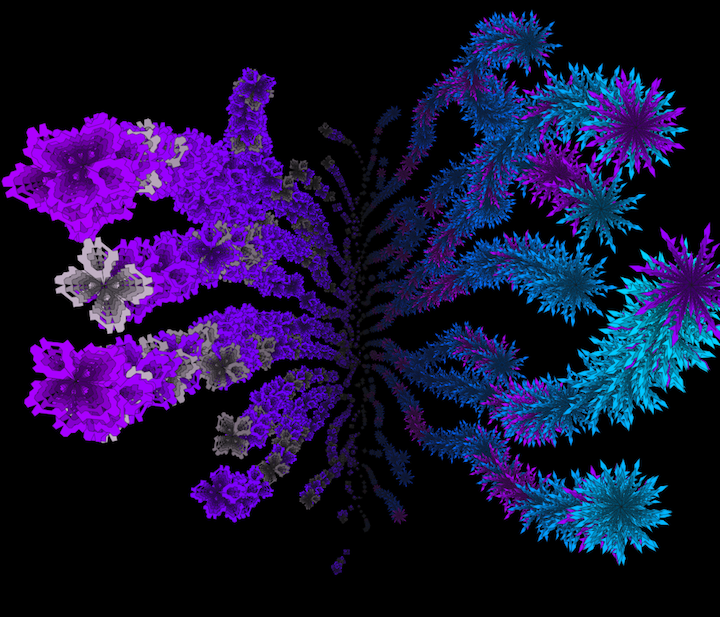

# Introduction

In this course, we'll use learn the basics of object oriented programming while learning the Java Language and the Processing Library.

### Information Dynamics:  Experience Design and Modeling Creativity

This course will explore computational modeling of Experience using a lens of modeling the dynamics of information flow, with a focus on learning in adaptive systems, cognition, memory, feelings, emotion, creativity as expressed through contemplative art practices,

#### Generative Art 

> Generative art refers to any art practice where the artist uses a system, such as a set of natural language rules, a computer program, a machine, or other procedural invention, which is set into motion with some degree of autonomy contributing to or resulting in a completed work of art. \[[Modeling Creativity, Tom D. De Smedt](https://www.clips.uantwerpen.be/sites/default/files/modeling-creativity.pdf)\]

