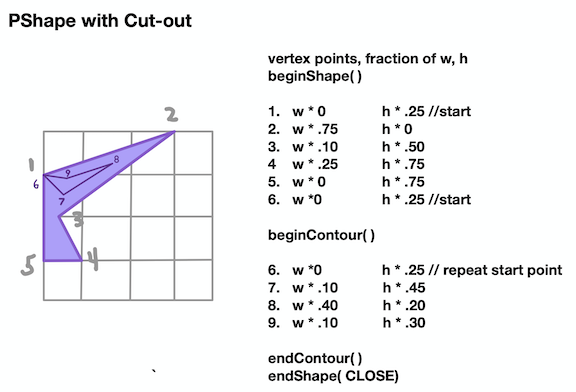
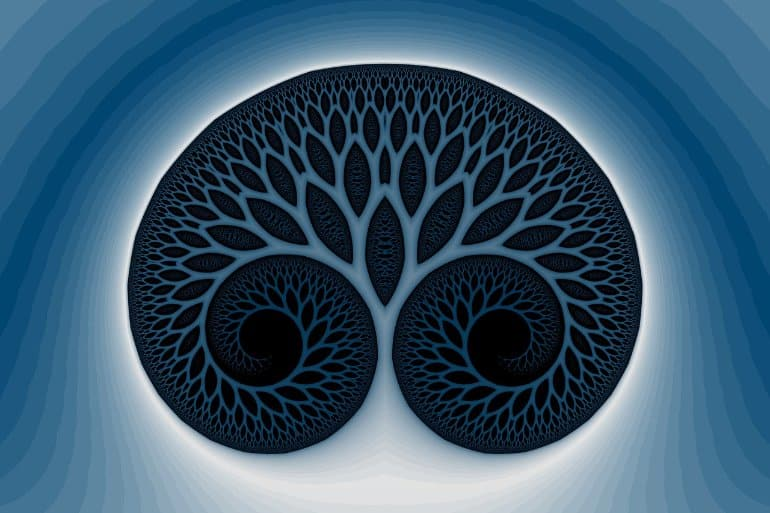

# A3: Repeat Patterns

.png>)

**Behavior:  Patterns:** Repetition using loops or recursion\
**Function**: Recursion:  Self-Similar Replication\
**Structure:** Recursion

If Life is a Game, These are the Rules:  _Cherie Carter Scott_

> **Rule 3: **_**There are no mistakes, only Lessons**_
>
> _**Growth is a process of experimentation, a series of trials, errors, and occasional victories**.  The **failed experiment** are as much a part of the process as the experiments that work. Cherie Carter Scott_
>
> _**Compassion:**  An Individual is capable of both great **compassion** and great **indifference,** he has it within his means to nourish the former and outgrow the latter._   Norman Cousins
>
> **Rule 4: A lesson is repeated until Learned**\
> **Lessons will be repeated** to you in various forms until you have learned them. When you have learned them, you can then on on to the next lesson.  &#x20;
>
> **Challenge:  Identify and release the patterns that you are repeating**&#x20;
>
> **Cultivate:  Awareness, Willingness, Patience, Acknowledge Causality**

## Assignment 3 Overview:&#x20;

The tabs below show examples for creating a **PShape that includes an inner contour**.  See the simple example of a program that includes code for a **recursive function** that creates a PShape pattern&#x20;







```java
//Code for shape above - with contour
//create custom PShape usign vertex points
PShape fallShapeContour( float w, float h, color c1 ) {
  PShape s = createShape(); //initialize PShape
  s.beginShape();
  s.vertex( 0, .25*h);  //1
  s.vertex( w*.75, 0);  //2
  s.vertex( w* .10, h* .50); //3
  s.vertex( w* .25, h* .75); //4
  s.vertex( w* 0, h* .75); //5
  s.vertex( 0, .25*h);  //6
  s.beginContour();
  s.vertex( 0, .25*h);  //6
  s.vertex( w* .10, h* .45); //7
  s.vertex( w* .40, h* .20); //8
  s.vertex( w* .10, h* .30); //9
  s.endContour();
  s.endShape(CLOSE);
  s.setFill( c1);
  return s;
}
```





#### Example of Recursive Function &#x20;

See [Gitbook Section](../project-1/recursion/) for Details on writing Recursive functions

```java
//Example code to create a simple recursive function

int maxCount = 5;
color c1 ;

void setup() {
  size( 600, 600); //use size(600,600,P2D) if possible
  colorMode( HSB, 360, 100, 100, 100);
  background(0);
  c1 = color ( 200, 100, 100);
}

//When mouse is pressed, draw pattern at mouse location
void draw() {
  if (mousePressed) {
    translate(mouseX, mouseY);
    PShape s = createShape1(100, 100, c1 );
    recursivePattern( s, maxCount, c1); //here level is initialized at 5 because we decrement it inside the recursive function
    resetMatrix();
  }
}

//Simple Recursive Function
//Parameter: PShape s - rendered on canvas
//Parameter: int count - specify the number of repeats: recursive calls
//Parameter: color - reduce brightness - with each recursion
//task is to set size, color, then render PShape on canvas
//Terminates when count is less than 0
//Required - global variable: maxCount - used to determine scaleFactor
void recursivePattern( PShape s, int count, color c1) {
  if (count <1 ) { //termination condition
    return; //stop function execution by returning from the function
  }
  float scaleFactor = map( count, maxCount, 1, 1.0, 0.5); 
  s.scale(scaleFactor, scaleFactor ); //- task - create PShape by calling the vertexShape function
  color curColor = color ( hue( c1), saturation( c1), brightness( c1) * 0.8, 50);
  s.setFill( curColor);
  shape( s, 0, 0); //draw the shape on the canvas at x=0,y=0.
  s.resetMatrix();
  recursivePattern( s,  count-1, curColor ); //recursive call - changed values for count, color
}


//Rounded rectangle
PShape createShape1( float w, float h, color c1 ) {
  PShape s = createShape( RECT, 0, 0, w, h, 10);
  s.setFill( c1);
  return s;
}

```



#### Example Basic Code Structure for Defining Region Boundaries

```java
int maxCount = 10;

void setup() {
  size( 600, 600);
  colorMode(HSB, 360, 100, 100, 100); //HSBA
  background(0);
}

void draw( ) {
  if (mousePressed) { //add region logic here
    translate( mouseX, mouseY); //in all cases
    
    if( mouseX > width/2 && mouseY < height/2){  //region 1
      color summerColor = color( 70, 100, 100, 100);  //lime
      PShape myShape = fallShape( 100, 100, summerColor); //create R1 shape
      drawMirroredShapes( myShape, summerColor); //render R1 pattern
      } //end region 1
      
      /*
      else if( region 2 logic? ){ //region 2
          //add code for R2: color, PShape, pattern
      }
      else if ( region 3 logic?){ //region 3
          //add code for R3: color, PShape, pattern
      }
      else{ //region 4 logic
         //add code for R4: color, PShape, pattern
      }
    
    */
    
    resetMatrix(); //in all cases
  }
}
//Function to display PShapes in a mirrored pattern
//Color uses small random variations of HSBA color components
//Using PShape transform methods
void drawMirroredShapes(PShape s, color c1   ) { 
  float hue = hue ( c1 ) + random( -15, 15 );
  float sat = saturation ( c1) - random( 0, 30);
  float bright = brightness( c1) - random( 0, 30);
  float alpha = alpha( c1) - random( 0, 40);
  color curColor = color (hue, sat, bright, alpha);
  s.setFill(curColor );
  shape( s, 0, 0); //draw one time
  s.scale( 1.0, -1.0); //mirror across x-axis
  shape( s, 0, 0); //draw 2nd  time
  s.resetMatrix();
}

//create custom PShape usign vertex points
PShape fallShape( float w, float h, color c1 ) {
  PShape s = createShape(); //initialize PShape
  s.beginShape();
  s.vertex( 0, .25 * h);  //1
  s.vertex( w*.75, 0);  //2
  s.vertex( w* .10, h* .50); //3
  s.vertex( w* .25, h* .75); //4
  s.vertex( w* 0, h* .75); //5
  s.endShape(CLOSE);
  s.setFill( c1);
  return s;
}
```



## Assignment 3 Details:  Recursion

### Recursive Patterns - Hand Sketching

1. **Hand Drawing:** Draw A [**Fibonacci spiral**](../project-1/recursion/#fibonacci-recursion-cycles-of-energy-flow-greater-than-growth-decay) using grid paper, draw a minimum of 7 cubes.&#x20;
   * **Gitbook:  Post photo** of your sketch on Gitbook
2. **Hand Drawing:** Draw any **simple branching pattern** inspired by recursion&#x20;
   * **Gitbook:  Post photo** of your sketch on Gitbook
3. **Hand Drawing:** Create **2 new Vertex PShapes** ( you must now have 4 functions that create / return vertex shapes)
   1.
      * **Draw 2 new PShapes** on **grid paper** to specify width, height, vertex points
        * One PShape must include contour&#x20;
        * **Gitbook:  Post photo** of your sketch on Gitbook
4.  **Gitbook:  Post an image** of your **Processing project's execution - the sketch canvas** should show patterns shown in each region.


### **Programming:  Processing Code: (submit as zip file)**

### 1. Custom PShapes (2 new functions)

**Total  of 4 functions to create and return a Pshape Object : all PShapes must use vertex points.  Reuse** 2 functions created in assignment 2. **Details:**   One PShape must use include a contour, all PShapes must use vertex points\
**Function signature:**\
**** ``` `**`PShape myShape1( float w, float h, color c1)`**

### **2. Recursive functions (2 new functions)  to Display PShapes in a Pattern**

**Function signature:** **`void displayRecursivePattern( Pshape myShape, color c1, int count)`**

### 3. Overall Program Specification

**Program:** Include new logic in **draw( )** to have custom pattern drawn in each region of the canvas.

**Required Global variable:**\
**int maxCount;** //specify number of recursion repeats – used in map( ) to control scaleFactor\
\
**setup() logic** – initialize size, colorMode HSB

**draw( ) logic – ( see diagram above for regions )**

* if mouse is pressed
* translate origin to mouse position, (remember to include code to resetMatrix )
  * if on the left side of the center-line: regions 1,2
    *   if on the top half: (region 1)

        * display Pshape pattern associated with region 1

        if on the bottom half (region 2)

        * display Pshape pattern associated with region 2
  * if on the right side of the center-line: regions 3,4
    *   if on the top half: (region 4)

        * display Pshape pattern associated with region 4

        if on the bottom half (region 3)

        * display Pshape pattern associated with region 3

#### **Include: Custom Functions:** Total of 8

* 4 Custom Functions to create PShapes, 1 must include a PShape w/contour (see above)
  * 2 PShape functions - using vertex points (from assignment 2)
  * 2 new PShape functions - using vertex points ( Assignment 3)
    * One PShape must include an inner contour  ( Assignment 3)
* 4 Custom Functions to create Patterns - use PShape as input parameter
  * 2 Custom Functions to create Patterns using PShapes – (from Assignment 2)&#x20;
  * 2 Custom Functions to create Recursive Patterns using PShapes (Assignment 3)

## Supplemental resources for Recursion, Iteration

### Recursion - Self-similar repetition, base-case, recursive step&#x20;

> In mathematics and computer science, a class of objects or methods exhibits **recursive behavior** when it can be defined by two properties:
>
> * A simple **base case** (or cases) — a terminating scenario that does not use recursion to produce an answer
> * A **recursive step** — a set of rules that reduces all successive cases toward the base case.  &#x20;
> * A [function](https://en.wikipedia.org/wiki/Function\_\(mathematics\)) may be **recursively** defined in terms of itself.\
>   &#x20;A familiar example is the [Fibonacci number](https://en.wikipedia.org/wiki/Fibonacci\_number) sequence: **F(n) = F(n − 1) + F(n − 2).** For such a definition to be useful, it must be reducible to non-recursively defined values: in this case F(0) = 0 and F(1) = 1. \
>   [Wikipedia](https://en.wikipedia.org/wiki/Recursion)


### Iteration: Repetition of a block of statements

> **Iteration** is the repetition of a process in order to generate an outcome.\
> \
> **Iteration** in computing is the technique marking out of a block of statements within a [computer program](https://en.wikipedia.org/wiki/Computer\_program) **for a defined number of repetitions.** That block of statements is said to be iterated; a computer scientist might also refer to that block of statements as an **"iteration"**.\
> \
> The primary difference is that **recursion can be employed as a solution without prior knowledge as to how many times the action will have to repeat,** while a successful **iteration requires that foreknowledge**[****\
> ****Wikipedia](https://en.wikipedia.org/wiki/Iteration)

#### Youtube Videos about Recursion and Fibonacci Sequence

1. &#x20;[https://www.youtube.com/watch?v=JSyQx9zdQAM](https://www.youtube.com/watch?v=JSyQx9zdQAM)
2. [https://www.youtube.com/watch?v=SjSHVDfXHQ4](https://www.youtube.com/watch?v=SjSHVDfXHQ4)
3. [https://www.youtube.com/watch?v=7bod8x0LgJs](https://www.youtube.com/watch?v=7bod8x0LgJs)
4. [https://www.youtube.com/watch?v=IGJeGOw8TzQ](https://www.youtube.com/watch?v=IGJeGOw8TzQ)\


## Inspiration - Recursive Experiencing






Negentropy -&#x20;






### Negentropic Success

> ...(we).....have studied how energy is [lost or gained in many types of systems](https://www.profoundliving.live/why-picking-up-your-socks-isnt-enough-or-how-negentropy-could-save-the-university) – including in [higher education](https://www.academia.edu/36783647/The\_Negentropic\_University), [leadership for online education](https://web.b.ebscohost.com/abstract?direct=true\&profile=ehost\&scope=site\&authtype=crawler\&jrnl=00349461\&AN=138635682\&h=vhDUW3VBg%2fzG4HqjKy0oUtlt7BS0ueCezkrAoMB5t8GG1ZJEcV0Auij03UKTMVSkYV7z6N%2fwu4ZTcR%2b2qC2Xqg%3d%3d\&crl=f\&resultNs=AdminWebAuth\&resultLocal=ErrCrlNotAuth\&crlhashurl=login.aspx%3fdirect%3dtrue%26profile%3dehost%26scope%3dsite%26authtype%3dcrawler%26jrnl%3d00349461%26AN%3d138635682), [workplace organizations](https://doi.org/10.1007/s11528-019-00448-5) and [online learning settings](https://doi.org/10.1145/3168360.3152716).
>
> **Our work suggests that when people keep the idea of negentropy in mind and take actions that limit or reverse energy loss, social systems are** [**more efficient and effective**](https://doi.org/10.1007/s11528-019-00448-5)**.** This might even make it [easier for people to achieve larger goals](https://hbr.org/2011/05/the-power-of-small-wins). In other words, yes, you should pick up that sock, and yes, you should improve your meetings, and doing so may allow you to see other ways to avoid future energy losses.





### 5 steps for negentropic success

From my colleagues’ and my research into negentropy, we have come up with five steps to reverse energy loss in in daily life.

1: Find the entropy.

Identify places where energy is lost in the social systems in your daily life. It’s helpful to think of it like a thermal map of the outside of your house that highlights where heat – or energy – is lost. A badly sealed window leaks heat energy. A poorly organized kitchen makes things hard to find. A badly designed new employee onboarding system can lead to serious legal problems later.

2: Prioritize the losses.

Identify the largest or most annoying losses and those that draw your attention most often. For example, perhaps that leaky kitchen faucet drives you crazy. Fixing it might make room in your mind to consider other improvements to your kitchen that would make it more functional.

3: Come up with a plan.

Identify actions that will reverse the energy losses you noted and plan ways to address the highest priorities first. You could start by fixing the leaky faucet or picking up your socks; if pre-pre-planning meetings are causing your organization a lot of trouble, analyze the problem and figure out how to fix it.

4: Try it out and pay attention.

Put the ideas into action, but stay focused on energy gains and losses. As you try to implement negentropic ideas, keep track of what works, how much effort it took and ideas you come up with for future negentropic actions.

5: Go beyond fixing and maintenance.

As you work to reverse energy losses, you may find that at times you are actually maintaining a social system that isn’t beneficial no matter how smoothly it works. Spending time improving an orientation to introduce new workers to a company culture may not be very useful if the culture itself needs to change. The best way to apply the idea of negentropy to social systems is to not only improve the small processes, but also look at the big picture and see if the status quo itself promotes energy loss.

Seeing things through a negentropic lens won’t solve a bad relationship or help you love a job you hate – those are complicated issues. However, if you begin to notice where energy is lost in your life, it will be easier to prioritize and act in ways that can improve the social systems around you.



### **Feelings are Always Conscious**

> **To manage life’s problems we use emotions as a compass. It is feeling that guides all learning from experience.** But biology provides one further drive to help us on our way:  Mark Solms


Mark Solms


> In order to solve the hard problem of consciousness, science needs to discern the laws governing **the mental function of ‘feeling’.** This is not just a matter of words. I marshaled considerable evidence to show that **feeling is the foundational form of consciousness,** its prerequisite. I also explained both **physiologically and mechanistically the difference between felt and unfelt needs and showed that feelings have concrete consequences.**  **‘Consciousness is not merely a subjective perspective upon the “real” dynamics of self-organizing systems; it is a function with definite causal powers of its own’.**  _Mark Solms_

> Hunger feels bad, and it feels good to relieve it by eating; a distended bowel feels bad, and it feels good to relieve it by defecating; pain feels bad, and it feels good to withdraw from the source of it. These are **bodily affects but the same applies to emotional ones**. Separation distress feels bad and we respond to it by seeking reunion. Fear feels bad and we escape it by fleeing the danger (and sometimes by fainting). Suffocation alarm and hunger and sleepiness and fear all feel bad, but they feel bad in different ways. **Getting rid of them, by contrast, feels good, also in different ways.”**

**The Law of Affect:**  voluntary behavior is guided by affect - You decide what to do or not to do on the basis of the felt consequences of your actions.

**Affective States: Mental States:** Affective States are hedonically valanced:  Good or Bad....Feeling sensations possess intrinsic value:  Good, Bad.  Pleasure and Unpleasure tell you how you are doing in relation to your biological needs.

**Affect and Arousal** are aspects of human experience that are essential for  survival.  Affect and arousal aspects of subjective human feelings have properties of  valence, magnitude, category, that are associated with unmet human drives. &#x20;

**Affective Experience is primarily a felt phenomena**, Feelings guide our behavior in conditions of uncertainty. **** Humans have the unique ability as complex organisms to 'register our own states - subjective being.

**Arousal accommodates emotional responsively and intentionality:** affective arousal enables volition

**Thinking is Virtual Action:** The capacity to try things out in the imagination - imaginary form of experience

**When feelings become conscious, drives measure demands made upon the mind for work.  A feeling disappears from consciousness when the need it announces it has been met. Felt needs are prioritized over unfelt needs. Priorities are determined by the relative strengths of your needs in relation to the range of opportunities afforded by your current circumstances. When you become aware of a need, when it is felt, it governs your voluntary behavior.  Choices can be made only if they are grounded in a value system...**

**Feelings make creatures like us do something necessary - they are measures of demands for work - Drive as a measure of the demand made upon the mind for work in consequence of its connection with the body**. **Affects are the subjective manifestation of drives - they convey which biological things are going well or badly for us and they arouse us to do something about them**&#x20;

There are **three types of affect:** homeostatic (interoceptive) and sensory (exteroceptive) ones (both of which are bodily) and **emotional ones** (which involve the body but cannot be described as ‘bodily’ in any simple sense).”

Affect: Primary Emotions, Feelings:  _Mark Solms_

* Lust
* Seeking - exploratory foraging: state: curiosity - default emotion
* Rage - Fight
* Fear - Flight
* Panic / Grief
* Care
* Play

Secondary Emotions: guilt, envy, shame, jealousy arise from conflict situations - learnt constructs - hybrids of emotions and cognition


## Culture as Patterns - Impacts of Social Pressures and Influences



### Rececca Solnit: Recollections of My Nonexistence - The Ordinary Voiceless



