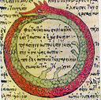

# A3: Repeat Patterns

**Behavior:  Patterns:** Looping, Fractal  
**Function**: Self-Similar Replication  
**Structure:** Recursion

If Life is a Game, These are the Rules:  _Cherie Carter Scott_

> **Rule 3:** _**There are no mistakes, only Lessons**_
>
> _**Growth is a process of experimentation, a series of trials, errors, and occasional victories**.  The **failed experiment** are as much a part of the process as the experiments that work. Cherie Carter Scott_
>
> _**Compassion:**  An Individual is capable of both great **compassion** and great **indifference,** he has it within his means to nourish the former and outgrow the latter._   Norman Cousins
>
> **Rule 4: A lesson is repeated until Learned  
> Lessons will be repeated** to you in various forms until you have learned them. When you have learned them, you can then on on to the next lesson.   
>
> **Challenge:  Identify and release the patterns that you are repeating** 
>
> **Cultivate:  Awareness, Willingness, Patience, Acknowledge Causality**

## Assignment 3:  Recursive Functions

#### 1.  Hand Drawing: Draw A Fibonacci spiral using grid paper with a minimum of 

#### 2.  Hand Drawing:  Draw a branching pattern

#### 3.  Hand Drawing:  Create 2 Vertex Shapes that include a contour

#### 4.  Programming:  Processing Program

1. Write 2 Recursive Functions that take a PShape as an input parameter and display PShapes in a pattern
2. 

### Recursion - Self-similar repetition, base-case, recursive step 

> In mathematics and computer science, a class of objects or methods exhibits **recursive behavior** when it can be defined by two properties:
>
> * A simple **base case** \(or cases\) — a terminating scenario that does not use recursion to produce an answer
> * A **recursive step** — a set of rules that reduces all successive cases toward the base case.   
> * A [function](https://en.wikipedia.org/wiki/Function_%28mathematics%29) may be **recursively** defined in terms of itself.  A familiar example is the [Fibonacci number](https://en.wikipedia.org/wiki/Fibonacci_number) sequence: **F\(n\) = F\(n − 1\) + F\(n − 2\).** For such a definition to be useful, it must be reducible to non-recursively defined values: in this case F\(0\) = 0 and F\(1\) = 1.  [Wikipedia](https://en.wikipedia.org/wiki/Recursion)

### Iteration: Repetition of a block of statements

> **Iteration** is the repetition of a process in order to generate an outcome.  
>   
> **Iteration** in computing is the technique marking out of a block of statements within a [computer program](https://en.wikipedia.org/wiki/Computer_program) **for a defined number of repetitions.** That block of statements is said to be iterated; a computer scientist might also refer to that block of statements as an **"iteration"**.  
>   
> The primary difference is that **recursion can be employed as a solution without prior knowledge as to how many times the action will have to repeat,** while a successful **iteration requires that foreknowledge**[  
> ****Wikipedia](https://en.wikipedia.org/wiki/Iteration)

#### Youtube Videos about Recursion and Fibonacci Sequence

1.  [https://www.youtube.com/watch?v=JSyQx9zdQAM](https://www.youtube.com/watch?v=JSyQx9zdQAM)
2. [https://www.youtube.com/watch?v=SjSHVDfXHQ4](https://www.youtube.com/watch?v=SjSHVDfXHQ4)
3. [https://www.youtube.com/watch?v=7bod8x0LgJs](https://www.youtube.com/watch?v=7bod8x0LgJs)
4. [https://www.youtube.com/watch?v=IGJeGOw8TzQ](https://www.youtube.com/watch?v=IGJeGOw8TzQ) 

## Inspiration

### **Feelings are Always Conscious**

> **To manage life’s problems we use emotions as a compass. It is feeling that guides all learning from experience.** But biology provides one further drive to help us on our way:  Mark Solms



> In order to solve the hard problem of consciousness, science needs to discern the laws governing **the mental function of ‘feeling’.** This is not just a matter of words. I marshaled considerable evidence to show that **feeling is the foundational form of consciousness,** its prerequisite. I also explained both **physiologically and mechanistically the difference between felt and unfelt needs and showed that feelings have concrete consequences.**  **‘Consciousness is not merely a subjective perspective upon the “real” dynamics of self-organizing systems; it is a function with definite causal powers of its own’.**  _Mark Solms_

> Hunger feels bad, and it feels good to relieve it by eating; a distended bowel feels bad, and it feels good to relieve it by defecating; pain feels bad, and it feels good to withdraw from the source of it. These are **bodily affects but the same applies to emotional ones**. Separation distress feels bad and we respond to it by seeking reunion. Fear feels bad and we escape it by fleeing the danger \(and sometimes by fainting\). Suffocation alarm and hunger and sleepiness and fear all feel bad, but they feel bad in different ways. **Getting rid of them, by contrast, feels good, also in different ways.”**

**The Law of Affect:**  voluntary behavior is guided by affect - You decide what to do or not to do on the basis of the felt consequences of your actions.

**Affective States: Mental States:** Affective States are hedonically valanced:  Good or Bad....Feeling sensations possess intrinsic value:  Good, Bad.  Pleasure and Unpleasure tell you how you are doing in relation to your biological needs.

**Affect and Arousal** are aspects of human experience that are essential for  survival.  Affect and arousal aspects of subjective human feelings have properties of  valence, magnitude, category, that are associated with unmet human drives.  

**Affective Experience is primarily a felt phenomena**, Feelings guide our behavior in conditions of uncertainty. ****Humans have the unique ability as complex organisms to 'register our own states - subjective being.

**Arousal accommodates emotional responsively and intentionality:** affective arousal enables volition

**Thinking is Virtual Action:** The capacity to try things out in the imagination - imaginary form of experience

**When feelings become conscious, drives measure demands made upon the mind for work.  A feeling disappears from consciousness when the need it announces it has been met. Felt needs are prioritized over unfelt needs. Priorities are determined by the relative strengths of your needs in relation to the range of opportunities afforded by your current circumstances. When you become aware of a need, when it is felt, it governs your voluntary behavior.  Choices can be made only if they are grounded in a value system...**

**Feelings make creatures like us do something necessary - they are measures of demands for work - Drive as a measure of the demand made upon the mind for work in consequence of its connection with the body**. **Affects are the subjective manifestation of drives - they convey which biological things are going well or badly for us and they arouse us to do something about them** 

There are **three types of affect:** homeostatic \(interoceptive\) and sensory \(exteroceptive\) ones \(both of which are bodily\) and **emotional ones** \(which involve the body but cannot be described as ‘bodily’ in any simple sense\).”

Affect: Primary Emotions, Feelings:  _Mark Solms_

* Lust
* Seeking - exploratory foraging: state: curiosity - default emotion
* Rage - Fight
* Fear - Flight
* Panic / Grief
* Care
* Play

Secondary Emotions: guilt, envy, shame, jealousy arise from conflict situations - learnt constructs - hybrids of emotions and cognition

## Culture as Patterns - 

### Rececca Solnit: Recollections of My Nonexistence - The Ordinary Voiceless



