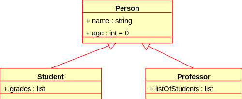

# A4 - Objects:  Things and No Thing

#### If Life is a Game, These are the Rules:  _Cherie Carter Scott_

> **Rule 5 - Learning Does Not End  
>   
> There is no part of life that does not contain lessons   
>      -  if you are alive, there are lessons to be learned.**
>
> **Learn to embrace your role as a perpetual student**
>
>  "**Surrender** - does not obstruct our power, it enhances it" Marianne Williamson  
>   
> **Commitment** - "Our greatest weakness lies in giving up.  The most certain way to succeed is always to try just one more time."  Thomas Edison  
>   
> **Humility** - "and when you have reached the mountaintop, then you shall begin to climb." Kahlil Gibran   
>   
> **Flexibility** - "To improve is to change;  to be perfect is to change often."  Winston Churchill

## No Thing: Energy Flows to create alternate realities

### Energy flows of Lives, Learning and Loves - Collaborative Learning Collectives

See video linked below to learn about Information Dynamics - Energy Flows of Life



## Objects - Things:  Attributes and Behaviors



## Object Oriented Paradigms

**Humans perceive the world as being composed of objects.**  Human object perception - can be understood as 'snapshots' of transient sensory input associated with a 'system' of condensed matter; matter and energy are different forms of the same phenomena.  

**Energy  \( change \) flows in continuous waves** - analog oscillations - Energy is a measure of change.  Humans perceive change as a discrete measured difference between observations. __Measured values can be stored as data. Without **Human observation** - no change can be quantified.   Humans use language to communicate knowledge across time and space.   Discrete **data represents relational** measurements of change phenomena.  

Human languages provide a way to communicate about human subjective perception of some observed change.  



## Object Design: 

### The Situated Function, Behavior, Structure Framework [\[ Wikipedia \] ](https://en.wikipedia.org/wiki/Function-Behaviour-Structure_ontology#:~:text=The%20Function%2DBehaviour%2DStructure%20ontology%20is%20the%20basis%20for%20two,and%20structure%2C%20and%20subclasses%20thereof.)

> The basic assumption underpinning the **situated FBS framework** is that designing involves interactions between **three worlds**: **the external world, the interpreted world and the expected world.** 
>
> * **External world:** contains things in the “outside” world
> * **Interpreted world**: contains experiences, percepts and concepts, formed by the designer’s interactions with the external world
> * **Expected world:** contains expectations of the results of the designer’s actions, driven by goals and hypotheses about the current state of the world
>
> **The three worlds are interconnected by four classes of interaction:**
>
> * **Interpretation:** transforms variables sensed in the external world into variables within the interpreted world
> * **Focussing:** selects subsets of variables in the interpreted world and uses them as goals in the expected world
> * **Action:** changes the external world according to the goals and hypotheses composing the expected world
> * **Constructive memory:** produces memories as a result of re-interpreting past experiences.



#### From Sensing to Meaning:  Semiosis

> **Semiosis** \(from the [Greek](https://en.wikipedia.org/wiki/Greek_language): σημείωσις, sēmeíōsis, a derivation of the verb σημειῶ, sēmeiô, "to mark"\), or **sign process**, is any form of [activity](https://en.wikipedia.org/wiki/Action_%28philosophy%29), conduct, or **process that involves** [**signs**](https://en.wikipedia.org/wiki/Sign_%28semiotics%29)**, including the production of** [**meaning**](https://en.wikipedia.org/wiki/Meaning_%28semiotics%29)**.** A sign is anything that communicates a meaning, that is not the sign itself, to the interpreter of the sign. The meaning can be intentional such as a word uttered with a specific meaning, or unintentional, such as a symptom being a sign of a particular medical condition. Signs can communicate through any of the senses, visual, auditory, tactile, olfactory, or taste.

> For humans, semiosis is an aspect of the wider systems of social interaction in which information is exchanged. It can result in particular types of social encounter, but the process itself can be constrained by social [conventions](https://en.wikipedia.org/wiki/Convention_%28norm%29) such as propriety, privacy, and disclosure. This means that no social encounter is reducible to semiosis alone, and that semiosis can only be understood by identifying and exploring all the conditions that make the transmission and reception of signs possible and effective. When two individuals meet, the ways in which they think, the specific identities they assume, the emotional responses they make, and the beliefs, motives, and purposes they have, will frame the situation as it develops dynamically and potentially test the legitimacy of the outcomes. All these elements are, to a greater or lesser extent, semiotic in nature in that prevailing codes and [values](https://en.wikipedia.org/wiki/Value_%28Semiotics%29) are being applied. Consequently, where the line is drawn between semiosis and semiotics will always be somewhat arbitrary.  
> [Wikipedia](https://en.wikipedia.org/wiki/Semiosis)

**See also:**  [**Biosemiotics - Wikipedia**](https://en.wikipedia.org/wiki/Biosemiotics)\*\*\*\*

> **Biosemiotics** \(from the [Greek](https://en.wikipedia.org/wiki/Ancient_Greek) βίος bios, "life" and σημειωτικός sēmeiōtikos, "observant of signs"\) is a field of [semiotics](https://en.wikipedia.org/wiki/Semiotics) and [biology](https://en.wikipedia.org/wiki/Biology) that studies the prelinguistic meaning-making, or production and [interpretation](https://en.wikipedia.org/wiki/Interpretation_%28logic%29) of [signs](https://en.wikipedia.org/wiki/Sign_%28semiotics%29) and [codes](https://en.wikipedia.org/wiki/Code_%28semiotics%29) and their [communication](https://en.wikipedia.org/wiki/Communication) in the biological realm.[\[1\]](https://en.wikipedia.org/wiki/Biosemiotics#cite_note-1)
>
> Biosemiotics attempts to integrate the findings of biology and semiotics and proposes a [paradigmatic shift](https://en.wikipedia.org/wiki/Paradigm_shift) in the scientific view of [life](https://en.wikipedia.org/wiki/Life), in which [semiosis](https://en.wikipedia.org/wiki/Semiosis) \(sign process, including [meaning](https://en.wikipedia.org/wiki/Meaning_%28semiotics%29) and interpretation\) is one of its immanent and intrinsic features.



UML - Class Diagram - [Wikipedia](https://en.wikipedia.org/wiki/Class_diagram)  
  
The image below shows the hierarchical view of a series of   

UML Class Diagram - [Wikipedia](https://en.wikipedia.org/wiki/Class_diagram)

> In [software engineering](https://en.wikipedia.org/wiki/Software_engineering), a **class diagram** in the [Unified Modeling Language](https://en.wikipedia.org/wiki/Unified_Modeling_Language) \(UML\) is a type of **static structure diagram** that describes the structure of a system by showing the system's [classes](https://en.wikipedia.org/wiki/Class_%28computer_science%29), their **attributes, operations \(or methods\), and the relationships among objects.**
>
> The class diagram is the main building block of [object-oriented](https://en.wikipedia.org/wiki/Object-oriented_programming) modeling. It is used for general [conceptual modeling](https://en.wikipedia.org/wiki/Conceptual_model) of the structure of the application, and for detailed modeling translating the models into [programming code](https://en.wikipedia.org/wiki/Programming_code). Class diagrams can also be used for [data modeling](https://en.wikipedia.org/wiki/Data_modeling).[\[1\]](https://en.wikipedia.org/wiki/Class_diagram#cite_note-1) The classes in a class diagram represent both the main elements, interactions in the application, and the classes to be programmed.
>
> In the diagram, classes are represented with boxes that contain three compartments:
>
> * The top compartment contains the **name of the class.** It is printed in bold and centered, and the first letter is capitalized.
> * The middle compartment contains the **attributes of the class.** They are left-aligned and the first letter is lowercase.
> * The bottom compartment contains **the operations the class can execute**. They are also left-aligned and the first letter is lowercase.
>
> A class with three compartments.
>
> In the design of a system, a number of classes are identified and grouped together in a class diagram that helps to determine the static relations between them. With detailed modeling, the classes of the conceptual design are often split into a number of subclasses.
>
> In order to further describe the behavior of systems, these class diagrams can be complemented by a [state diagram](https://en.wikipedia.org/wiki/State_diagram) or [UML state machine](https://en.wikipedia.org/wiki/UML_state_machine).[\[2\]](https://en.wikipedia.org/wiki/Class_diagram#cite_note-SWA09-2)




### Objects and Agents

Just as we can consider organic and inorganic forms in the real world, these same concepts are metaphorically mapped  to objects and agents in the world of software design, modeling, and simulation.  Agents are objects that have additional complexity which may have higher order logic for example, the agent behavior may be dependent on the agent's state, ex: idle, walk, attack, collaborate.

### Dynamics: Frame-based Paradigm

Simulation Engines and Multimedia Software platforms use frame-based execution to enable programming of dynamic object behaviors.  It is the dynamic nature of the real-world that is sublime and subtle that makes it difficult for humans to understand the elegant sophistication of our own organic hardware / software systems.  When thinking in the context of video games,  it is helpful to consider the nature of the Player, NPC, and other functional and interactive game objects.  It is helpful to use our imagination to contemplate the nature of human experiential reality...it is the interactions between objects that determine changes in the state of gameplay...Whereas the NPC gameObjects have action-states and associated behaviors, the player gameObject 

### Modeling Systems of Connected Autonomous Objects:

Here we want to consider the difference between modeling static deterministic processes as compared to systems with non-deterministic behavior....it is these non-linear interactions that most closely reflect the phenomena felt in the 'real' world.    
  
We are at a point in time, space, culture, cyber-technical sophisitation that we are rapidly approaching a bifurcation point - a singularity.    
  
Computational Generative Art: Modeling Emergence and transformational phenomena - self-adaptive collaborative systems.....that is what humans are.  The neurobiological, evoloutionary ecologies ....capable of describing the nature of reality: ever evolving forms of integrated informational phenomena .... intelligence....the combination of human and machine intelligence.  The question is:  What can we do to impact the outcome .... does it matter?  The Precipice...General AI - Generative Art....able to learn ... the computational nature of optimal decision making:  Understanding the nature of the 'world'.  The world is 



## Assignment 4 - Details:

#### Watch the Video 

#### Submit 2 paragraph document.

## Inspiration: 

## "To Change with Change is the Changeless State"



> “To change with change is the changeless state.”  **Bruce Lee**

**Bruce Lee believed that individuals, societies and cultures need to change with change. The world is changing quickly and we want to do what we can to help it be for the better. To spark positive change and growth, there is much work and healing to be done.**

> _**Under the heavens, under the sky, we are all one family.” –Bruce Lee**_

**Bruce Lee was an ally of humanity and believed that if everyone helped his neighbor, no one would be without help.**

> ### "BE WATER, MY FRIEND. Empty your mind. Be formless, shapeless, like water. You put water into a cup, it becomes the cup. You put water into a bottle, it becomes the bottle. You put it into a teapot, it becomes the teapot. Now water can flow or it can crash. Be water, my friend."



> **Magic, Error and Terror:**  
> Modern brain science has produced extraordinary insight into the functioning of the human brain. **This book combines some of these results with the idea of subconscious and conscious models. It then explores how these models often generate magic, sometimes error, and occasionally terror.** **Subconscious models help us understand how psychotherapy changes minds, why fatigue is an emotion, how breathing affects our well-being, and how we may give mind and body a rest.** **Conscious models explain some instances of deception in medicine, economics, politics, and religion.** **Subconscious and conscious models together allow us to identify nonsensical questions.** The age-old question "Do we have free will?" is one such case. Hence, this question cannot be answered. This book offers a kaleidoscope of topics and cases. More ideas about subconscious and conscious models and their effects will surely occur to you as you read.   Klaus Truemper









