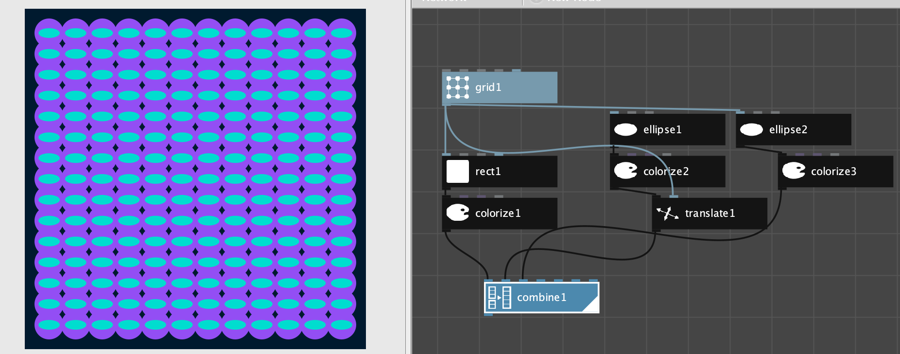

# Assignment 1: Meta, Metta

## Exploration of Concepts, Feelings: Meta, Metta 

> "the quality of the **imagination** is **to** **flow**, and not to freeze" Ralph W. Emerson

**Feeling Flow: Embodied:** positive affect, calm, low-activation states, low stress   
**Express Concepts**: Using geometric forms, colors to represent ideas.

### Meta, Metta: Higher Levels of Abstraction, Loving Kindness 

[**Meta:**  ](http://www.literaturepage.com/read/emersonessays2-17.html#:~:text=Ralph%20Waldo%20Emerson%3A%20Essays%2C%20Second%20Series&text=The%20religions%20of%20the%20world,flow%2C%20and%20not%20to%20freeze.)**Meta** \(from the [Greek](https://en.wikipedia.org/wiki/Ancient_Greek) μετα-, [meta-](https://en.wiktionary.org/wiki/meta-), meaning "after" or "beyond"\) is a prefix meaning more comprehensive or transcending[ \[Wikipedia\]](https://en.wikipedia.org/wiki/Meta)

[**Metta**](https://en.wikipedia.org/wiki/Maitr%C4%AB) ****: Mettā is a Pali word, from maitrī itself derived from mitra which, states Monier-Williams, means "friendly, amicable, benevolent, affectionate, kind, good-will",[\[13\]](https://en.wikipedia.org/wiki/Maitr%C4%AB#cite_note-MWD-13) as well as a form of "love, amity, sympathy [\[Wikipedia\]](https://en.wikipedia.org/wiki/Maitr%C4%AB#Maitr%C4%AB_and_Mett%C4%81)

## Assignment Tasks:

Review the assignment tasks,  look through the [**Inspiration**](../project-1/beginshape_-_vertex_shapes/diagram-and-art-expression.md) ****content below to find links, ideas, etc. Complete the tasks to create your gitbook and a gitbook page that documents your process. Submit on eLearning using the submission template.

### 1. Create your personal [Gitbook](https://www.gitbook.com/): 

You will submit screenshot and a link to your gitbook page as part of your assignment submission.

1. Recommended: Create a [**GitHub Account**](https://github.com/)\*\*\*\*
2. Create a [**Gitbook**](https://www.gitbook.com/) Account using your GitHub account.
3. Create a Gitbook, Private, Personal Notes:  Name it: 
4. Create a page: Assignment 1:
5. Find: Share-Link - you'll include this in your submission document 
6. After completing steps below, take **a screenshot** of a portion of your gitbook page using the share link to open as a **web-document** \(not in edit mode\)

### 2. Abstract Concepts - Concrete Feelings: meta, metta, loving kindness 

1. **Song:**  **Feeling Flow:** Select and list a song that evokes **positive, relaxing, calm feelings** for you: 
   1. Provide a link to the song, artist, lyrics, or album.
   2. **Example:**  Wildfire by the Wild Feathers
   3. [https://genius.com/The-wild-feathers-wildfire-lyrics](https://genius.com/The-wild-feathers-wildfire-lyrics)
2. **Conceptual art - Concept: Meta, Metta**

   **Create a Sol Lewitt** inspired sketch to explore the concepts of metta, and/or meta

   1. **Create a simple pencil sketch on paper and list the rules,  procedures** used to create the artwork so that someone else could create the same artwork from the listed rules. 
   2. **Gitbook: Take a screenshot** of the sketch, **insert the image** on your gitbook page
   3. **Gitbook:** **List the procedure, rules** that you followed in making the sketch.
   4. **Gitbook:**  **Paragraph:** Include one or two sentences using paragraph markup to explain the connection between the concept - idea, and the artwork - expression

3. \*\*\*\*[**Data-Flow, Nodebox:** ](assignment-1.md#5-nodebox-tom-d-desmedt)**Procedural, Generative Design**
   1. [ **Download, Install Nodebox**](https://www.nodebox.net/download/)\*\*\*\*
   2.  Open Nodebox, Open Examples from the Edit Menu: 
   3.  Select an Example program.  
   4. Take a screenshot of the starting design
   5. **Customize:** Make Modifications to several nodes, add a node to create your version of the design
   6. Take a Screenshot of the final design
   7. **Gitbook:** Insert both images into gitbook.
   8. **Gitbook:** Write a simple description of some of the changes you made to create your version.
4. \*\*\*\*[**Code - Java, Processing:**](../getting-started/pde-code-editor.md)  **Create simple Processing program** that uses shapes, colors to represent the concepts of **meta and/or metta.**
   1. **Gitbook:**  Image:  insert a screenshot of your canvas as an image on your gitbook.
   2. **Gitbook:**  Code: Copy and paste as code on your gitbook.
   3. **Gitbook:**  Paragraph: Write a description of how your design reflects your concept.

## Inspirations: 

### Book: [If Life is a Game, These are the Rules:](../resources-and-references/resources/games-rules.md)  **Cherie Carter-Scott**

**Rule 1: You will receive a body**

* Acceptance
* Self-Esteem
* Respect
* Pleasure

### 2.  Introduction to Mindfulness: 

 [Mindfulness Awareness Research Center](https://www.uclahealth.org/marc/covid19-mindfulness) UCLA MARC- Covid Mindfulness Resources



[Metta:  Loving Kindness Meditation](https://www.uclahealth.org/marc/mpeg/05_Loving_Kindness_Meditation.mp3) UCLA MARC - mp3 - audio

### **3. Inspiration Artist:** 

### **Sol Lewitt - Conceptual, Minimal Art**

> The **idea** is the **machine** that makes the art   **Sol Lewitt**

> [LeWitt ](https://en.wikipedia.org/wiki/Sol_LeWitt)is regarded as a founder of both [Minimal](https://en.wikipedia.org/wiki/Minimal_art) and [Conceptual art](https://en.wikipedia.org/wiki/Conceptual_art).[\[4\]](https://en.wikipedia.org/wiki/Sol_LeWitt#cite_note-GuggenheimMuseum-4) His prolific two and three-dimensional work ranges from wall drawings \(over 1200 of which have been executed\) to hundreds of works on paper extending to structures in the form of [towers](https://en.wikipedia.org/wiki/Tower), [pyramids](https://en.wikipedia.org/wiki/Pyramid), geometric forms, and progressions. These works range in size from books and gallery-sized installations to [monumental](https://en.wikipedia.org/wiki/Monument) outdoor pieces. [Wikipedia](https://en.wikipedia.org/wiki/Sol_LeWitt)

> In conceptual art the **idea of concept** is the most important aspect of the work.1 **When an artist uses a conceptual form of art, it means that all of the planning and decisions are made beforehand and the execution is a perfunctory affair.** The **idea becomes a machine that makes the art.** This kind of art is not theoretical or illustrative of theories; **it is intuitive,** it is involved with all types of mental processes and it is purposeless. It is usually free from the dependence on the skill of the artist as a craftsman. It is the **objective of the artist who is concerned with conceptual art to make his work mentally interesting to the spectator, and therefore usually he would want it to become emotionally dry.** There is no reason to suppose, however, that the conceptual artist is out to bore the viewer. It is only the expectation of an emotional kick, to which one conditioned to expressionist art is accustomed, that would deter the viewer from perceiving this art  [Paragraphs on Conceptual Art](../resources-and-references/resources/conceptual-art.md#paragraphs-on-conceptual-art-sol-lewitt), ,







#### [Paragraphs on Conceptual Art - Sol Lewitt: pdf](https://monoskop.org/images/3/3d/LeWitt_Sol_1967_1999_Paragraphs_on_Conceptual_Art.pdf)

### 4. [Modeling Creativity:](../resources-and-references/resources/creativity.md#modeling-creativity-tom-d-desmedt)  Tom D. DeSmedt,

> Intuitively, a **model** for **\(artistic\) artificial creativity** appears to involve the steps illustrated in figure 1. A **“good idea”**, that is, a novel and appropriate solution to a given problem, is selected or **combined from a pool of many possible ideas** \(chapters 4 and 5\). **A work \(of art\) that captures this idea is then created** \(chapters 2 and 3\). **The work is then evaluated** by the author or a community of knowledgeable peers \(chapters 6 and 7\). Following a **negative evaluation, the idea is subsequently adapted** \(chapter 1\). We will test this conjecture in a number of case studies and ground it in the literature.



Valence \(Tom De Smedt, Lieven Menschaert & Ludivine Lechat, 2010\) is an interactive installation developed in NodeBox for OpenGL \([http://www.cityinabottle.org/nodebox](https://www.youtube.com/redirect?q=http%3A%2F%2Fwww.cityinabottle.org%2Fnodebox&redir_token=QUFFLUhqbWl4WWl4T0pKTFR1WEpuOV9fenNSbElrcE5Od3xBQ3Jtc0tuSHU4bXcybWszMXg1dXFiMnlJbVk1dzJJVWluZ3c5MnZHRWZGWXZNTlB6YnBnTVIyQW1TWUtCbGFTUnFvcmhUT3hwS2JhVG1INk5QVlN5aEpFOU5HeG01V0xTY2RNRGdZcU1QZDZua0p2endmelN3Zw%3D%3D&event=video_description&v=9ZTy5P8ud0c)\) **that represents the player's affect \(relaxation or arousal\) by measuring alpha brain waves, using a wireless EEG headset.**

### 5. [Nodebox: ](https://www.nodebox.net/download/) Tom D. DeSmedt

Nodebox is a visual programming application based on the paradigm of data-flow, as opposed to control-flow paradigm used in Java.  Generative art, parametric architecture and design applications often use the data-flow paradigm which uses a network of connected nodes to represent transformations to data that flows through the system.

