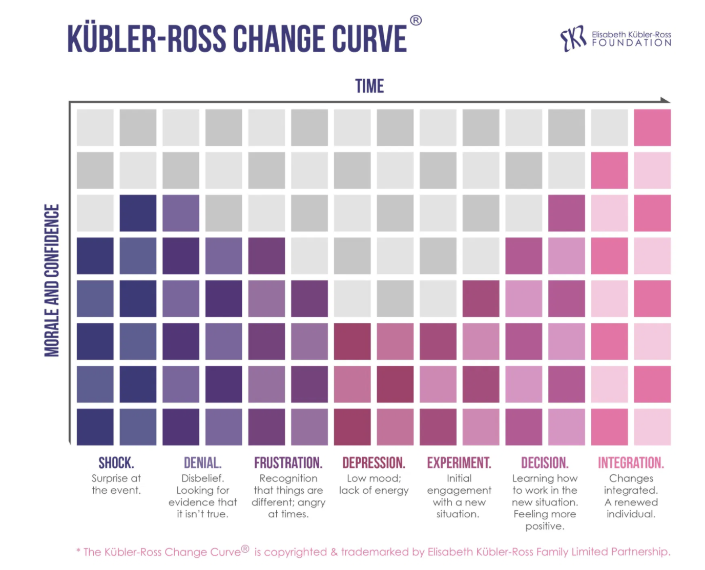

# A2: Functions, Emotions

### Overview: Computational Dynamics of Being _\(and Doing\)_

> "Life is a succession of **lessons** which must be lived to be understood."   
> Helen Keller

> **Rule 2: "You will be presented with lessons"**   
> 'You are enrolled in a full-time informal school called "life." Each day in this school you will have the **opportunity to learn lessons**.  **You may like the lessons or hate them**, but **you have designed** them as a part of your curriculum.'    
> Cherie Carter Scott:  _If Life is a Game, These are the Rules_

## Leveling-up in the Game of Life: 

#### Event-Driven Experience: Emotions, Cognition, Behaviors

#### Compass:  Tool for Orienteering and Way-finding: Align with Flows of Hidden Forces

Just as Einstein's curiosity about the alignment of a **compass needle** to indicate the hidden force-field corresponding to the **energy flows of magnetic fields,** useful for orienting in the physical world. **Emotions can be considered as parameters for a personal intuition compass,** a tool for way-finding where emotions can be attuned to align with energy flows of  information integration: growth, learning, adaptation, evolution, leveling-up.   

## Creating A Personalized Dynamic Compass

### 1. Song: Emotional Dynamics 

1. **Song:**  **Emotional Dynamics:** Select and list a song that reflects **dynamic rhythms** that correspond to the **changing nature of opposite emotions.** 
2. **Gitbook: Provide a lin**k to the song, artist, lyrics, or album.
3. **Example:  John Prine:** **That's the way the world goes around** [https://www.youtube.com/watch?v=wvY02SSj450](https://www.youtube.com/watch?v=wvY02SSj450) [https://genius.com/John-prine-thats-the-way-that-the-world-goes-round-lyrics](https://genius.com/John-prine-thats-the-way-that-the-world-goes-round-lyrics)

#### First Steps - Mapping Emotions to a Spatial Representational Form

### 2.  Hand Draw:  Emotions and Colors Wheel:

**Identifying emotions** can improve emotional self-awareness and can be useful in developing skill in cognitive reappraisal to enhance emotional self-regulation. \([See Below](assignment-2-functions-of-color.md#emotion-classification-dimensional-models-pad-pleasure-arousal-dominance)\) Several models of emotion classification exist that are useful in understanding the nature of emotions. \([See Emotion Classification\)](assignment-2-functions-of-color.md#emotion-classification-dimensional-models-pad-pleasure-arousal-dominance).  [Kandinsky](assignment-2-functions-of-color.md#wassily-kandinsky-concerning-the-spiritual-in-art) art theories associate colors with emotion /feelings in the creation of his expressionist art. 

1. **On sketch paper**, draw a wheel and divide into **8 arcs.**  
2. Along the outside of the circle, write an **emotion / feeling next to each arc section.** 
3. **Choose a color** to associate with each **emotion/ feeling**, add selected colors to the the corresponding arcs.
4. optional see: [emotions list](../project-1/modeling-emotions/#hour-glass-emotional-dimensions-wikipedia), [wikipedia list](https://simple.wikipedia.org/wiki/List_of_emotions)
5. **Gitbook:  Post photo** of your sketch on Gitbook
6. **Gitbook:**  **Create a table:** for each ****of your emotions, determine and list as either positive or negative valanced.

_see example gitbook table below_

| Positive | Negative |
| :--- | :--- |
| Joy | Anger |
| Serenity | Disgust |

### 3.  Hand Draw:  2D-Mapping Emotions: Affect, Arousal

Some models of Emotion consider that emotions can be classified according to 2 or more dimensions: **affect** \( **unpleasant:** negative,  **pleasant:** positive\), and **arousal:** \(**intense:** positive, **mild:** negative\) , _valence is positive, negative_ as shown in the image below for the [Circumplex Model of Emotions](assignment-2-functions-of-color.md#circumplex-model-of-emotions).  

* Using the 8 emotions that you identified in part 1: 
* Sketch a **circumplex diagram** with labeled axis: 
  * **x-axis: affect:** unpleasant \(left\), pleasant \(right\)
  * **y-axis: arousal:** intense \(up\), mild \(down\)
* Write your emotions in the associated quadrant of the circle based on the affect and arousal level of these emotions.   
* **Select one color** for each of the 4 regions of your diagram 
* Add **color** to each region using the selected colors
* **Gitbook: post a photo** of your sketch

### 4.  **Hand Draw:  4 Custom Shapes for Emotion Regions**

* For each region of your diagram: design / sketch a custom simple motif using combination of processing primitive shapes or vertex points, to represent each of the 4 regions of your diagram. 
* 2 Shapes must specify vertex points to create the PShapes
* 2 Shapes can use processing primitive shapes to create the PShapes
* Layout the shape on paper using a square grid: recommended use units: 100 \* 100 
* Color the shapes using colors you specified for the region.
* Optional: consider inspiration from symbols of cycles such as temporal: [seasons](http://www.symbolism.org/writing/books/sp/4/page2.html), card suits, [Tao Taijitu](https://en.wikipedia.org/wiki/Taijitu), geographic directions.
* **Gitbook: post a photo** of your 4 shape sketches

### 5.  Processing:  Functions to Create, Display PShape Objects

#### Custom Functions to Create, Transform, Display Processing PShape Objects





### Write a Processing program with the following features:

1.  **Functions \(create four\) to create custom PShape objects**
   1. Two Functions can use PShape primitive shapes
      1. PShape s = createShape\( KIND, p1,p2, p3, p4\);  //example 
   2. Two Functions must use PShape beginShape vertex 

* **Required:**  write code for **4 custom functions,** each function will **create** and **return** a **PShape object.**  
* **Function signature:** _specify a custom function name_ **`PShape myShape1 ( float w, float h, color fillColor );`**

**2.  Functions \(create 2 \) to display PShape objects as Patterns**

* **Required:** write **2 custom functions** that will **display** your custom **PShapes in some pattern**. It is suggested that you add logic such as for-loops and random value ranges to draw multiple PShapes with variation in hue, saturation, brightness, width, height, position.  Ex: `void mirrorPattern( PShape s, color fillColor)`
* When the function is executed, it will **display PShapes** that correspond to either the  negative or positive affect region: _\( left, right regions of the canvas.\)_
* **Function signature:** _specify a custom function name - determine parameters to match your requirements_ **`void drawComplexShapes( PShape s, float w, float h, color fillColor );`**

**3. Use in a Processing program with setup \( \) and draw \( \):  interactive display**  
You'll create a simple program to test your PShapes  
  
**Create logic in draw\( \) to determine if mouse is on the left or right of the center-line.**  

**When the mouse is on the left side,** randomly select to display one of the negative region PShapes. 

**When the mouse is on the right side of the center-line**, randomly display a positive shape.

* **Global Variables**: define global variables for 5 colors: background and primary fill for each of your PShape objects.
* **setup\( \)** - Set canvas size, colorMode\( HSB \), test your 4 PShape object functions by executing in setup, comment this code out when adding draw\( \) logic.
  * PShape s = myShape1\( ......\); //call your shape function, provide parameters.
  * shape\( s, 100, 100\); //display one time
  * initialize global colors using the processing color selector tool
* **draw\( \)** -  if mousePressed logic
  * translate origin to mouse position
  * if mouse is on left region, randomly display a negative-region PShapes
  * if mouse is on right region, randomly display a positive-region PShape
* optional:  **keyPressed\( \)** - events
  * if desired, add logic to have filters, or transparent background added - corresponding to specific keys being pressed.

4. **Gitbook:** **Post a screenshot** of your canvas showing all 4 patterns displayed.  
5. **Gitbook: Post code** for one of your PShape functions and one of your display functions using the gitbook format for embedding code.  
6.  **Rename** your project to use syntax: **lastname\_netID\_A2.pde**  
7. **Submit zip file** of your code on eLearning using submission template.

## Inspiration: 



According to the **Semantic Pointer Architecture Theory of Emotions** \(SMA\), emotions can be considered as transient, dynamic neural phenomena that are associated with connections between explicit memory's linguistic abstract concepts and implicit memory's stored instances of concrete sensory experiences.  Emotions can be considered as dynamic flows of energy.  Emotions can also be considered as tunable parameters to help us learn from difficulties and to orient toward personal growth.  Learning how to process emotions associated with difficult situations is an important key to learning how to grow toward self-actualization, consider this as leveling-up in life's lessons.  

### **Wassily Kandinsky:**  [Concerning the Spiritual In Art](http://www.public-library.uk/ebooks/22/92.pdf)



> Published in Munich in 1911, Kandinsky's text, Über das Geistige in der Kunst, **defines three types of painting; impressions, improvisations and compositions. While impressions are based on an external reality that serves as a starting point, improvisations and compositions depict images emergent from the unconscious, though composition is developed from a more formal point of view**.[\[29\]](https://en.wikipedia.org/wiki/Wassily_Kandinsky#cite_note-Pompidou-29) Kandinsky compares the [spiritual](https://en.wikipedia.org/wiki/Spirituality) life of humanity to a [pyramid](https://en.wikipedia.org/wiki/Pyramid)—the artist has a mission to lead others to the pinnacle with his work. The point of the pyramid is those few, great artists. It is a spiritual pyramid, advancing and ascending slowly even if it sometimes appears immobile. During decadent periods, the [soul](https://en.wikipedia.org/wiki/Soul_%28spirit%29) sinks to the bottom of the pyramid; humanity searches only for external success, ignoring spiritual forces.[\[30\]](https://en.wikipedia.org/wiki/Wassily_Kandinsky#cite_note-30)
>
> Colours on the painter's palette evoke a double effect: a purely physical effect on the eye which is charmed by the beauty of colours, similar to the joyful impression when we eat a delicacy. This effect can be much deeper, however, causing a vibration of the soul or an "inner resonance"—a spiritual effect in which the colour touches the soul itself.[\[31\]](https://en.wikipedia.org/wiki/Wassily_Kandinsky#cite_note-31) [Wikipedia](https://en.wikipedia.org/wiki/Wassily_Kandinsky#Concerning_the_spiritual_in_art)

[Kandinsky Color Summary:  pdf](https://www.mat.ucsb.edu/~g.legrady/academic/courses/12w259/Kandinsky_%20Color%20Theory.pdf)   \([https://www.mat.ucsb.edu](https://www.mat.ucsb.edu/)\)

### **Modeling Emotions:** 



#### **Circumplex Model of Emotions**

> This model suggests that emotions are distributed in a two-dimensional circular space, containing arousal and valence dimensions. Arousal represents the vertical [axis](https://en.wikipedia.org/wiki/Cartesian_coordinate_system) and valence represents the horizontal axis, while the center of the circle represents a neutral valence and a medium level of arousal.[\[9\]](https://en.wikipedia.org/wiki/Emotion_classification#cite_note-Rubin_Telerico-9) In this model, emotional states can be represented at any level of valence and arousal, or at a neutral level of one or both of these factors. Circumplex models have been used most commonly to test stimuli of emotion words, emotional facial expressions, and [affective](https://en.wikipedia.org/wiki/Affect_%28psychology%29) states.[\[11\]](https://en.wikipedia.org/wiki/Emotion_classification#cite_note-Remington-11)     [**Circumplex Model**](https://en.wikipedia.org/wiki/Emotion_classification#Circumplex_model) **- Wikipedia**

> Emotions can be defined as multi-componential, including subjective feeling, appraisals, reactions in the service of action preparation and expressions, action tendencies \(including expressions\), and regulation \(compare Scherer, 2005; Frijda, 2007\). A central component of emotions, the “feeling component,” is inherently subjective and can only be assessed with self- report measures, such as the Geneva Emotion Wheel \(GEW; Scherer, 2005\).



### Emotional and Cognitive Appraisals of Events

> “the main way in which c**ognitions and emotions are linked is through appraisals**. When anything happens, we evaluate what it means for us, it's significance to us – this is an emotional appraisal, or an appraisal that leads to an emotional reaction. These appraisals are believed to help us in making fine distinctions about our emotional experiences or in determining the extent or the intensity of the emotion.” [Ogelk pdf 2007](http://www.ogelk.net/dersnot/tip/Emotion_cognition_motivation.pdf)



### Emotion Classification - Dimensional Models: PAD - Pleasure, Arousal, Dominance

> PAD uses three numerical dimensions to represent all [emotions](https://en.wikipedia.org/wiki/Emotion).[\[21\]](https://en.wikipedia.org/wiki/Emotion_classification#cite_note-Mehrabian1-21)[\[22\]](https://en.wikipedia.org/wiki/Emotion_classification#cite_note-22) The PAD dimensions are Pleasure, Arousal and Dominance.
>
> The Pleasure-Displeasure Scale measures how pleasant or unpleasant one feels about something. For instance both anger and fear are unpleasant emotions, and both score on the displeasure side. However joy is a pleasant emotion.[\[1\]](https://en.wikipedia.org/wiki/PAD_emotional_state_model#cite_note-Mehrabian1-1)
>
> The Arousal-Nonarousal Scale measures how energized or soporific one feels. It is not the intensity of the emotion -- for grief and depression can be low arousal intense feelings. While both anger and rage are unpleasant emotions, rage has a higher intensity or a higher arousal state. However boredom, which is also an unpleasant state, has a low arousal value.[\[1\]](https://en.wikipedia.org/wiki/PAD_emotional_state_model#cite_note-Mehrabian1-1)
>
> The Dominance-Submissiveness Scale represents the controlling and dominant versus controlled or submissive one feels. For instance while both fear and anger are unpleasant emotions, anger is a dominant emotion, while fear is a submissive emotion.[\[1\]](https://en.wikipedia.org/wiki/PAD_emotional_state_model#cite_note-Mehrabian1-1)Wikipedia
>
> ### Virtual Emotions of Avatars: PAD - FAP
>
> Zhang et al. describe how the PAD model can be used to assign specific emotions to the faces of [avatars](https://en.wikipedia.org/wiki/Avatar_%28computing%29). In this approach the PAD model is used as a high level emotional space, and the lower level space is the [MPEG-4](https://en.wikipedia.org/wiki/MPEG-4) [Facial Animation Parameters \(FAP\)](https://en.wikipedia.org/wiki/Face_Animation_Parameter). A mid-level Partial Expression Parameters \(PEP\) space is then used to in a two level structure: the PAD-PEP mapping and the PEP-FAP translation model.[\[14\]](https://en.wikipedia.org/wiki/PAD_emotional_state_model#cite_note-14)

### Emotional Regulation

**Emotional self-regulation** or **emotion regulation** is the ability to respond to the ongoing demands of [experience](https://en.wikipedia.org/wiki/Experience) with the range of [emotions](https://en.wikipedia.org/wiki/Emotion) in a manner that is socially tolerable and sufficiently flexible to permit spontaneous reactions as well as the ability to delay spontaneous reactions as needed.[\[1\]](https://en.wikipedia.org/wiki/Emotional_self-regulation#cite_note-1)

**Cognitive change: Reappraisal**  
Reappraisal, an example of cognitive change, is a late selection strategy, which involves reinterpreting the meaning of an event so as to alter its emotional impact.[\[13\]](https://en.wikipedia.org/wiki/Emotional_self-regulation#cite_note-:3-13) For example, this might involve reinterpreting an event by broadening one's perspective to see "the bigger picture."[\[31\]](https://en.wikipedia.org/wiki/Emotional_self-regulation#cite_note-31) Reappraisal has been shown to effectively reduce physiological,[\[32\]](https://en.wikipedia.org/wiki/Emotional_self-regulation#cite_note-32) subjective,[\[14\]](https://en.wikipedia.org/wiki/Emotional_self-regulation#cite_note-:4-14) and neural[\[33\]](https://en.wikipedia.org/wiki/Emotional_self-regulation#cite_note-33) emotional responding. As opposed to distraction, individuals show a relative preference to engage in reappraisal when facing stimuli of low negative emotional intensity because these stimuli are relatively easy to appraise and process.[\[26\]](https://en.wikipedia.org/wiki/Emotional_self-regulation#cite_note-:5-26)

### Research: Emotion Regulation and Wellbeing

> We found that **acceptance and reappraisal were predictive of higher wellbeing,** while **rumination and suppression were predictive of lower wellbeing.** [\[ Pauw et al \]](https://www.researchgate.net/publication/344769724_Emotion_Regulation_and_Wellbeing_A_Cross-Cultural_Study_During_the_COVID-19_Outbreak)



### Stages of Grief 





### 



### Sailboat - Hierarchy of Needs - Kauffman



### Emotions and Creativity: 

> When trying to produce novelty, how can we anticipate the feelings, the emotions, and the aesthetics that our creation will provide our audience based on their previous experiences?
>
> .... **imagination, and thus creative possibilities, are not only grounded in symbolic representations but are also tightly connected with previous bodily experiences evoking emotions and memories**.  
>   
> \(15\) \(PDF\) The Microsociology of Creativity and Creative Work. Available from: [https://www.researchgate.net/publication/337053085\_The\_Microsociology\_of\_Creativity\_and\_Creative\_Work](https://www.researchgate.net/publication/337053085_The_Microsociology_of_Creativity_and_Creative_Work) \[accessed Jan 29 2021\].

### Non Dualism

> Nondualism primarily refers to a mature state of consciousness, in which the dichotomy of I-other is "transcended", and awareness is described as "centerless" and "without dichotomies"  [Wikipedia](https://en.wikipedia.org/wiki/Nondualism)

### Nondual Awareness

> Ordinary human experience is structured by the duality of subject-object distinctions. However, multiple philosophical and mystical traditions ... point to the possibility that this dichotomy may be transcended in special states of nondual awareness.
>
> Nondual awareness \(NDA\) can be defined as a state of consciousness that rests in the background of all conscious experiencing – a background field of awareness that is unified, immutable, and empty of mental content, yet retains a quality of cognizant bliss \(Josipovic, 2014\).   [Research Publication: Nondual Awareness Dimensional Assessment](https://www.ncbi.nlm.nih.gov/pmc/articles/PMC6265073/)

### Choiceless Awareness

> Awareness is the silent and choiceless observation of what is; in this awareness the problem unrolls itself, and thus it is fully and completely understood.
>
> A problem is never solved on its own level; being complex, it must be understood in its total process. To try to solve a problem on only one level, physical or psychological, leads to further conflict and confusion. For the resolution of a problem, there must be this awareness, this passive alertness which reveals its total process.  
> [J. Krishnamurti](https://jkrishnamurti.org/content/series-i-chapter-41-%E2%80%98awareness%E2%80%99)

### **Non-Dual, The Void**

> When you appreciate the power of nature, knowing the rhythm of any situation, you will be able to hit the enemy naturally and strike naturally. All this is the Way of the Void.
>
> When your spirit is not in the least clouded, when the clouds of bewilderment clear away, there is the true void  
> [ Miyamoto Musashi](https://en.wikipedia.org/wiki/Miyamoto_Musashi) ****- [The Book of Five Rings](https://en.wikipedia.org/wiki/The_Book_of_Five_Rings)

> Philosophers speak of reality as unencumbered by the dualistic oppositions we so often get lost in; a reality lacking such distinctions as mind/matter, subject/object, reality/appearance, self/other, substance/attribute, essentialism/nihilism, past/future, here/there, true/false, good/evil—all binary pairs that cause fracturing and suffering.  [Science and Non-Duality](https://www.scienceandnonduality.com/nonduality)

### Less Wrong



