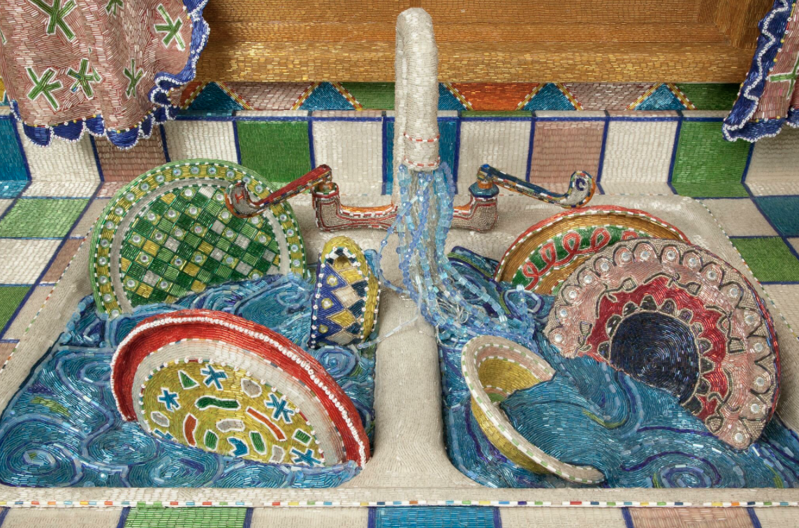

# Inspiration

## Introduction to Music Visualization - Processing







## Edusemiotics: Learning as Meaning-Making

> The semiotic approach to education challenges the assumptions for learning and education of the linguistic turn, claiming that learning processes occur more broadly in nature. In this view, learning is not construed as a matter of linguistic articulation but, more generally, as meaning-making \(semiosis\)



## Self-Actualization



## Meta-Cognition: Flow vs Stress-Activation - Experiential States: 

## Emotions as Dynamic Signals:

### Dynamic Signals: Change: Modulation, Frequency, Amplitude, Valence, Increasing, Decreasing, Oscillation, Rhythm, Color, Form, Pattern - Information Integration - Learning: motivation, attention, features, 



### Emergence

Emergence has been thought to describe the appearance of patterns, structures or properties of systems at the macro-level, where such features stem from or are generated by the dynamical properties of and interactions among system elements and components at the mid- and micro-level of organizations.  
\(15\) \(PDF\) The Holonic Enterprise and Theory Emergence: On emergent features of self-organization in distributed virtual agents. Available from: 



### Intelligent Systems

> On the one hand, we distinguish a primary set of cognitive abilities to interact with the world including perception, action control, deliberation or language use. On the other hand, the system has a secondary set of abilities about how to use the primary abilities, resulting in a more complex intelligent behavior. These second abilities are related to \(1\) rationality to maximize system performance, \(2\) improving behavior through learning, and \(3\) observation through introspection which allows, for example, explaining the use of the own knowledge  
> \(15\) \(PDF\) What is an intelligent system?. Available from:



### Dynamic Patterns

 Patterns of growth, decay: Morphologies: spiral, star, fan, branching:  decay:  voronoi,  cuboids: Fractals, Recursion, Parametric Design - parameters define relationships between relationships:  metaphors:  

Nature: 

### Consciousness



> ‘Consciousness’ leads us to a method of questioning based on the mechanical notion that the mind can be switched on and off like a machine. But there is no evidence — either philosophical or scientific — that the mind or the soul \(of which the mind is an aspect\) has an “on switch” or an “off switch.” The most reasonable scientific inference is that we are _never_ “unconscious,” nor are we “conscious” in any meaningful sense. Our mental life is a composite of abilities — arousal, sensation, perception, locomotion, reason, etc., and these abilities appear to subsist in modified form despite dramatic changes in the body and brain. We are aware of sounds and sensations and dreams when we sleep, we are aware of many things in our environment — pain, some conversations around us, etc.

**Computational Artists**







>



