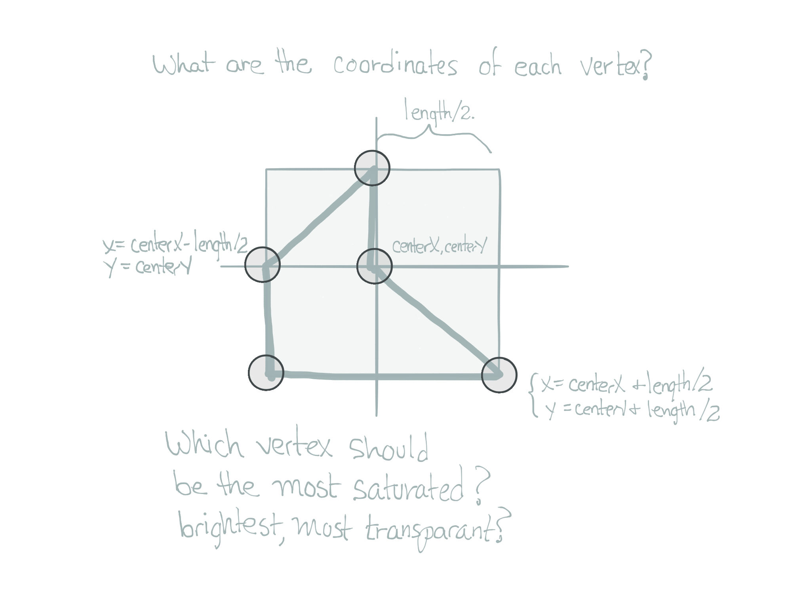
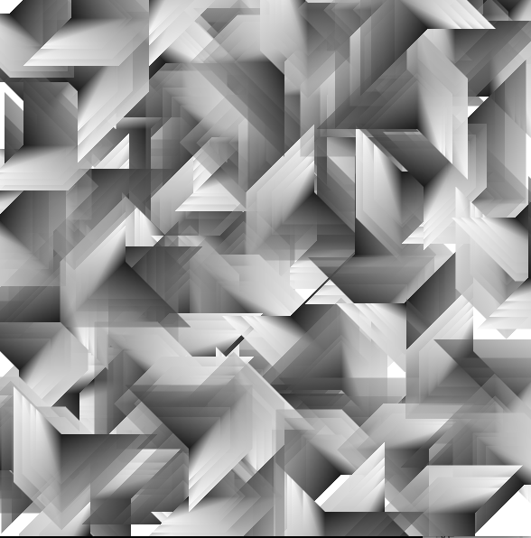

# Vertex Shapes - Recursive Pattern

The image below shows how we can create a simple polygon using the [Processing beginShape\( \), endShape\( \)](https://processing.org/reference/beginShape_.html) functions.

For our recursive pattern project, it will be important to create a simple pattern that can be defined by a central point \(vertex\) and one length value.  You can see from the image below that if we design our pattern based on points on a square, this becomes straightforward.  For each recursive call, we want to make the length smaller, but keep the center point somewhat fixed.  Each time we draw the shape, if we use a different value for the length parameter, the shape will be scaled according to that length dimension parameter. 

Defining the shape based on a variable length means that if length 100, it should create a pattern that is 10 times larger than if we'd set length = 10.  



For the image below, we could have a drawPattern\( \) function that uses the vertex pattern from the above image.

For the vertices: if we start in the center, then rotate clockwise, we can determine the vertices as:

```
v0:  centerX, centerY
v1:  centerX + len/2, centerY + len/2
v2:  centerX - len/2, centerY + len/2
v3:  centerX - len/2, centerY
v4:  centerX        , centerY - len/2
```

Finally, to simplify further, we can consider that if we translate the origin to the position where we want to draw the pattern, we can consider centerX, centerY as the point \(0,0\).

```
  PShape s = createShape();
  s.beginShape();
  s.fill( 100, 200, 255, 100 ); 
  s.vertex(0,0);
  s.vertex( len, 0);
  s.vertex( len, len);
  s.vertex( len/2, len/2);   
  s.vertex( 0, len);
  s.endShape(CLOSE);
  shape( s, 0,0);  //this displays the shape on the canvas at point (0,0)

```
###Custom Draw Rectangles Function using Vertex Points 


The image above shows that we could define our own drawRectangle(w, h) function, where we define xWidth, xHeight input parameters.  This will work just like the processing rectangle function, except that it doesn't take in x,y location input parameters. Instead, we're hard-coding the position vertex at (0,0);  We can see from the code on the diagram how the input parameters are used to define 4 vertex points that represent the rectangle corners.  This way, if we call the function 2 times with different inputs, we'll have 2 different rectangles scaled according to the input values:

```java
//rectangles are scaled using the input parameters: xWidth, xHeight
drawRectangle( 100,200 );
drawRectangle( 200, 300);

```
###Processing P2D - Vertex Shading

```java
void setup(){
    size( 500, 600, P2D);
}
```

If we use the processing P2D rendering context, we can set a different fill value and stroke value for each vertex, this allows us to create visual depth in the pattern. When incorporated into a simple recursive function this can create interesting complex images.  
P2D might not work on some computers, if not, then just use regular: size\(600,600\);.  You will need to create an interesting pattern using fill outside of the beginShape\(\) function that impacts the entire shape.
###recursivePattern and vertexPattern Functions


```java

void recursivePattern( float length, float level){
   if(level <1 ) { //termination condition
   return;    //stop function execution by returning from the function
   }
   vertexPattern( length); //draws 1 instance of the pattern, size: length
   recursivePattern( length - 20, level -1  );  
}


void vertexPattern( float len){
  PShape s = createShape();
  s.beginShape();
  s.fill( 255, 200, 255, 100 );  
  s.vertex(0,0);
  s.vertex( len, 0);
  s.vertex( len, len);
  s.vertex( len/2, len/2);   
  s.vertex( 0, len);
  s.endShape(CLOSE);
  shape( s, 0,0);  //this displays the shape on the canvas at point (0,0)
}


```

If we look at the fill\( grayScaleVal, alphaVal\) in the drawSimpleShape\(\) function, we can see a simple pattern, we're increasing the value of grayScaleVal, it increases between each call:  25, 75,150,200,250.  We want to have it change based on the number of vertices in our shape, and it should increase each time we call it.  This suggests we should create a function:  setFill\( int vertexNumber\);   
We could call the function using an integer variable vertNum=1;  setFill\(vertNum++\).

What would setFill\(int vertNumber\) fuction definition look like?  Could we expand this function definition so that we use set: hue, sat, and brightness within the function using a single vertNum as the input parameter?

We can use frameCount and modulus, to add a timer to the draw loop and \(we can also rotate the pattern each time it is drawn using a similar technique\)

#Framecount as a timer
```java

if(framecount % 10 == 0){ 
   //this event occurs every 10 frames
   //doSomething every 10 frames
}
```

#Main Program where Recursive function is used  in draw( )

```java

float length=150;

void setup(){
  size( 600,600);   //use size(600,600,P2D) if possible
}

void draw(){
   if(mousePressed && (frameCount % 10 == 0)){
        translate(mouseX, mouseY);
        recursivePattern( length,5);  //here level is initialized at 5 because we decrement it inside the recursive function
        resetMatrix();
   }
}

```




# HSB ColorMode

Once a design has been developed using grayscale color values as show above, then it's very easy using HSB colormode to add hueValues.  Design your pattern using grayscale values to see if the pattern has a dynamic quality.


