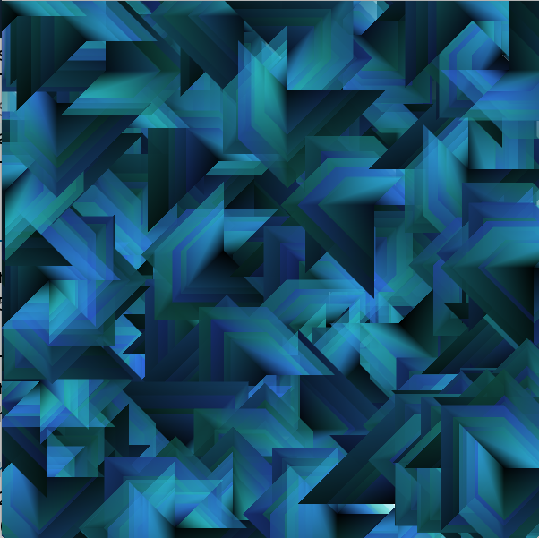

# beginShape - Vertex Shapes

The image below shows how we can create a simple polygon using the [Processing beginShape( ), endShape( )](https://processing.org/reference/beginShape_.html) functions.  

For our recursive pattern project, it will be important to create a simple pattern that can be defined by a central point (vertex) and one length value.  You can see from the image below that if we design our pattern based on points on a square, this becomes straightforward.  For each recursive call, we want to make the length smaller, but keep the center point somewhat fixed.    


For the image below, we could have a drawPattern( ) function that uses the vertex pattern from the above image.

For the vertices: if we start in the center, then rotate clockwise, we can determine the vertices as:

```
v0:  centerX, centerY
v1:  centerX + len/2, centerY + len/2
v2:  centerX - len/2, centerY + len/2
v3:  centerX - len/2, centerY
v4:  centerX        , centerY - len/2

```
Finally, to simplify further, we can consider that if we translate the origin to the position where we want to draw the pattern, we can consider centerX, centerY as the point (0,0), and we can introduce a new variable: halfLen = len/2

```
float halfLen=len/2;
beginShape();
vertex( 0, 0);              // v0
vertex(halfLen, halfLen);   // v1
vertex(-halfLen, halfLen);  // v2
vertex(-halfLen, 0);        // v3
vertex( 0 ,-halfLen);       // v4
endShape(CLOSE);
```
If we use the processing P2D rendering context, we can set a different fill value and stroke value for each vertex, this allows us to create visual depth in the pattern. When incorporated into a simple recursive function this can create interesting complex images.
P2D might not work on some computers, if not, then just use regular: size(600,600);.  You will need to create an interesting pattern using fill outside of the beginShape() function that impacts the entire shape.

```
void recursivePattern( float length, float level){
   if(level <=1 ) { return; }
    drawSimpleShape( length);
    recursivePattern( length * .8, level -1);  
}

void drawSimpleShape(float len){
    float randomVal=random(-5,5);
    float halfLen=len/2 + randomVal;  //add a little randomness for interest
    
    beginShape();
     fill(25,100);  //modify grayscale and alpha for each vertex
    vertex(0,0);  //start at center point and visit vertices clockwise
     fill(75,125);
    vertex( halfLen, halfLen);
     fill(150,150);
    vertex(-halfLen, halfLen);
     fill(200,175);
    vertex(-halfLen, 0);
     fill(250, 200);
    vertex(0 ,  - halfLen);
    endShape(CLOSE);
}

```
If we look at the fill( grayScaleVal, alphaVal) in the drawSimpleShape() function, we can see a simple pattern, we're increasing the value of grayScaleVal, it increases between each call:  25, 75,150,200,250.  We want to have it change based on the number of vertices in our shape, and it should increase each time we call it.  This suggests we should create a function:  setFill( int vertexNumber); 
We could call the function using an integer variable vertNum=1;  setFill(vertNum++).  

What would setFill(int vertNumber) fuction definition look like?  Could we expand this function definition so that we use set: hue, sat, and brightness within the function using a single vertNum as the input parameter?

We can use frameCount and modulus, to add a timer to the draw loop and (we can also rotate the pattern each time it is drawn using a similar technique) 
``` 
if(framecount % 10 == 0){ 
   //this event occurs every 10 frames
   //doSomething every 10 frames
}
```

```
float length=150;

void setup(){
  size( 600,600, P2D);
  strokeWeight(0);
  background(255);
}
void draw(){
   if(mousePressed && (frameCount % 10 == 0)){
     translate(mouseX, mouseY);
     //we could rotate using framecount and modulus
    recursivePattern( length, 5);
   }
}
```


#HSB ColorMode
Once a design has been developed using grayscale color values as show above, then it's very easy using HSB colormode to add hueValues.  Design your pattern using grayscale values to see if the pattern has a dynamic quality.



