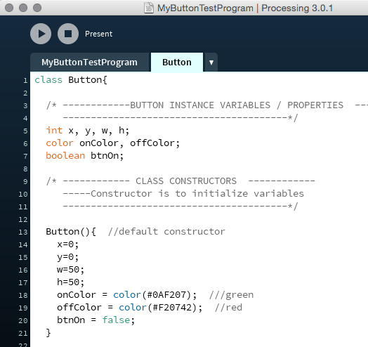

#Buttons as Objects

In the previous sections, we discussed buttons in terms of features 

Physical Objects
================

When we use a physical button, like the on-off button of a light-switch, we understand that the button has a physical configuration that controls electrical current to the bulb. The physical movement of the switch itself is responsible for controlling the state of the lightbulb as well as controlling the state of the switch itself, so we can look at the switch and understand if it's in the on or off position. However, when we think about a virtual button on a device such as our mobile phone, there is not a tangible, physical configuration of the button that controls these behaviors. To be intuitive for a user, the virtual button should behave analogously to the physical version, so it is helpful for us to think of buttons that we create as if they were physical objects.

Object Responsibilities
=======================

If we think of our button as a physical object, then it makes sense for our button object to be responsible for it's own behaviors and states. A physical button has a configuration that controls and indicates if it's on or off. For our button, we need to create a *state variable*, `on`, so the button object can remember whether it is currently on or off. Similarly, we want the button to be responsible for responding to user-events whether it is and it's display (behavior), and for knowing it's current state, size, position and orientation (state and configuration). Then we can have many button instances, each responsible for is own object properties, and the object behaviors (methods) will be consistent across all instances.

Objects and Classes
===================

To create objects, we write code to define a **class**, which we can think of as the **blueprint** for creating objects. When creating objects in code, it's helpful to think of object responsibilities in terms of what information an object knows about itself, and the behaviors an object can do. In our code, we will use **instance variables** to store an object's state and configuration information. To implement an object's behaviors, we'll write functions, these are referred to as the object's **methods**. Once we write code to define the Button class, then we can create an unlimited number of button objects. When our code is executed, then the button objects are created where the compiler uses the class code as the blueprint.

Object - Class Structure
========================

The image below is a **UML Class Diagram**. [UML](http://www.omg.org/gettingstarted/what_is_uml.htm) *Unified Modeling Language* is modeling language specification that provides formal structures for designing models of systems. The [UML](http://www.omg.org/gettingstarted/what_is_uml.htm) website states that 'modeling is the designing of software applications before coding.'


The class diagram shows the name of the class, the instance variables, and the methods. In UML, we can use class diagrams to show relationships between several different classes. There are a wide variety of UML diagrams, some are designed to show structure like this class diagram, while other UML diagrams are designed to model behavior and interaction of system entities.

Processing Tabs
===============

Processing provides tabs to allow us to organize our code when using classes, the main tab is the name of the sketch, while each other tab should be the name of the class, such as Button. The image below shows the Button tab with the basic code elements which define the class.



When looking at the code in a Class definition, we can see a similarity with the structure of code that we've been writing in our previous examples. The table below shows these similarities, in the left column, we can see that the code we write in the main tab can be though of as having 3 sections, the top of our programs is where we declare global variables, then the setup() function is executed once, while the draw() function is where the main behavior of our program is typically executed. When we write code for a class definition, we are required to write our instance variables at the top, then we must write the constructor functions, these are similar to setup() in that the constructor for an object is a function that is only executed once, when the object is first created and it's used to initialize all of the instance variables for our object. Finally, the bottom of the tab contains all of the functions / methods that we write for our object's behaviors. Within these methods, we can also have local variables, but they will only exist for the duration of that method's execution. The instance variables exist for the life of the object instance, store all of the information about the state and configuration of our object instances throughout the duration of an object's lifetime.


###Button Class Definition


```java


/* ------------BUTTON CLASS DEFINITION ------------
----------------------------------------*/
class Button{

/* ------------BUTTON INSTANCE VARIABLES / PROPERTIES ------------
----------------------------------------*/
float x, y, w, h;
color onColor, offColor;
boolean btnOn;

/* ------------ CLASS CONSTRUCTORS ------------
-----Constructor is to initialize variables
----------------------------------------*/
Button(){ //default constructor
  x=0;
  y=0;
  w=50;
  h=50;
  onColor = color(#0AF207); ///green
  offColor = color(#F20742); //red
  btnOn = false;
}

Button(float _x, float _y, float _w, float _h){ //input parameters are used to initialize instance variable values
  x=_x;
  y=_y;
  this.w=_w; //`this` refers to the current object instance
  h=_h;
  onColor = color(#0AF207); ///green
  offColor = color(#F20742); //red;
  btnOn=false;
}

/* ------------ CLASS METHODS ------------
-----Methods are Functions used by Object instances
-----Methods provide implementation of object behaviors and functions
----------------------------------------*/
void Display(){
  if(btnOn){
    fill(onColor);
  }
  else{
    fill(offColor);
  }
  rect(x, y, w, h);
} //end Display( )

void Click(int mX, int mY){
  if( (mX >= x && mX<=(x + w) ) && (mY >= y && mY <= (y + h) ) ){
  println("button class, I was clicked! y value is: " + y); 
  btnOn = !btnOn; //toggle btnOn state between true or false
}
} //end Click()
}//end Button Class

```


In [Shiffman's book](http://learningprocessing.org),he provides example code for how to make an Button class as part of his example problems: 9.8.  

###Main Tab - Creating Button Objects
The code below is from the main tab for a simple program which uses the Button class to make Button objects.  The code shows the comparison between how to declare and initialize primitive variables like int.  When creating objects, it's necessary to call the class constructor function. 

###Clear Button
The example code below also creates a clear button.  In the draw loop, we check to see if the myClearBtn.on is true, if it is, then we draw a large rectangle that is the size of the canvas.  Then we must remember to set the state to on=false.

```java
//Global Variable Declaration
int someVal;  //we declare the type: int, then the name someVal
Button myButton;  //we declare the type: Button, then the name: myButton
Button myButton2;
Button myClearBtn;

//initialization
void setup(){
  size(400,400);
  someVal=5;  //we initialize the int variable
  myButton = new Button();  //for objects, we must call the constructor method
                            //to instantiate a new object
                            //here we call the default constructor - it takes no input arguments
  myButton2= new Button(100,100,50,50); // use Constructor with arguments
  myClearBtn = new Button( 0,0,50, 50);
}                            

void draw(){
  myButton.Display();   //we use 'dot-notation' to call the Button Display() method
  myButton2.Display();
  myClearBtn.display();
  
  if(myClearBtn.on == true){  //see if the clear button has been clicked
    fill(255);
    rect(0,0,width, height);
    myClearBtn.on = false;   //turn the button off!
    println("ClearScreen");
  }
}

void mouseClicked(){
  myButton.Click(mouseX, mouseY); 
  myButton2.Click(mouseX, mouseY);
  myClearBtn.click(mouseX, mouseY);
}

```

###Questions

1.  What is the difference between a class and an object?
2.  What is the difference between a constructor and a method?
3.  What is a default constructor?
4.  What is an object instance?
5.  What does a constructor do?
6.  How do we execute a method for an object instance?