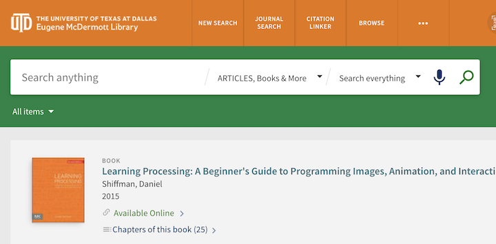

# Learning Processing

This course will use some content from the book: \
**Learning Processing, by Daniel Shiffman**

[**Learning Processing**](http://learningprocessing.com) - website with additional content

&#x20;**** [**Daniel Shiffman's website**](https://shiffman.net)****

Also See Shiffman's Advanced Online Book:  [**The Nature of Code**](https://natureofcode.com)****

[**UTDallas McDermott Library Link**](https://utdallas.primo.exlibrisgroup.com/permalink/01UT\_DALLAS/16oidda/cdi\_skillsoft\_books24x7\_bks00089202) **** - Login with your UTD ID to Access the Book

