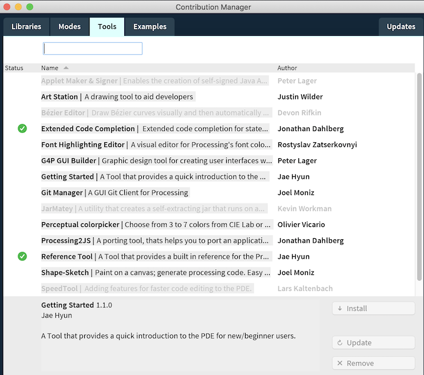

# Processing IDE

This course will use the Java version of the Processing Language.

### Processing Development Environment \(PDE\)

* [**Download Processing**](https://processing.org/download/)\*\*\*\*
* \*\*\*\*[**Install Processing**](processing.md#installing-processing) ****- should be straightforward.
* **Open the Processing Application** - will open by creating a new sketch, save the sketch with a meaningful name.
* **Processing.org Documentation:**  Reference, Examples, Tutorials
* **Installing Tools, Libraries, Modes, Examples**
  * **Extended Code Completion**
  * **Reference Tool**
  * **Examples: Learning Processing, others**



