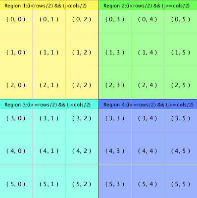
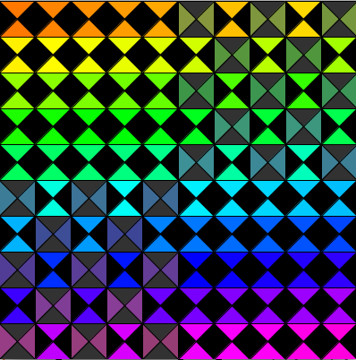

# Grid Region Logic

## Logic for Grid Regions

We can determine logic to define grid-regions within a nested for-loop, and we can display certain patterns within these regions using this logic.



### Patterns in Grid Regions



### Logic for Displaying Patterns in Regions

The code below shows that we can use for-loop logic that looks at the index values: i, j to determine 4 regions where we can display different shapes to develop a more interesting pattern.

**Region Logic:**

* Region 1: i &lt; rows/2 && j &lt; cols/2
* Region 2: i &lt; rows/2 && j &gt;= cols/2
  * Even Cells: \(i+j\) % 2 == 0 
* Region 3: i &gt;= rows/2 && j &lt; cols/2
  * Even Cells: \(i+j\) % 2 == 0 
* Region 4: i &gt;= rows/2 && j &gt;= cols/2

**Region Design Patterns: Fill grid cells** 

* Region1:  display Shape1
* Region2:  display Shape2, if even cells, display Shape1
* Region3:  display Shape2, if even cells, display Shape1
* Region4:  display Shape1

## Example Code for the Region-Based Design Patterns

```java
void displayShapeList( PShape[] _shapes1, PShape[] _shapes2, float cellSize, int rows, int cols) {
  int xPos =0;
  int yPos = 0;
  int shapeIndex=0;
  for ( int i=0; i<rows; i++) { 
    for (int j=0; j<cols; j++) {  //draw a shape in each column
      if(  i < (rows/2) && j < (cols/2)  ){  //region 1
          shape(_shapes1[shapeIndex], xPos, yPos);   //display the shape
      }
      else if( i >= (rows/2) && j >= (cols/2)){  //region 4
         shape(_shapes1[shapeIndex], xPos, yPos);   //display the shap
      }
      else if( (i + j) % 2 == 0 ){  //even position in region 2,3
        shape(_shapes1[shapeIndex], xPos, yPos);   //display the shap
      }else{ //remaining positions in region 2, 3
        fill( 50);
        rect(xPos, yPos, cellSize, cellSize);
        shape(_shapes2[shapeIndex], xPos, yPos);   //display the shap
      }
      xPos += cellSize;
      shapeIndex++;
    }
    xPos = 0;
    yPos += cellSize;
  }  //end outer for loop
}   //end displayShapeList
```

