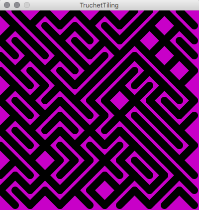

# Truchet Tiling

Truchet Tiling

The code below shows an example of Truchet Tiling -[ Wikipedia](https://en.wikipedia.org/wiki/Truchet_tiles) The



## Code Example

This code example shows how we can use a 1-Dimensional array of PShapes to create a grid arrangement of shapes.

```java
PShape[] shapes;
int colWidth=30;
int rowHeight = 30;
void setup() {
  size(600, 600);
  colorMode(HSB, 360, 100, 100);
  background(200, 100, 100);
  strokeJoin(ROUND);
  stroke(0);
  strokeWeight(15);
  shapes = populateArray(colWidth, rowHeight);
  drawGrid(shapes, colWidth, rowHeight);
}

PShape[] populateArray( float colWidth, float rowHeight) {
  PShape[] shapes;
  int numRows =int( height/rowHeight);
  int numCols =int( width/colWidth);
  shapes = new PShape[numRows * numCols];
  PShape block1 = createBlock( colWidth, rowHeight, true);
  PShape block2 = createBlock( colWidth, rowHeight, false);
  for ( int i=0; i< numRows* numCols; i++) {
    float rand = random(0, 2);
    if ( rand > 1) { //flip a coin
      shapes[i]= block1; ///use block 1
    } else {
      shapes[i]= block2;
    }
  }
  return shapes;
}


PShape createBlock( float xSize, float ySize, boolean mode ) {
  PShape s2;
  s2=createShape();
  s2.beginShape();
  if ( mode == true) { //arrangement 0
    s2.vertex( 0, 0);
    s2.vertex( xSize, ySize);
  } else {
    s2.vertex( xSize, 0);
    s2.vertex( 0, ySize);
  }
  s2.endShape();
  return s2;
}


void drawGrid(PShape[] shapes, int colWidth, int rowHeight ) {
  int numRows = height/rowHeight;
  int numCols = width/colWidth;
  int xPos=0;
  int yPos = 0;
  int k=0;
  for ( int i=0; i< numRows; i++) { //rows
    for ( int j=0; j< numCols; j++) { //cols
      PShape s =shapes[k] ;
      shape( s, xPos, yPos);
      xPos += colWidth;
      k++;
    }
    xPos=0;
    yPos += rowHeight;
  }
}

void draw() { //draw must be included for mouseReleased event function to work
}

void mouseReleased() {
  background(random(360), 100,100);
  shapes = populateArray(colWidth, rowHeight);
  drawGrid(shapes, colWidth, rowHeight);
}
```

