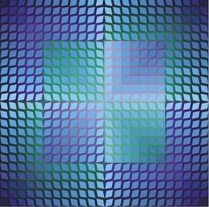
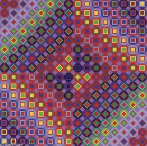
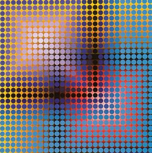

# Artist: Victor Vasarely

Victor Vasarely is considered the father of the op-art movement.

He had a series of artworks that were based on variations of shape patterns in a rectangular grid. We'll use his artwork as inspiration for some projects in this course

[http://www.vasarely.com/](http://www.vasarely.com/)

[http://www.artnet.com/artists/victor-vasarely/](http://www.artnet.com/artists/victor-vasarely/)

[https://en.wikipedia.org/wiki/Victor\_Vasarely](https://en.wikipedia.org/wiki/Victor_Vasarely)

