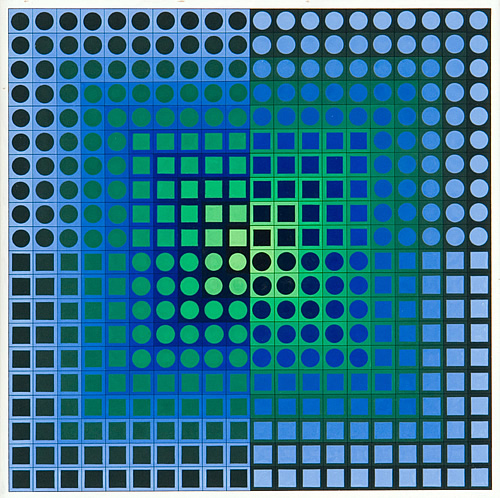

# Artist: Victor Vasarely

**Victor Vasarely is considered a pioneer of the op-art movement**.

He had a series of artworks that were based on variations of shape patterns in a rectangular grid. 

We'll use his artwork as inspiration for some projects in this course







