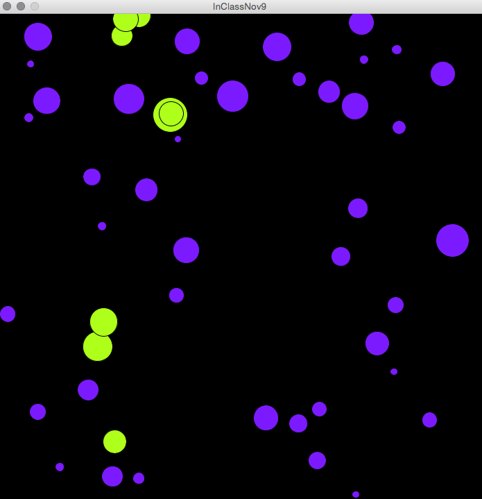

# Intersecting Agents

As we begin our look at dynamic patterns, we can start with a simple ball class that is covered in Chapter 10 of Shiffman's book.  He creates a simple Ball class that has position and speed instance variables.  He adds methods to display(), move(), and intersect(Ball b). We can create lists or arrays of these ball objects, and then we can animate these Ball objects by calling move() and display() methods within the processing draw loop.



Below is our custom code for a Ball class

```java
class Ball{
  float x, y, r, speedX, speedY;
  color curColor, highlightColor, basicColor;
  
  //constructor
  Ball(float _x,float _y){
    x= _x;
    y = _y;
    r = random(5,25);  ///radius is for test intersection
    speedX  = random(1,3);
    speedY = random(1,3);
    highlightColor = color(#AEFF1A);
    basicColor = color(#7C1AFF);
    curColor = basicColor;
  }
  
  void display(){
    fill(curColor);
    ellipse(x,y, 2*r,2*r); 
    curColor= basicColor;
  }
  
  void highlight(){
    curColor = highlightColor;
  }
  
  void reverseX(){
    speedX *= -1;
  }
  
  void move(){
    if( x >width || x < 0){
      speedX *= -1;
    }
    if( y > height || y < 0){
      speedY *= -1;
    }
    
    x += speedX;
    y += speedY;
  }
  
  
  boolean intersect( Ball b){
    boolean isIntersect = false;
    float d = dist(this.x, this.y, b.x, b.y);
    if(d < this.r + b.r){
      isIntersect= true;
    }
   return isIntersect;
  }
  
  
} // end Ball class

```

