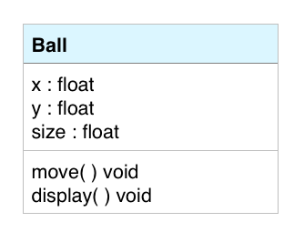

#Introduction To Objects

To begin our look at Object oriented programming, we'll look at the simple task of animating a ball moving across the Processing canvas.

First, we'll look at the code in the Ball Class Definition, then we'll look at the main tab code to see how to create an instance of a Ball Class object.

Below is a UML (Unified Modeling Language)  Class diagram which gives an overview of the important information about the Ball class.  In the top section is the class name, the second section shows the instance variables or properties of the class.  The bottom section shows the class methods, which are functions that belong to the class.




```java
class Ball{
  //instance variables or properties
  float x; 
  float y;
  float size;
  float speedX;
  float speedY;
  color ballColor;
  
  //////Class Constructors - to initialize instance variables
  /////Overloaded versions - each with a unique parameter list
  Ball(){  //default constructor takes no input parameters
    this( 5, 5, 50); //calls the Ball constructor Ball(5,5,50)
  }
  
  Ball(float _x, float y, float size ){
    x = _x;  //initialize instance variable: x
    this.y  = y;  //initialize instance variable: y
    this.size = size;
    speedX = 5;  //the same for every object
    speedY = 10;  //the same for every object
    ballColor = color( 100); //default ball color is gray
  }
  
  Ball(float _x, float y, float size, float speedX, float speedY, color ballColor ){
    x = _x;  //initialize instance variable: x
    this.y  = y;
    this.size = size;
    this.speedX = speedX;  //the same for every object
    this.speedY = speedY;  //the same for every object
    this.ballColor = ballColor;
  }
  
  ////////////Methods or functions
  
  //displays the ball
  void display(){
    fill( ballColor);
    ellipse( x, y, size, size); //diameter
  }
  
  //determines new position for ball each time this is executed
  void move(){
    if( x > width || x < 0){
      speedX *= -1;
    }
     if( y > height || y < 0){
      speedY *= -1;
    }
    x += speedX;
    y += speedY;
    
  }
  
} //end of class Ball

////Main Tab Code:

Ball ball1, ball2, ball3;   //ball1 = null
//declare a variable that can point to a ball object's data in heap memory

void setup() {
  size( 600, 600);
  ///create 3 different Ball object instances
  ball1 = new Ball(20, 20, 30, 15, 5, color(255, 0, 0)); //new is the keyword used to create an object instance
  ball2 = new Ball(40, 40, 40, 5, 10, color(255, 0, 255)); //new is the keyword used to create an object instance
  ball3 = new Ball(20, 50, 50, 10, 15, color(255, 255, 0)); //new is the keyword used to create an object instance
}

void draw() {
  background(255);
  
  //have each ball execute it's move method
  ball1.move();
  ball2.move();
  ball3.move();
  
  //have each ball display itself
  ball1.display();
  ball2.display();
  ball3.display();
}


```

