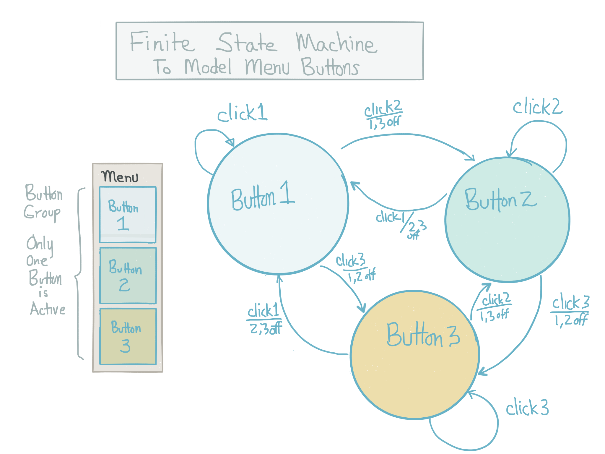

# Modeling Buttons: States and Events

## Finite State Machine

Below is a Finite state machine diagram a simple button application. We want to implement this dynamic Menu with these interactive Button behaviors using Processing. This button system is referred to as a radio-type button group.



The diagram above shows that we have a menu of 3 buttons, where only 1 button can be active at any time. The arcs indicate events, which correspond to the user clicking a button, the arcs also indicate tasks that must be implemented in our code to insure the system demonstrates the desired behavior. The events can cause the menu-system to change state.

```java
States - Which Button is Active:   Button1 , Button2, Button3

Events - User Interactions:   click1, click2, click3
```

The arrows in the diagram represent events: The events cause the button to change state. To implement a button-group in our program code, we'll need to create a variable that we can use to remember which button is currently active.
