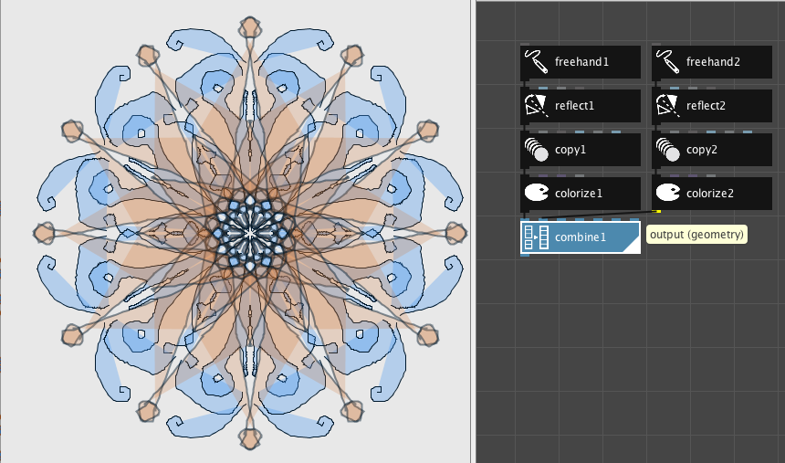

# OOP vs Data-Flow

Two main programming paradigms are Object-Oriented and Data-Flow.  
Many visual programming languages actually use a combination of both.  

### Data Flow

The data flow paradigm is commonly used for design software in fields like architecture, sound design, graphic design, 3-D modeling.  Data flow is the primary paradigm associated with Parametric Design, where each Logic-Node has input, output ports where data streams can be connected

### Examples of Data-Flow Software:

2D Design: [NodeBox](https://www.nodebox.net/node/): Visual Programming Language for Geometric Forms:  Free and Open-source

3D Modeling:  Rhino3D: Grasshopper, Shader Forge

Sound Design:  MAX-MSP, Pure-Data

### [Rhino3D Grasshopper ](https://www.grasshopper3d.com/)

