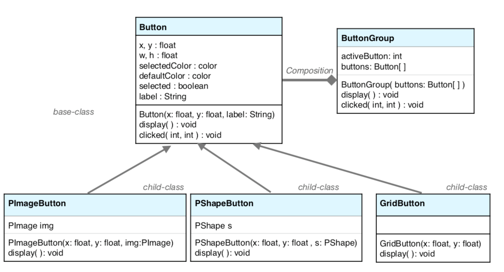
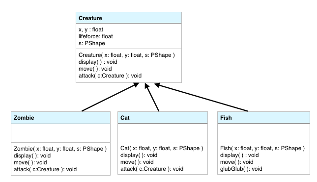
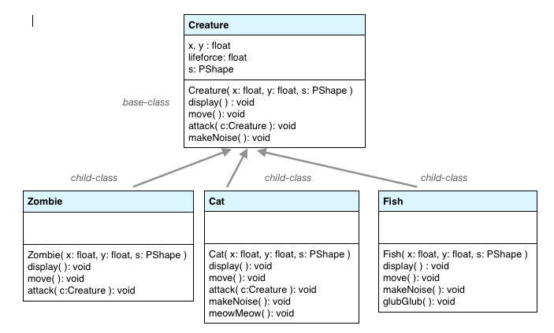

# UML Class Diagram

A graphical representation of the features of a class including: name, variables, methods. Class diagrams can be combined to show relationships between classes such as inheritance and composition relationships. The diagram below shows the Button Class. The PImageButton and PShapeButton classes are child classes, they inherit all of the variables and methods from the Button base class. The only methods that should be specified in the child classes are methods that over-ride the base-class method.



## UML Diagram of Inheritance Relationships



The diagram above shows a base-class: Creature, and 3 Child classes: Zombie, Cat, Fish

When creating object reference variables, we specify the data-type of the variable, and this impacts the methods that can be called for the object.

Example 1: **Base-class object-reference variable:**

Creature creature = new Fish\( 10, 10, f \);

This object can call any methods that are specified in the base-class.

creature.display\(\); creature.move\( \); creature.attack\( creature \);

**This object can not call any methods that are not specified in the base-class**, even if they are specified in the child-class for the object's actual data-type:

**//this will cause an error:** creature.glubGlub\( \); Example 2:  **Child-class object-reference variable:**

Fish fish = new Fish\( 10, 10, f\); This object can call any methods specified in either it's base-class, or it's own class \(Fish\) fish.attack\( fish \); //no error doing this fish.glubGlub\( \);

## Object Oriented Design - Add methods to the base-class to provide access to specialized behavior in child-classes.

When designing classes, as in the example above, we should identify any specialized behavior that will be exhibited by any child-class and create a method in the base-class that represents the generalized behaivor. Example: We have a child-class: Fish, where the fish has a specialized behavior: glubGlub\( \). Let's assume that can be considered as a more generalized concept: makeNoise\( \), where other child classes might also share this behavior. If we define the method: makeNoise\( \) in the base-class, then, within the Fish class, we can over-ride makeNoise\( \), and call the glubGlub\( \) method within makeNoise\( \). Then any base-class object can call makeNoise\( \), if the object happens to be a Fish, child-class object, it will have it's glubGlub\( \) behavior executed.

```java
//within the Creature class: provide makeNoise( )
void makeNoise( ){
println("some creatures will make special noises by overriding this method");
}
```

```java
//Within the Fish class: over-ride makeNoise( )
void makeNoise( ){
this.glubGlub( );
}
```

The image below shows an improved object-oriented design, so that all methods implemented in the base-class can be called by an object with a base-class type reference variable, and if the object is a child-class object, it'll have specialized behavior because it has provided an over-ride for methods where it has special logic to be executed 

