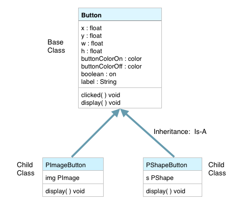

# Object-Oriented Programming: Principle: Inheritance

One of the most powerful aspects of Object-Oriented programming is that we can utilize inheritance relationships as we create objects.  Inheritance relationships in real-world contexts help us to understand shared features that are the result of natural processes like evolution. OOP allows us to design our classes to take advantage of these conceptual object relationships.  If we look at relationships in evolutionary species, such as Darwin's finches, each successive generation becomes more specialized, yet each of the species still shares a group of common features with their common ancestor.  

As we design classes, we want to think about designing a base-class that can function as the parent class for one or more specialized child classes.  We see these relationships as the basis for how we classify and categorize objects in the world.  We might have a parent class called `Car`, this *base-class* would have properties and behaviors that are shared by all Car objects with properties like:  wheels, engine, seats, and behaviors like: drive, stop, refuel.  Then we could have child classes that were specialized types of cars: mini-van, sports-car, station-wagon, convertible-coupe...etc.

###Important Aspects of Inheritance:
1. Inherit features from the Parent / Base-class
    - By default, a Child-class includes the features: instance variables and methods from the Base-Class 
2. Child-Class is a specialized version of a more general Base-Class

For our project, we'll look at inheritance in 2 cases.  We'll first create a generic Button class.  Then we'll create more specific types of Buttons:  PImageButton and PShapeButton.  These special Button child classes will allow us to add additional features compared to the generalized Button class. 

###UML Class Diagram: Button Base Class
The image below shows a Unified Modeling Language (UML) Class-diagram for the Button Class.  A UML Class Diagram provides a simple graphic representation of the features of a class.  The structure of a UML diagram is that the top section lists the name of the class, the second section lists the classes variables or fields.  The bottom UML class section shows the classes methods.  Some UML diagrams include the class constructors in the specified methods. UML diagrams are also useful for showing relationships between classes.  We have already seen an example of a Composition relationship:  The MenuArray Class is composed of an array of Button objects.  

As seen in the UML class diagram below,  the PImageButton and PShapeButton classes are child classes of the base class:  Button.  They have an inheritance relationship, this is refered to as an 'Is-A' relationship.  When we define these classes, we only define new instance variables that are not inherited from the base class.  We can also indicate which methods are going to be over-ridden in the child class by listing them in the child class.  So, from the diagram below, we see that thePImageButton has a PImage img instance variable and it provides a customzed implementation for display().   

