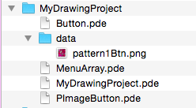
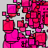

#Child Class - PImageButton

###PImageButton Class

If we look at the code for the PImage Button below,in the first line, we see the keyword *extends* which is how we indicate that this class inherits from the Button base class. Then  we see that we are able to call the Button base class constructor using the *super* keyword to call the Button base class constructor ``super()``.  In addition, we can also use  *super* as a way to call the Button base class methods: ``super.display()``.  This allows us to first call the Button display method, which gives use the background display of the default Buttons, then we can display the image() to customize the appearance of the PImageButton.  

###Class PImageButton

```java
class PImageButton extends Button{
  PImage img;
  
  //constructor
  PImageButton(PImage _p){
       super();
       img = _p; 
  }
  
 // constructor
  PImageButton(float _x, float _y, float _w, float _h, PImage _img){
       super(_x, _y, _w, _h);
       img = _img;
  }
  
  //over-ride display() from base-class
  void display(){
        super.display();
        image(img, x+5,y+5,w-10,h-10);
  }  
}
```
###Create a PImageButton Object in Main Tab
The code below shows that we 
```java
//main tab

 
Button pBtn;

void setup(){
//declare a PImage object reference variable, initialize using loadImage()
PImage p = loadImage("pattern1Btn.png");  //this file must be in the project data folder
pBtn = new PImageButton(20,20,100,100, p);  //call PImageButton constructor
}

void draw(){
pBtn.display();
}

void mouseClicked(){
pBtn.clicked( mouseX, mouseY) ;
}

```
###Processing Data Folder
To create a PImage object in the main tab, we must first make sure we have an image that we can use in our project.  In order to use any files as data files for our project, we must create a `data` folder inside our current processing project folder. We need to place any images or other resources that we'll use in our projects within this data folder, so Processing knows where to locate these assets and we don't need to specify the file path to this folder. 



###Processing PImage 
To learn more about how to use PImage objects, refer to the Processing.org [PImage](https://processing.org/reference/PImage.html) Reference. To create a PImage button, we can create a reference-type variable of type PImageButton and then we pass the filename to the PImageButton constructor.
 


```java
p= loadImage("MyIMage.png");
pBtn = new PImageButton(20,20,100,100, p);
```


###Inherited Method: clicked( ) 
 In the mouseClicked function we need to call the click() method.``pimageBtn.click()``.  We haven't explicitly defined the clicked( ) method in the code above because we want to use the Button base-class clicked( ) method. By not redefining clicked( ) in the child class, any child class instances will execute the clicked() method of the Button base class.

###Over-ride Method: display()
In the draw loop we need to call the display method of our pimageBtn:
``pimageBtn.display()``. Since we have provided explicit implementation of the display() method in the child class, then when a PImage object instance executes the display( ) method, it is this PImageButton child method that is executed.  As discussed above, the code: ``super.display()`` in the PImageButton class calls the Button base class display() method to draw the background rectangle before drawing the PImage image.

Example Image For ImageButton



###Computational Efficiency - Improved PImageButton Class
In the code below, we pass in the PImage object, p.  This is more efficient than passing in the image file string, filename.


```java

class PImageButton extends Button{
  PImage img;

  //constructor
  PImageButton(PImage p){
       super();
       img=p;
  }

 // constructor
  PImageButton(float _x, float _y, float _w, float _h, PImage p){
       super(_x, _y, _w, _h);
       this.img= p;
  }

  //over-ride display() from base-class
  void display(){
        super.display();
        image(img, x+5,y+5,w-10,h-10);
  }  
}


```