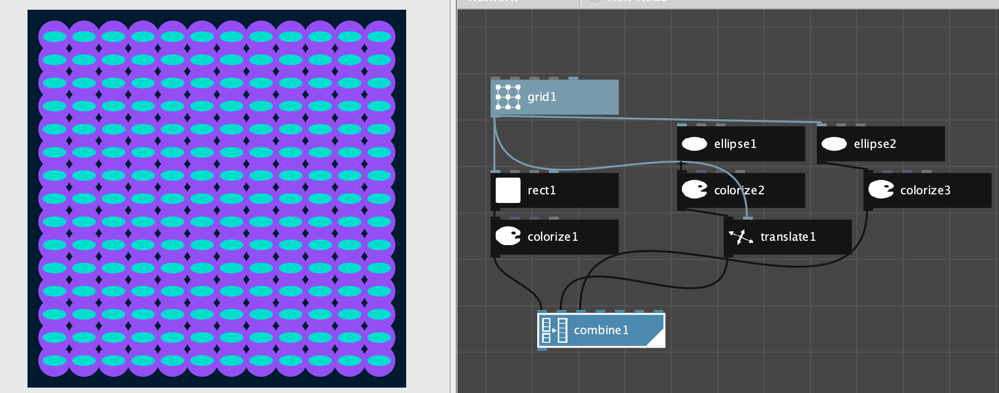

# Assignment 1: Meta

### Exploring Subjective Feelings:  Meta

### Meta: Kindness, Higher Levels of Abstraction 

      **Feeling Flow: Embodied Feelings:** positive affect, calm, low-activation states, low stress 

### 

## Assignment Tasks:

### 1. Create Gitbook: 

You will submit screenshot and a link to your gitbook page as part of your assignment submission.

1. Create a Gitbook Account
2. Create a Gitbook - Name it: 
3. Create a page: Assignment 1:
4. Find: Share-Link - you'll include this in your submission document 

### 2. Subjective Feelings:   Pleasant, Calm

1. **SONG:**  Select and list a song that evokes **positive, relaxing, calm feelings** for you: 
   1. Provide a link to the song artist, album.
   2. **Example:**  Wildfire by the Wild Feathers
   3. [https://genius.com/The-wild-feathers-wildfire-lyrics](https://genius.com/The-wild-feathers-wildfire-lyrics)
2. **Hand - Sketch:  Create a Sol Lewitt** Inspired sketch to invoke: **Calm, Pleasant Feelings**
   1. **Create a simple pencil sketch on paper and list the rules,  procedures** used to create the artwork so that someone else could create the same artwork from the listed rules. 
   2. **Gitbook: Take a screenshot** of the sketch, **insert the image** on your gitbook page
   3. **Gitbook:** List the procedure, rules that you followed in making the sketch.
3. **Code - Sketch:  Create simple processing program** that uses shapes, colors to invoke a positive, relaxing, calm feelings.
   1. **Gitbook:**  Take a screenshot of the canvas, insert the image on your gitbook page
   2. **Gitbook:**  Copy and paste as code on your gitbook.
   3. **Gitbook:**  Write a description of your subjective moods that your artwork expresses.

### Inspirations: 

### [If Life is a Game, These are the Rules:](../resources-and-references/resources/games-rules.md)  

**Rule 1: You will receive a body**

* Acceptance
* Self-Esteem
* Respect
* Pleasure

### 2.  Introduction to Mindfulness:

*  [Mindfulness Awareness Research Center](https://www.uclahealth.org/marc/covid19-mindfulness) - Covid Mindfulness Resources



### **3. Inspiration Artist: Sol Lewitt**

> The idea is the machine that makes the art   **Sol Lewitt**

> [LeWitt ](https://en.wikipedia.org/wiki/Sol_LeWitt)is regarded as a founder of both [Minimal](https://en.wikipedia.org/wiki/Minimal_art) and [Conceptual art](https://en.wikipedia.org/wiki/Conceptual_art).[\[4\]](https://en.wikipedia.org/wiki/Sol_LeWitt#cite_note-GuggenheimMuseum-4) His prolific two and three-dimensional work ranges from wall drawings \(over 1200 of which have been executed\) to hundreds of works on paper extending to structures in the form of [towers](https://en.wikipedia.org/wiki/Tower), [pyramids](https://en.wikipedia.org/wiki/Pyramid), geometric forms, and progressions. These works range in size from books and gallery-sized installations to [monumental](https://en.wikipedia.org/wiki/Monument) outdoor pieces. [Wikipedia](https://en.wikipedia.org/wiki/Sol_LeWitt)

> The idea itself, even if not made visual, is as much a work of art as any finished product." Stated LeWitt in 1971. "All intervening steps, scribbles, sketches, drawings, failed work models, studies thoughts, conversations, are of interest. Those that show the thought process of the artist are sometimes more interesting than the final product." \(LeWitt, 'Paragraphs on Conceptual Art', Artforum Vol.5, no. 10, Summer 1967, pp. 79-83\)







[https://monoskop.org/images/3/3d/LeWitt\_Sol\_1967\_1999\_Paragraphs\_on\_Conceptual\_Art.pdf](https://monoskop.org/images/3/3d/LeWitt_Sol_1967_1999_Paragraphs_on_Conceptual_Art.pdf)

> In conceptual art the idea of concept is the most important aspect of the work.1 When an artist uses a conceptual form of art, it means that all of the planning and decisions are made beforehand and the execution is a perfunctory affair. The idea becomes a machine that makes the art. This kind of art is not theoretical or illustrative of theories; it is intuitive, it is involved with all types of mental processes and it is purposeless. It is usually free from the dependence on the skill of the artist as a craftsman. It is the objective of the artist who is concerned with conceptual art to make his work mentally interesting to the spectator, and therefore usually he would want it to become emotionally dry. There is no reason to suppose, however, that the conceptual artist is out to bore the viewer. It is only the expectation of an emotional kick, to which one conditioned to expressionist art is accustomed, that would deter the viewer from perceiving this art

### 4. [Modeling Creativity:](../resources-and-references/resources/creativity.md#modeling-creativity-tom-d-desmedt)  Tom D. DeSmedt,

> Intuitively, a **model** for **\(artistic\) artificial creativity** appears to involve the steps illustrated in figure 1. A **“good idea”**, that is, a novel and appropriate solution to a given problem, is selected or **combined from a pool of many possible ideas** \(chapters 4 and 5\). **A work \(of art\) that captures this idea is then created** \(chapters 2 and 3\). **The work is then evaluated** by the author or a community of knowledgeable peers \(chapters 6 and 7\). Following a **negative evaluation, the idea is subsequently adapted** \(chapter 1\). We will test this conjecture in a number of case studies and ground it in the literature.



Valence \(Tom De Smedt, Lieven Menschaert & Ludivine Lechat, 2010\) is an interactive installation developed in NodeBox for OpenGL \([http://www.cityinabottle.org/nodebox](https://www.youtube.com/redirect?q=http%3A%2F%2Fwww.cityinabottle.org%2Fnodebox&redir_token=QUFFLUhqbWl4WWl4T0pKTFR1WEpuOV9fenNSbElrcE5Od3xBQ3Jtc0tuSHU4bXcybWszMXg1dXFiMnlJbVk1dzJJVWluZ3c5MnZHRWZGWXZNTlB6YnBnTVIyQW1TWUtCbGFTUnFvcmhUT3hwS2JhVG1INk5QVlN5aEpFOU5HeG01V0xTY2RNRGdZcU1QZDZua0p2endmelN3Zw%3D%3D&event=video_description&v=9ZTy5P8ud0c)\) **that represents the player's affect \(relaxation or arousal\) by measuring alpha brain waves, using a wireless EEG headset.**

### 5. [Nodebox: ](https://www.nodebox.net/download/) Tom D. DeSmedt

Nodebox is a visual programming application based on the paradigm of data-flow, as opposed to control-flow paradigm used in Java.  Generative art, parametric architecture and design applications often use the data-flow paradigm which uses a network of connected nodes to represent transformations to data that flows through the system.

