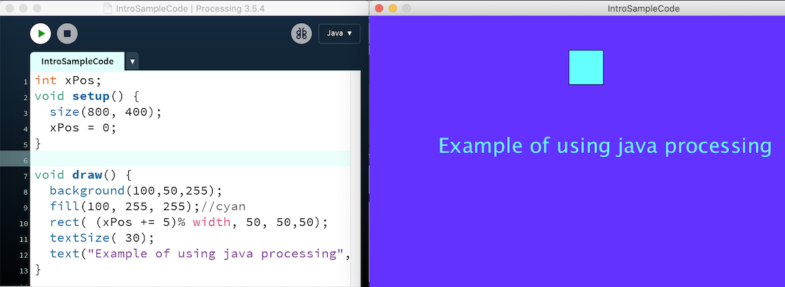

# Processing





### **Processing**: a language, a library, a development platform

* Created by Ben Fry, Casey Reas at MIT MediaLab under direction of John Maeda - 2001
* There are multiple different language versions of Processing. 
* **The Java version that we'll learn in this course is the 'original' version**
* Khan Academy uses an _unofficial_ javascript language version of Processing
* **P5.js:**  Official Javascript version of Processing - Includes functionality to create and modify html.  Ideal for using on web pages
* **Codepen.io - Online Code Editor - Useful for learning P5.js**



### Installing Processing: 

* [processing.org](http://processing.org) - download processing IDE, reference, examples, tutorials, etc.
* Open Processing Application

Paste the following code into the code editor: then push the play button

```text
int xPos;
void setup() { 
  size(800, 400);
  xPos = 0;
} 

void draw() { 
  background(100,50,255);
  fill(100, 255, 255);//cyan
  rect( (xPos += 5)% width, 50, 50,50);
  textSize( 30);
  text("Example of using java processing", 100,200);
}
```




