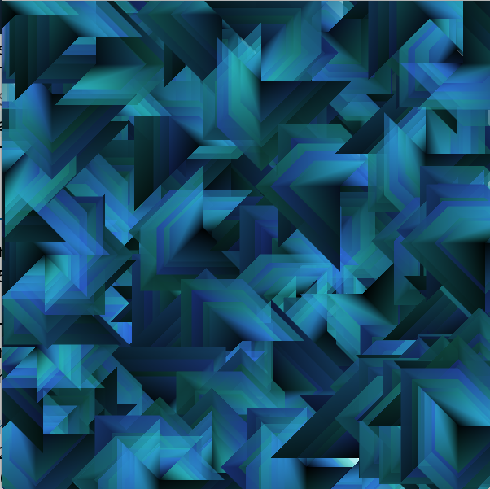

#vertexPattern and recursivePattern

In the code below, we define a Recursive function: `recursivePattern()` that creates repeated versions of the vertexPattern.  
    - parameter: float length - size of the pattern
    - parameter: float level - controls number of repeats - insures termination 
    - recursivePattern() defines the repetition structure
    - vertexPattern( ) is the task that is repeated
 
 ###vertexPattern( float len)  function

```java
    //Draws one pattern each time it is called
    //pattern size is determined by input parameter: len
    void vertexPattern( float len){
        PShape s = createShape();
        s.beginShape();
        s.fill( 255, 200, 255, 100 ); //rgb with alpha
        s.vertex(0,0);
        s.vertex( len, 0);
        s.vertex( len, len);
        s.vertex( len * .5, len * .5);
        s.vertex( 0, len);
        s.endShape(CLOSE);
        shape( s, 0,0); //this displays the shape at the origin
    }
```
  
###recursivePattern( float length, float level ) function
```java
    //recursive function to draw nested patterns
    //length is input as largest size, smaller patterns are drawn with each recursive call
    //level determines how many patterns are drawn
    //level MUST be decremented in each recursive call to insure termination
    void recursivePattern( float length, float level){
        if(level <1 ) { //termination condition
            return; //stop function execution by returning from the function
        }
        vertexPattern( length); //- task - draws 1 instance of the pattern
        recursivePattern( length - 20, level -1 ); //recursive call
    }
```


### Program using recursivePattern

```java
float length=150;

void setup(){
    size( 600,600); //use size(600,600,P2D) if possible
}

void draw(){
    if(mousePressed){
        translate(mouseX, mouseY);
        recursivePattern( length,5); //here level is initialized at 5 because we decrement it inside the recursive function
        resetMatrix();
    }
}
```

###HSB Colormode - Set Fill at the Vertex Level - Option

Once a design has been developed using grayscale color values as show above, then it's very easy using HSB colormode to add hueValues. Processing using P2D mode as specified in the size\( 600,600, P2D\) supports vertex shaders, where gradient colors are computed for fill\( \) values specified between vertex for PShape objects.


```java
   
        //size(600,600, P2D); //vertex shading using P2D
        //colorMode(HSB, 360,100,100);
        //float len = 100;
        
        //reducing brightness value between vertex points
        void vertexPattern(float len){
            PShape s = createShape();
            s.beginShape();
            s.fill(200, 100, 100 ); // blue, HSB
            s.vertex( 0, 0 ); //point origin
            s.fill(200, 100, 80 ); // blue, HSB
            s.vertex( len *.4, 0 ); //point(40,0)
            s.fill(200, 100, 60 ); // blue, HSB
            s.vertex( len *.6, len*.6 ); //point(60,60);
            s.fill(200, 100, 40 ); // blue, HSB
            s.vertex( 0, len *.4 ); //point(0,40);
            s.fill(200, 100, 20 ); // blue, HSB
            s.vertex( 0, 0 );
            s.endShape(CLOSE); //end shape
            shape(s, 0, 0);
        }
```
###Vertex Shading Example




The image above uses fill variation between each vertex, as shown above, to create enhanced depth for the pattern.

If we use the processing P2D rendering context, we can set a different fill value and stroke value for each vertex, this allows us to create visual depth in the pattern. When incorporated into a simple recursive function this can create interesting complex images.  
P2D might not work on some computers, if not, then just use regular: size\(600,600\);.  You will need to create an interesting pattern using fill outside of the beginShape\(\) function that impacts the entire shape.


### Framecount as a timer - Option
We can use frameCount and modulus, to add a timer to the draw loop and \(we can also rotate the pattern each time it is drawn using a similar technique\)

```java
if(framecount % 10 == 0){
//this event occurs every 10 frames
//doSomething every 10 frames
}
```
