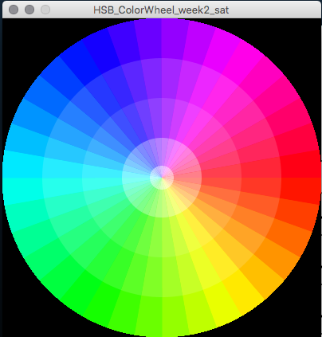
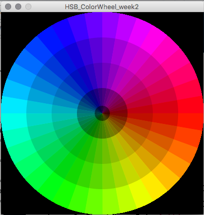

# HSB Color Wheel

### Static HSB ColorWheel

### Dynamic HSB ColorWheel, v1

The images below show 2 color wheels, both color-wheels have an outer ring of full saturation and brightness. The first color-wheel has saturation reduced toward the center. The second color-wheel has brightness decreased toward the center.

The programs use a custom function: drawColorWheel\( int size\) that draws a color-wheel using the size input parameter to determine the size of the wheel. For the images below, the function is called multiple times, each time the brightness or saturation is reduced before each smaller color-wheel is drawn.

Can you change the program below so that the repeated code logic is placed in a for-loop? 

 

```java
///Global Variables
float sat, bright;
///for initialization
void setup() {
  size( 800, 800);
  colorMode(HSB, 360, 100, 100);
  background(0);
  sat = 100; //initialize to full value saturation
  bright = 100;
  noStroke();
}

void draw() {
  //when mousePressed, show Saturation version
  if (mousePressed) {
    bright=100; //make sure bright and sat start at full values for outer circle
    sat=100;
    //How can we simplify this repetitive code using a custom function with a loop?
    drawColorWheel(width);
    sat = 75;
    drawColorWheel(width * .75);
    sat = 50;
    drawColorWheel(width * .50);
    sat = 25;
    drawColorWheel(width * .25);
  } else { //otherwise show brightness variation version
    sat=100;
    bright=100;
    //How can we simplify this repetitive code using a custom function with a loop?
    drawColorWheel(width);
    bright = 75;
    drawColorWheel(width * .75);
    bright = 50;
    drawColorWheel(width * .50);
    bright = 25;
    drawColorWheel(width * .25);
  }
}

//draws a full color wheel
void drawColorWheel( float size ) {
  float angleSize=10; //declare and intialize local variables
  float startDegree=0; //used for drawing arc, value changes in loop after each arc is drawn
  int numSlices = int(360/angleSize); ///loop maximum value: how many slices to draw?

  for (int i=0; i < numSlices; i++) {
    float endDegree = startDegree + angleSize;
    float hue = startDegree + ( angleSize / 2); //calculate hue for middle of arc
    fill( hue, sat, bright); //set fill
    arc( width/2, height/2, size, size, radians(startDegree), radians( endDegree));
    startDegree += angleSize; //change startDegree for each new slice to be drawn
  }
}
```

### Coding Challenge

Rewrite the program listed above so that it uses loops to create the nested colorWheels.  Anytime you have repeated lines of code, try to figure out if you can replace that logic using loops.

