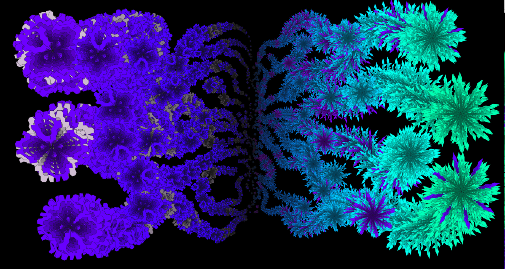
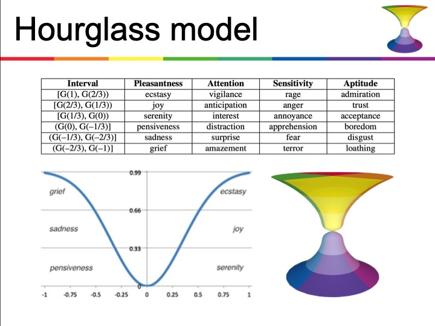

# Subjective Modeling of Emotions

This project instructs a design tool for self-exploration of subjective emotions, feelings, abstractions. The idea is to design a parametric tool that is personally encoded by each maker's choice of

In this project, we want design an interactive abstract artwork to represent our personal emotions about some personal event that we remembered as being highly emotional.

[Moving from Design-Thinking to Emotional-Thinking - Fast Company Article, 2019](https://www.fastcompany.com/90300071/from-design-thinking-to-emotional-thinking-designing-products-with-e-q)

In order to recall our emotions that are associated with our selected experience, it's helpful to have models of emotion that provide a structure of information about emotions.

## Models of Emotion

### Theory of Constructed Emotion

[wikipedia](https://en.wikipedia.org/wiki/Theory_of_constructed_emotion)

> In every waking moment, your brain uses past experience, organized as concepts, to guide your actions and give your sensations meaning. When the concepts involved are emotion concepts, your brain constructs instances of emotion.
>
> ...emotions "are not triggered; you create them. They emerge as a combination of the physical properties of your body, a flexible brain that wires itself to whatever environment it develops in, and your culture and upbringing, which provide that environment. [Lisa Feldman Barrett: Wikipedia](https://en.wikipedia.org/wiki/Lisa_Feldman_Barrett)

[Article: Fear or Defense Circuit, Dr Joseph Ledoux](https://brainworldmagazine.com/on-fear-emotions-and-memory-an-interview-with-dr-joseph-ledoux/)

> emotions are conscious experiences that occur when we find our self in a situation where a challenge or opportunity exist. Some occur when a survival circuit is active — like fear — while others don’t involve survival circuits — like pride. **What defines the emotion is** not whether there’s a survival circuit that’s active but **whether we interpret the situation we’re in as either challenging or potentially beneficial.**

[Dr Joseph Ledoux: Wikipedia](https://en.wikipedia.org/wiki/Joseph_E._LeDoux)

### [Contrasting and Categorization of Emotions - Wikipedia](https://en.wikipedia.org/wiki/Contrasting_and_categorization_of_emotions#Plutchik.27s_wheel_of_emotions)

Classical Models of Emotions

## Plutchick's Wheel of Emotions

## Hour Glass of Emotions

The Hour Glass model of Emotions was created by UX researchers. This model provides categories of emotion: Sensitivity, Attention, Pleasantness, Aptitude, where Emotions are given a numeric value based on the strength of the emotion. This dimensional, numeric model has been used to analyze emotional sentiment from written statements such as twitter tweets. Colors are used in the model to indicate the emotional dimensions.

[Sentic Presentation ](http://sentic.net/seminar/) 

Hour Glass Emotional Dimensions - [Wikipedia](https://en.wikipedia.org/wiki/Contrasting_and_categorization_of_emotions#Plutchik.27s_wheel_of_emotions)

| Dimension |
| :--- |

|  | +3 | +2 | +1 | -1 | -2 | -3 |
| :--- | :--- | :--- | :--- | :--- | :--- | :--- |
| [Sensitivity](https://en.wiktionary.org/wiki/sensitivity) | [Rage](https://en.wikipedia.org/wiki/Rage_%28emotion%29) | [Anger](https://en.wikipedia.org/wiki/Anger) | [Annoyance](https://en.wikipedia.org/wiki/Annoyance) | [Apprehension](https://en.wiktionary.org/wiki/apprehension) | [Fear](https://en.wikipedia.org/wiki/Fear) | [Terror](https://en.wiktionary.org/wiki/terror) |
| [Attention](https://en.wikipedia.org/wiki/Attention) | [Vigilance](https://en.wikipedia.org/wiki/Vigilance_%28psychology%29) | [Anticipation](https://en.wikipedia.org/wiki/Anticipation_%28emotion%29) | [Interest](https://en.wikipedia.org/wiki/Interest_%28emotion%29) | [Distraction](https://en.wikipedia.org/wiki/Distraction) | [Surprise](https://en.wikipedia.org/wiki/Surprise_%28emotion%29) | [Amazement](https://en.wiktionary.org/wiki/amazement) |
| [Pleasantness](https://en.wikipedia.org/wiki/Pleasantness) | [Ecstasy](https://en.wikipedia.org/wiki/Ecstasy_%28emotion%29) | [Joy](https://en.wikipedia.org/wiki/Joy) | [Serenity](https://en.wiktionary.org/wiki/serenity) | [Pensiveness](https://en.wikipedia.org/wiki/Melancholia) | [Sadness](https://en.wikipedia.org/wiki/Sadness) | [Grief](https://en.wikipedia.org/wiki/Grief) |
| [Aptitude](https://en.wikipedia.org/wiki/Aptitude) | [Admiration](https://en.wikipedia.org/wiki/Admiration) | [Trust](https://en.wikipedia.org/wiki/Trust_%28emotion%29) | [Acceptance](https://en.wikipedia.org/wiki/Acceptance) | [Boredom](https://en.wikipedia.org/wiki/Boredom) | [Disgust](https://en.wikipedia.org/wiki/Disgust) | [Loathing](https://en.wiktionary.org/wiki/loathing) |

[Sentic.net](http://sentic.net/)

