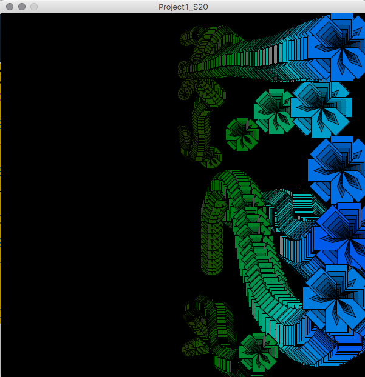

# Planning Structure: Functions:

#### Define Global Variables

* Define global variables to determine size range for pattern
* Define global variable balancePoint - can be animated for more interest 

#### Define Positive, Negative Custom Shape Functions

* Define custom Shape functions:
* Creates a single shape using len, c1

  * posCustomShape\( float len, color c1\)
  * negCustomShape\( float len, color c1\)

#### Define  Positive, Negative RecursivePattern Functions

* Define recursive functions: Creates a set of nested shapes - gradient in size, brightness
* Include Logic to determine changing brightness, changing size for each layered shape.

  * posRecursivePattern\( float len, color c1, color c2\)
  * negRecursivePattern\( float len, color c1, color c2\)

#### Define Positive, Negative Pattern Functions

* Define functions:  Creates 1 pattern - at  current mouse position, Gradients in color and size across the positive region
  * positivePattern\( float balancePoint, int mX \)
  * negativePattern\( float balancePoint, int mX\)

Example Code

```java

float minSize, maxSize;
float balancePoint;

void setup(){
  size( 600, 600);
  colorMode( HSB, 360, 100, 100,100);
  background(0);//only set one time
  minSize = 10;
  maxSize = 60;
  balancePoint = width/2;  //start at middle of canvas
}

void draw(){
  if(mousePressed){
    translate( mouseX, mouseY);//translate origin to mouse position
    for( int angle = 0; angle< 360; angle += 45){
     rotate( radians( angle));
     positivePattern( balancePoint, mouseX);
    } //end for
    resetMatrix();
  } //end if-mousePressed
  
}//end of draw


//determine current size, color: gradients across the positive region
void positivePattern(  float balancePoint, int mX){
   
  color cPos1 = color( 280, 100, 100); //purple
  color cPos2 = color( 80, 100, 100); //lime
  
  //define curColor based on mX relative to balancePoint
  float fraction = map( mX, balancePoint, width, 0.0, 1.0);
  color curColor = lerpColor( cPos2, cPos1, fraction); //fraction varies beteween 0.0, 1.0
  
  float curSize = map( mX, balancePoint, width, minSize, maxSize );
  posRecursivePattern( curSize, curColor);
  
}

//Draws a single motif - nested size and color gradient
void posRecursivePattern( float size, color c1){
  //termination test
  if(size < minSize){
    return;
  }
  //task
  float fraction = map( size, minSize, maxSize, 0.2, 1.0); //may want to customize
  color curColor = color( hue(c1), saturation( c1), brightness(c1)*fraction);
  PShape s1 = customPosShape( size, curColor); //test the shape
  shape(s1,0,0); //render the shape at the origin
  
  //recursive call
  posRecursivePattern( size * 0.8, c1); 
  //task - with reversed stacking - mirror across origin
  pushMatrix();
  scale( -1, -1);//mirror across the x, y axis (origin)
  shape( s1, 0, 0);
  popMatrix();
}

//Draws a single shape
PShape customPosShape(  float len, color c1){
  PShape s; //declare our first object-type variable //heap - object memory
  fill( c1);//attempt to set color for the shape
  s = createShape( );//initialize our shape
  s.beginShape();
  s.vertex( 0,0  ); //1 x, y points
  s.vertex(.5 * len , 0 ); //2
  s.vertex(len , .5* len ); //3
  s.vertex(.5 * len , len  );//4
  s.vertex( 0,  .5* len ); //5
  s.vertex( 0, 0 ); //6
  
  s.beginContour(); //make internal cutout 
  s.vertex( len*.25,len*.45); //inner cutouts - point 5
  s.vertex(len*.6, len*.6);  // 
  s.vertex( len*.45, len*.25); // 
  s.vertex(0,0);
  s.endContour(); //end internal cutout

  
  s.endShape();
  //shape( s, 0,0);  //render to the canvas
  return s; //return the PShape
  
}

  
```



### Planning Document


