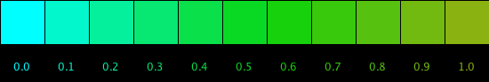

# Project 1: Programmatic Variations in Color

Using HSB ColorMode allows us to configure and modify colors in our programs based changing values for the Hue, Saturation, or Brightness.


## Gradients:

If we use a gradient \(programatic change\) for the brightness of an abstract pattern, we can enhance the illusion of depth for 2D designs.

Since we're using `float len` as an input parameter to determine the size of the shape, we can also use this value of len to help determine a good value to control varying the brightness each time we drawn a shape. One way to do this is to set the max value for Brightness using the max value for Len:

## Map Function

In the example below, we are creating a relationship between the current value of len, the maximum len value: lenMax, and the max value for brightness to determine the brightness value for a current value of len. This is exactly what the Map function does, it creates a linear mapping between 2 ranges of values. So, as long as we have access to the range of each set of values, we can use the processing map function to programmatically determine color for our vertexPatterns. To control the hue, we're using the map function to create a relationship between the mouseX position and we're constraining the hue to a narrow range between blue and pink \(Hue between 200,300\);

## LerpColor: Processing Function

Processing provides a function [LerpColor\( \) ](https://processing.org/reference/lerpColor_.html)to create gradients of color between 2 color endpoints. Lerp means Linear interpolation. 

```text
lerpColor(c1, c2, amt)
```

> Calculates a color between two colors at a specific increment. The **amt** parameter is the amount to interpolate between the two values where 0.0 is equal to the first point, 0.1 is very near the first point, 0.5 is halfway in between, etc.  
> An amount below 0 will be treated as 0. Likewise, amounts above 1 will be capped at 1. This is different from the behavior of lerp\(\), but necessary because otherwise numbers outside the range will produce strange and unexpected colors.

## Using lerpColor\( color c1, color c2, float amount\)

lerpColor takes 2 color values as input parameters, and takes a floating point fractional value to indicate the fractional distance between the 2 colors to calculate the intermediate color that is returned.



Using the colorSelector tool, we need to make sure to set HSB as below. This sets the range of values for Hue: 0-260, Sat: 0-100, Brightness: 0-100

`colorMode(HSB, 360, 100, 100 ); //corresponds to the colorSelector color values`

Logic for image above:

1. Select a start and end colors

   `color startColor = color(180, 100,100); //bright cyan` `color endColor = color(75, 90, 70); //pea green`

2. Set \(and modify\) the amount variable - it takes decimal values between 0.0 - 1.0

   `float amt = (.10 * i ); //i is loop index`

3. Determine calculated color:

   `color interColor = lerpColor( startColor, endColor, amt);`

4. The first square shows the startColor since `amt = 0.0`
5. The last square shows the endColor since `amt = 1.0`

## Example Code

```java
for( int j=0; j<= 10; j++){ //j index for columns
      float amt = j * 0.1;
      color intermediateColor = lerpColor( startColor, endColor, amt);
      fill(intermediateColor);
      rect( j* size, 0, size, size);
      }
```

