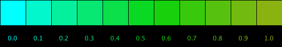

# LerpColor

## Using lerpColor\( color c1, color c2, float amount\)

lerpColor takes 2 color values as input parameters, and takes a floating point fractional value to indicate the fractional distance between the 2 colors to calculate the intermediate color that is returned.



Using the colorSelector tool, we need to make sure to set HSB as below. This sets the range of values for Hue: 0-260, Sat: 0-100, Brightness: 0-100

`colorMode(HSB, 360, 100, 100 ); //corresponds to the colorSelector color values`

Logic for image above:

1. Select a start and end colors

   `color startColor = color(180, 100,100); //bright cyan` `color endColor = color(75, 90, 70); //pea green`

2. Set \(and modify\) the amount variable - it takes decimal values between 0.0 - 1.0

   `float amt = (.10 * i ); //i is loop index`

3. Determine calculated color:

   `color interColor = lerpColor( startColor, endColor, amt);`

4. The first square shows the startColor since `amt = 0.0`
5. The last square shows the endColor since `amt = 1.0`

## Example Code

```java
for( int j=0; j<= 10; j++){ //j index for columns
      float amt = j * 0.1;
      color intermediateColor = lerpColor( startColor, endColor, amt);
      fill(intermediateColor);
      rect( j* size, 0, size, size);
      }
```

