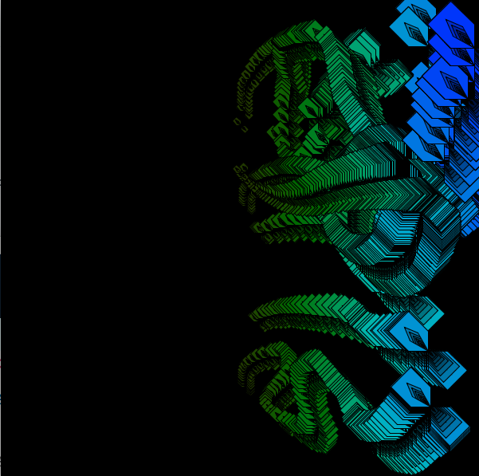

# Map with LerpColor

Given 2 colors c1, c2, use the map function to calculate how a fraction value changes across a region.  The calculated fraction is used in LerpColor to create a new color: curColor.  See full code below for extended version using similar logic.

```text
  color c1 = color( 230, 100, 100); //purple 
  color c2 = color( 80, 100, 100); //lime
  
  //define curColor based on mX relative to balancePoint 
  float fraction = map( mX, 0, width, 0.0, 1.0); 
  
  color curColor = lerpColor( c2, c1, fraction); //fraction varies beteween 0.0, 1.0
  
 
```



```text
void draw(){
  if(mousePressed){
    translate( mouseX, mouseY);//translate origin to mouse position
       positivePattern( balancePoint, mouseX);
  } //end if-mousePressed
}//end of draw


void positivePattern( float balancePoint, int mX){
  color cPos1 = color( 230, 100, 100); //purple 
  color cPos2 = color( 80, 100, 100); //lime
  
  //define curColor based on mX relative to balancePoint 
  float fraction = map( mX, balancePoint, width, 0.0, 1.0); 
  color curColor = lerpColor( cPos2, cPos1, fraction); //fraction varies beteween 0.0, 1.0
  
  //define curSize based on mX relative to balancePoint
  float curSize = map( mX, balancePoint, width, minSize, maxSize ); 
  
  posRecursivePattern( curSize, curColor);
}

//Draws a single motif - nested size and color gradient
void posRecursivePattern( float size, color c1){
  //termination test
  if(size < minSize){
    return;
  }
  //task
  float fraction = map( size, minSize, maxSize, 0.2, 1.0); //may want to customize
  color curColor = color( hue(c1), saturation( c1), brightness(c1)*fraction);
  PShape s1 = customPosShape( size, curColor); //test the shape
  shape(s1,0,0); //render the shape at the origin
  
  //recursive call
  posRecursivePattern( size * 0.8, c1); 
  //task - with reversed stacking - mirror across origin
  pushMatrix();
  scale( -1, -1);//mirror across the x, y axis (origin)
  shape( s1, 0, 0);
  popMatrix();
}

//Draws a single shape
PShape customPosShape(  float len, color c1){
  PShape s; //declare our first object-type variable //heap - object memory
  fill( c1);//attempt to set color for the shape
  s = createShape( );//initialize our shape
  s.beginShape();
  s.vertex( 0,0  ); //1 x, y points
  s.vertex(.5 * len , 0 ); //2
  s.vertex(len , .5* len ); //3
  s.vertex(.5 * len , len  );//4
  s.vertex( 0,  .5* len ); //5
  s.vertex( 0, 0 ); //6
  
  s.beginContour(); //make internal cutout 
  s.vertex( len*.25,len*.45); //inner cutouts - point 5
  s.vertex(len*.6, len*.6);  // 
  s.vertex( len*.45, len*.25); // 
  s.vertex(0,0);
  s.endContour(); //end internal cutout

  
  s.endShape();
  //shape( s, 0,0);  //render to the canvas
  return s; //return the PShape
  
}
```


