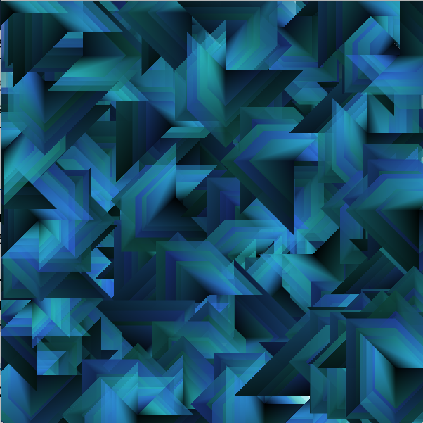

# VertexShape - Recursion

In the code below, we define a Recursive function: `recursivePattern()` that creates repeated versions of the vertexPattern.

* **parameter: float length** - size of the pattern
* **parameter: float level** - controls number of repeats - insures termination 
* **recursivePattern\(\)** defines the repetition structure
* **vertexShape\( \)** is the task that is repeated

  **vertexShape\( float len\)  function**

```java
    //Draws one PShape each time it is called
    //PShape size is determined by input parameter: len
    PShape vertexShape( float len, color c){
        PShape s = createShape();
        s.beginShape();
        s.fill( c ); //set fill
        s.vertex(0,0);//list points in clockwise order

        s.vertex( len, 0); 
        s.vertex( len, len);
        s.vertex( len * .5, len * .5);
        s.vertex( 0, len);
        s.endShape(CLOSE);
        return s;  //return the shape
    }
```

## recursivePattern\(PShape s, float scale, float count, color  c1 \) function

```java
    //recursive function to draw nested patterns
    //scale is input as largest size, smaller patterns are drawn with each recursive call
    //level determines how many patterns are drawn
    //level MUST be decremented in each recursive call to insure termination
    void recursivePattern( PShape s, float scale, float level){
        if(level <1 ) { //termination condition
            return; //stop function execution by returning from the function
        }
        s.scale( scale, scale) //- task - create PShape by calling the vertexShape function
        shape( s, 0, 0); //draw the shape on the canvas at x=0,y=0.
        recursivePattern( scale* 0.8, level -1 ); //recursive call
    }
```

## Program using recursivePattern function

```java
float length=150;
float scale = 1.0;
color c1 ;

void setup(){
    size( 600,600); //use size(600,600,P2D) if possible
    c1 = color ( 200, 100, 100);
}

void draw(){
    if(mousePressed){
        translate(mouseX, mouseY);
        PShape s = vertexShape( length, c1 )
        recursivePattern( s, scale,5); //here level is initialized at 5 because we decrement it inside the recursive function
        resetMatrix();
    }
}
```

## HSB Colormode - Set Fill at the Vertex Level - Shader Option

Once a design has been developed using grayscale color values as show above, then it's very easy using HSB colormode to add hueValues. Processing using P2D mode as specified in the size\( 600,600, P2D\) supports vertex shaders, where gradient colors are computed for fill\( \) values specified between vertex for PShape objects.


```java
        //size(600,600, P2D); //vertex shading using P2D
        //colorMode(HSB, 360,100,100);
        //float len = 100;

        //reducing brightness value between vertex points
        PShape vertexShape(float len, color c1){
            PShape s = createShape();
            s.beginShape();
            s.fill(c1); // 
            s.vertex( 0, 0 ); //point origin
            s.fill(hue(c1), saturation(c1), brightness(c1)*0.8 ); // reduce brightness
            s.vertex( len *.4, 0 ); //point(40,0)
            s.fill(hue(c1), saturation(c1), brightness(c1)*0.6 ); // reduce brightness
            s.vertex( len *.6, len*.6 ); //point(60,60);
            s.fill(hue(c1), saturation(c1), brightness(c1)*0.4 ); // reduce brightness
            s.vertex( 0, len *.4 ); //point(0,40);
            s.fill(hue(c1), saturation(c1), brightness(c1)*0.2 ); // reduce brightness
            s.vertex( 0, 0 );
            s.endShape(CLOSE); //end shape
            return s;
        }
```

## Vertex Shading Example



The image above uses fill variation between each vertex, as shown above, to create enhanced depth for the pattern.

If we use the processing P2D rendering context, we can set a different fill value and stroke value for each vertex, this allows us to create visual depth in the pattern. When incorporated into a simple recursive function this can create interesting complex images.  
P2D might not work on some computers, if not, then just use regular: size\(600,600\);. You will need to create an interesting pattern using fill outside of the beginShape\(\) function that impacts the entire shape.

## Framecount as a timer - Option

We can use frameCount and modulus, to add a timer to the draw loop and \(we can also rotate the pattern each time it is drawn using a similar technique\)

```java
if(framecount % 10 == 0){
//this event occurs every 10 frames
//doSomething every 10 frames
}
```

