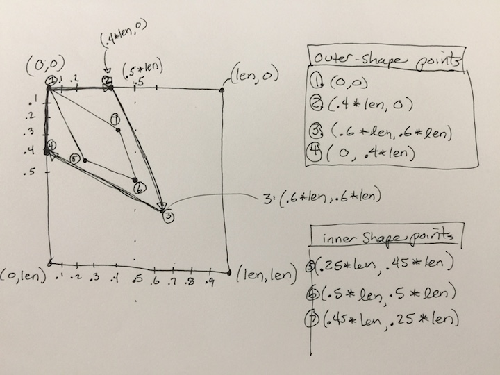
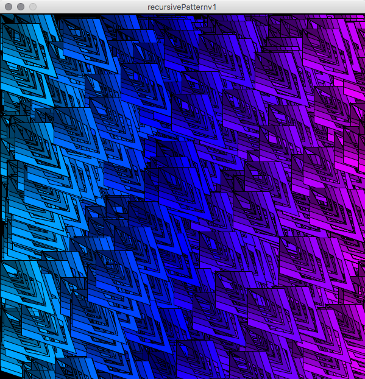

# PShape with Cutout - Inner Contour

### Processing PShape with Contour

Examples in the tabs below show details for specifying vertices to create an inner-cutout using the PShape methods: beginContour \( \), endContour\( \).  Note that vertex points specified to create a contour must be listed in reverse rotational order than what was used to specify the initial vertex points for the shape.





Notice: the initial 6 vertex points listed below are specified in **clockwise order**  
To specify **contour vertex points**, the order must be **reversed - counter-clockwise**.  Often you may choose to repeat points \(see point 6 \), in the code. Note: when specifying contour points, complex shapes can result.





PShape with Contour - example code below corresponds to the images on the previous tab.  Note the use of s.beginContour\( \), s.endContour\( \) methods.  Note that s.endShape\(CLOSE\) is the last line of code required to specify the PShape's form.

```java
//create custom PShape usign vertex points
PShape fallShapeContour( float w, float h, color c1 ) {
  PShape s = createShape(); //initialize PShape
  s.beginShape();
  s.vertex( 0, .25*h);  //1
  s.vertex( w*.75, 0);  //2
  s.vertex( w* .10, h* .50); //3
  s.vertex( w* .25, h* .75); //4
  s.vertex( w* 0, h* .75); //5
  s.vertex( 0, .25*h);  //6
  s.beginContour();
  s.vertex( 0, .25*h);  //6
  s.vertex( w* .10, h* .45); //7
  s.vertex( w* .40, h* .20); //8
  s.vertex( w* .10, h* .30); //9
  s.endContour();
  s.endShape(CLOSE);
  s.setFill( c1);
  return s;
}
```





The image below shows how vertex points can be specified as a fractional value of len, the input parameter for our PShape functions.

The drawing shows the points that are specified in the code below. You will want to draw a similar diagram to determine points for your custom shape vertices. Notice that points used for the cutout-inner-contour are specified in counter-clockwise manner. The last point for the outershape is \(0,0\), it's not re-numbered in the drawing, instead, the point with label 5 has values: s.vertex\(.25_len, .45_len\), it is located near point 4 on the drawing.





## PShape with Contour

The code below shows that PShape can have an inner cutout created using the beginContour\(\), endContour\(\) functions. The vertex points specified within those 2 functions will be cut-out of the larger shape that was specified before the beginContour\(\) function. The point numbers correspond to the circled numbers in drawing above.

```java
  PShape s = createShape();
  s.beginShape();
  s.fill(200, 100,100 ); //HSB - blue full sat, bright
  s.vertex( 0,0); //point 1 for outer shape (clock-wise rotation for drawing points)
  s.vertex( len*.4,0); //point  2
  s.vertex( len*.6, len*.6); //point 3
  s.vertex( 0, len*.4); //point 4
  s.vertex( 0,0); //last point for outer shape

   ////start of inner cutout - counter-clockwise ordering
  s.beginContour(); //make internal cutout 
  s.vertex( len*.25,len*.45); //inner cutouts - point 5
  s.vertex(len*.5, len*.5);  //point 6
  s.vertex( len*.45, len*.25); //point 7
  s.endContour(); //end internal cutout

  s.endShape(CLOSE); //end shape
  shape( s, 0,0);  //this displays the shape on the canvas at point (0,0)
```



## Repeat Pattern using PShape with contour

The image below shows an intricate pattern created using a recursive function and a PShape that has an inner cut-out, contour.



