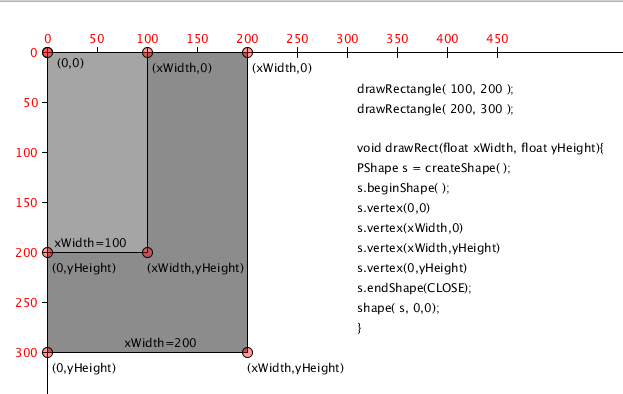

# PShape Objects

## PShape - Processing

[PShape](https://processing.org/reference/PShape.html) is a wrapper class for shapes in processing. It provides a class that can be used to **create objects** using scalable vector graphic format \(.svg\), processing primitive shape functions, and shapes created by specifying vertex points. In this project, we'll use the PShapes created by specifying a set of vertex points. Processing expects the points to be specified in a clockwise rotating pattern.

The image below shows how we can create a simple polygon using the [Processing PShape, createShape\( \), beginShape\( \), endShape\( \)](https://processing.org/reference/beginShape_.html) functions.

### 1. Processing Primitive Shapes

There are a variety of ways to create PShape Objects.  The most simple way is to create PShape objects using _Processing_ **primitive shapes**, and the PShape: ****[**createShape\( \)** ](https://processing.org/reference/createShape_.html)method. As shown in the code snipped below, you must first declare a variable of the type: PShape, then you can call the **createShape\( \)** method by specifying Processing _constant_ values of **kind:** either POINT, LINE, TRIANGLE, QUAD, RECT, ELLIPSE, ARC, BOX, SPHERE

It is required to input values for the corresponding parameters used to create the Processing shape primitive: ex. **ELLIPSE requires: float x, float y, float w, float h**

**Display using  the PShape method:  shape\( PShape s, float x, float y \)**

```java
  PShape s = createShape(ELLIPSE, 0, 0, 100, 80);
  shape( s, 100, 100 ) //displays at point ( 100, 100 )
```

### **2. Specify Vertex Points to Create PShape** 

For the code below, we've created a variable: length, which we'll use to constrain the shape to a rectangle of \(length x length \) dimensions. The points must be ordered in clockwise direction, starting from point at the beginning of the shape, listing all intermediate vertices, and ending with s.endShape\( CLOSE\) if we want the shape to have a colored fill.


```java
 float len  = 100;
  PShape s; //declare the PShape object named s
  s = createShape(); //initialize the PShape object
  s.beginShape(); //starts a vertex shape
  s.fill(200, 100, 100 );      // blue, HSB
  s.vertex( 0, 0 );               //point origin
  s.vertex( len  *.4, 0 );          //point(40,0)
  s.vertex( len  *.6, len *.6 );    //point(60,60);
  s.vertex( 0, len *.4 );         //point(0,40);
  s.vertex( 0, 0 );              //last point
  s.endShape(CLOSE);             //end shape

  shape(s, 0,0); //display shape at origin
```

For our recursive pattern project, it will be important to create a simple pattern that can be defined by a location point \(shape's origin point\) and one **len**  value.

`vertexPattern( len );`

If we design our pattern based on points on a rectangle, the code below shows this requires us to specify 4 corners as vertex points.

Defining the shape based on a variable length means that if length=100, it should create a pattern that is 10 times larger than if we'd set length = 10.

Finally, to simplify further, we can specify the object's position at the canvas origin, \(0,0\), we can use translate\( x, y\) for drawing the object at \(x, y\).

```java
  PShape s = createShape();
  s.beginShape();
  s.fill( 100, 200, 255, 100 ); //set shape's fill
  s.vertex(0,0);
  s.vertex( len, 0);
  s.vertex( len, len);
  s.vertex( 0, len);
  s.endShape(CLOSE);

  shape( s, 0,0);  //this displays the shape on the canvas at point (0,0)

//example shape 2 - Use factor of .5 to scale len parameter
  PShape s2 = createShape();
  s2.beginShape( );
  s2.vertex( 0, 0);
  s2.vertex( len * .5, len * .5);
  s2.vertex( len, len);
  s2.vertex( len * .5, len);
  s2.vertex( 0, len);
  s2.endShape( CLOSE);

  //to draw at location: 200,200, use transform functions
  pushMatrix();
  translate( 200,200);//translate origin to 200,200
  shape( s2, 0, 0); //display 
  popMatrix();
```

### Custom Draw Rectangles Function using Vertex Points

  
The image above shows that we could define our own drawRectangle\(w, h\) function, where we define xWidth, xHeight input parameters. This will work just like the processing rectangle function, except that it doesn't take in x,y location input parameters. Instead, we're hard-coding the position vertex at \(0,0\); We can see from the code on the diagram how the input parameters are used to define 4 vertex points that represent the rectangle corners. This way, if we call the function 2 times with different inputs, we'll have 2 different rectangles scaled according to the input values:

```java
//rectangles are scaled using the input parameters: xWidth, xHeight
drawRectangle( 100,200 );
drawRectangle( 200, 300);
```

### Custom Functions to Create PShape

Below is an example vertex pattern function that takes in 2 input-parameters: xWidth, yHeight. Within the function, those input parameters define the vertices of a rectangle. We've now created a function that will allow us to draw a rectangle of any size, and any location if we use the transform function to move the origin to the desired location prior to calling this function. We've just redesigned the processing rectangle function using PShape objects. What's much more interesting is that we can create functions to generate our own design motifs, as long as we design the pattern using parameters variables to define the actual design geometry.

```java
void drawRectangle( float xWidth, float yHeight){
   PShape s = createShape();
   s.beginShape();
   s.vertex( 0,0);
   s.vertex( xWidth, 0);
   s.vertex( xWidth, yHeight);
   s.vertex( 0, yHeight);
   s.endShape( CLOSE);
   shape( s, 0,0);
 }
```

### Custom Function to create, return a PShape

In the example below, a custom function is used to **create and return a PShape object.**

```java
void setup(){

PShape rect = createRect( 100, 200); //call the function
shape( rect, 0,0);//render on canvas at origin

}

//Function that creates and returns a PShape.
PShape createRect( float xWidth, float yHeight){
   PShape s = createShape();
   s.beginShape();
   s.vertex( 0,0);
   s.vertex( xWidth, 0);
   s.vertex( xWidth, yHeight);
   s.vertex( 0, yHeight);
   s.endShape( CLOSE);
   return s;
 }
```

