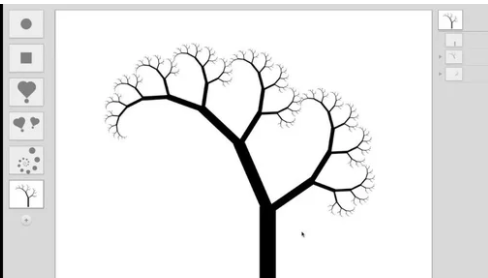

# Recursion

## Recursion: Self-Similar Replication, Evolution?

Recursion is a type of repetition. Recursion occurs when a thing is defined in terms of itself or of its type. [Wikipedia](https://en.wikipedia.org/wiki/Recursion)

## Experiential Being, Doing as  Recursive Flow

When contemplating experiential dynamics, it is useful to consider what recursion feels like.  I suggest that contemplation of recursion can provide a useful analogy for contemplation of the changing nature of experience.  At each point in time, each  self-adaptive system has a possibility for change - from the perspective of an observer, change occurs during an event, the measured features that change can be considered as parameters of a model - where information \(patterns of relational mappings\) are created through dynamic patterns of energy across time, space, and  other dimensions.

#### Recursive Painting - From Flowing Data.com -

[See the FlowingData.com article about the image below:](https://flowingdata.com/2019/02/05/recursive-painting-in-real-life/) First, a woman painted a photo, Then someone took a photo of her holding the painting. Then he painted the photo, and took a photo of him holding his painting, and so on....This is recursion.


Interactive Data Visualization of the recursion relationships for a growing series of these recursive paintings [visualization link](http://nubleh.github.io/i_painted/)

#### Recursion in Programming

Recursive programs refer to programs that contain at least **1 recursive function**. **A recursive function is a function that has a function call to itself within the function definition.** 

#### Example  - Nested Rectangles - 3 ways

The code below would create a set of nested rectangles, the largest is drawn first, the value of length is reduced, then a smaller rectangle is drawn...this is repeated 5 times.

```java
int length = 200;
fill(length);
rect( 0, 0, length, length);
length = length - 20;
fill(length);
rect( 0, 0, length, length);
length = length - 20;
fill(length);
rect( 0, 0, length, length);
length = length - 20;
fill(length);
rect( 0, 0, length, length);
length = length - 20;
fill(length);
rect( 0, 0, length, length);
```

### Loops for Repetition - Iteration

An experienced programmer would want to **refactor** such repetitive code, knowing that **loops** can provide a cleaner method to implement repetitive code:

```java
void loopNestedRectangles( float length, int count) {
  for ( int i = count; i > 0; i--) { //loop control structure
    fill(length);
    rect( 200, 200, length, length);
    println("length " + length);
    length = length - 20;
  }
}
```

### Recursive Function for Repetition

In the code below, the function: `recursiveNestedRectangles( int length, int count);`, draws a series of nested rectangles, starting with the largest rectangle, stopping when the count variable is less than 0;

```java
void recursiveNestedRectangles( float length, int count ) {
  if (count < 1) {
    return; //termination or end condition
  }
  fill(length);
  rect( 0, 0, length, length);
  println("length " + length);
  recursiveNestedRectangles( length-20, count -1 );
}

recursiveNestedRectangles( 200, 5); //call the function
```

#### Guidelines for Writing Recursive Functions

When writing recursive functions there are several factors to consider: 

1. **Identify the base-case** or stopping condition `if(count < 1){ return; }`
2. Insure that the **variable that controls the stopping condition** will be modified in the recursive function so that it will **eventually reach the stopping condition**. `count - 1` 
3. **Locate the conditional test for the stopping condition before the recursive call** to prevent the recursive call from occurring when the stopping condition has been met. 
4. Determine whether the function **task** should be performed before or after the recursive call \( or both \). `rect( 0, 0, length, length );` 
5. Insure that **input parameters** to the recursive function provide all information needed at each step, and be careful when modifying values passed as arguments.

`recursiveNestedRectangles( length-20, count -1 );`

**Error below when using postfix decrement operator** `recursiveNestedRectangles( length-20, count-- );` 

6. See info below about **call-stack**: Be aware that each instance of a recursive function call causes a unique instance of the function's code to be placed on the `call-stack`, this can potentially cause **stack-overflow errors** if the program runs out of available program-execution memory space.

#### Recursive Drawing

[Toby Schachman](http://tobyschachman.com/) created an interactive application that provides a visual interface for playing with recursion via 2D shape primitives. It's surprising how quickly the designs become disorienting, illustrating the power of recursion.



#### Recursive Patterns

When we look in nature, we see frequently see recursive patterning - we see a relationship between several objects - and we understand that these objects have a more complex relationship than simple repetition. Often in recursive patterns, we can observe that some feature has been scaled larger or smaller, where a self-similarity forms patterns across a series of objects. Recursive patterns often include parent-child relationships between objects.

**Russian Nesting Dolls** The classic Russian nesting dolls provides a nice example of a set of physical objects that have a recursive relationship. Each doll is positioned within it's parent object, and it's been scaled down to fit snuggly within.


#### Factorial:  N!

Factorial is a mathematical formula that is used when determining probabilities. One example of the use of factorials can be observed when looking at a distinct set of `n` objects, the objects can be arranged in `n!` different configurations, so there are `n permutations` of arrangements for n distinct objects. Factorials provide a nice example of a mathematical calculation that can be easily understood, and which can be written using a recursive function, factorial can also be calculated using standard for-loops. In section 13.6 of Shiffman's book, he provides examples of both types of functions to calculate Factorial values, a recursive version of the factorial program code is included below.

[Shiffman's Factorial Using Loops ](https://natureofcode.com/book/chapter-8-fractals/)

```java
int factorial(int n) {
  int f = 1;
Using a regular loop to compute factorial
  for (int i = 0; i < n; i++) {
    f = f * (i+1);
  }
  return f;
}
```

## Additional Examples of Recursion using Processing

For additional examples of patterns created using Recursive programs in Processing, see: The Nature of Code, Daniel Shiffman. Online eBook: [Chapter 8 , Section 2](http://natureofcode.com/book/chapter-8-fractals/)

