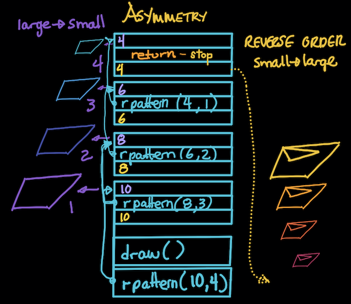
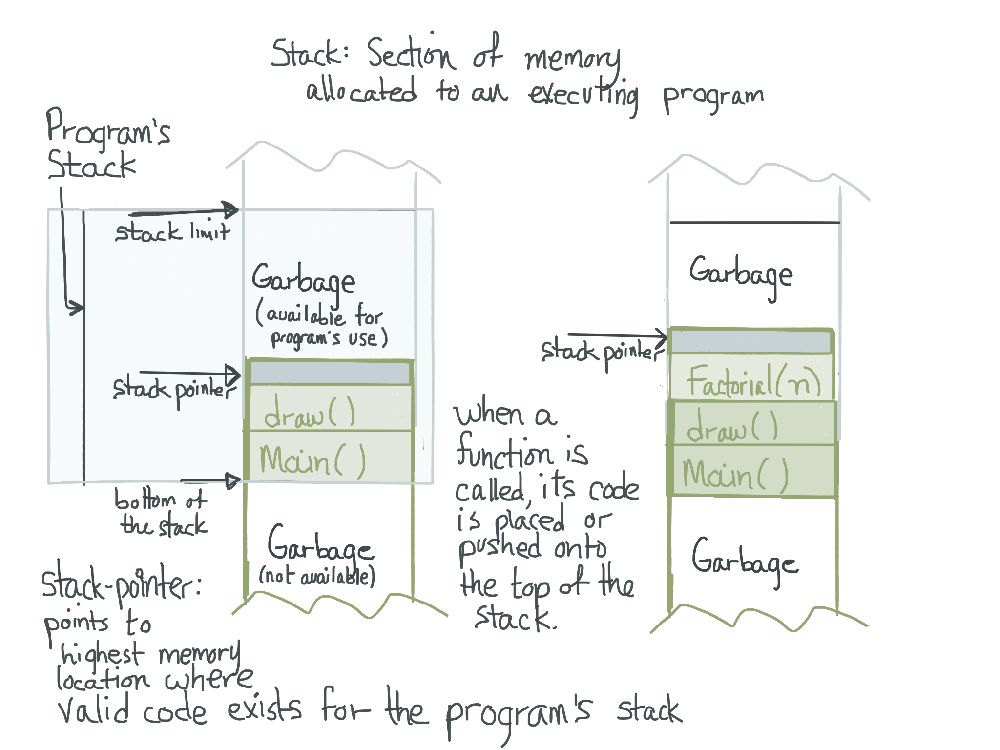

# Recursion Call-Stack

## Recursion Call-Stack

When our program is executing, a special section of the computer's memory-space is allocated just for our program called the program's `Call Stack`. It is important to understand how a program's `Call-Stack` operates, in order to understand how recursive functions behave when they are executing.



## Simplified Call Stack



Each time a function is called, the code for the function, as well as space for function arguments and return values, is pushed onto the top of the call stack. When the function finishes execution, then that code it is removed or popped-off of the top of the stack. A stack only allows items to be added to the top-end, so it is called a Last-In-First-Out \(LIFO\) data structure. In contrast, a queue is a First-In-First-Out data structure. In our programs, the draw\(\) function is constantly being pushed onto the stack, then it is popped off the stack when it's completed executing the code.

## Simplified Stack: Loop vs. Recursive Factorial Function


Similarly, if we use a factorial function that doesn't use recursion, but uses a for-loop, then only 1 instance of the function is repeatedly pushed onto the stack, and it remains on the stack until it has completed executing, we can see this in the diagram above, where 1 instance of the Factorial\(n\) function is on the top of the call-stack. However, when we execute a recursive function, then we have many distinct instances of our function's code pushed onto the stack, with the code on the top-most instance being executed until it completes.

## Order of Execution

Below is code for the Recursive version of Factorial Program, we have added several println statements so we can better understand how the code actually executes

```java
void setup(){
int finalResult = factorial( 6 );
println("final result " + finalResult);
}

int factorial( int n){
println("start of factorial n= " + n); //here is the recursive function call
if( n == 1){ //base case 1! = 1 //return 1
println( "base case result = 1");
return 1;
}
int result = n * factorial(n - 1);
println("end of factorial, result= " + result + " n " + n);
return result;
}
```


From the above image we can see that the println statement within the factorial function that is located before the function calls itself gets printed in the order that the functions are called. However, we can see that once we reach the base case, then the order changes. As each function is completing it's calculation, it prints the end of factorial statement and then returns that value to the calling instance of the function. So when we design recursive functions, the order of statements: before or after the recursive call has a large impact on the ordering of when the code is actually executed.

