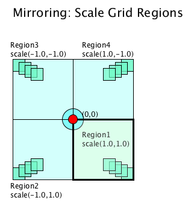
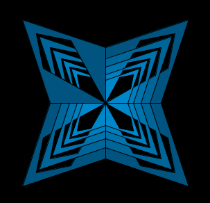
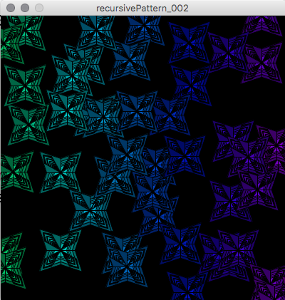

# Transforms for Mirroring

The Processing **Scale\( float scaleX, float scaleY\)** can be used to create mirroring of shape forms. [Processing reference: Scale](https://processing.org/reference/scale_.html)

> Increases or decreases the size of a shape by expanding and contracting vertices. Objects always **scale from their relative origin** to the coordinate system. **Scale values are specified as decimal percentages.**

For example, the function call scale\( 2.0, 1.0 \) increases the dimension of a shape by 200% along the x-dimension, with no change along the y dimension.



The image above shows a set of stacked squares, relative to the canvas origin, shown as a red circle at \(0,0\). When scale\(1.0,1.0\) is applied, no change to the shape occurs. When scale\( -1.0, 1.0\) is applied, mirroring across the y-axis occurs, since scaling is only changed in the x dimension. Here, this image is shown mirrored in a quadrant called Region2.

When using any transform functions, it's important to isolate those transforms so they don't impact any subsequent code. Using pairs of pushMatrix\(\), popMatrix\(\) functions calls can restrict the scale\( \) transform's impact to shapes drawn between the pushMatrix\(\), popMatrix\(\) pair.

## Mirroring with scale\( \) for RecursivePattern

The image below shows that we can create a complex asymmetric design using mirroring and recursion.



## RecursivePattern with scale for mirroring

```java
void recursivePattern( float len, int count){
  if( count < 1){ //termination test - variable must be modified somewhere in recursive function to insure termination
    return;  //termination condition
  }

  float bright = map(len, lenMin, lenMax, 100,50); //bright changes with len

  color c1 = color( 200, 100, bright ); //blue
  PShape s = vertexShape( len, c1 );  //create shape using current len
  shape( s, 0, 0);//draw the shape

  /////Draw pattern mirrored into region4 
  pushMatrix(); //take snapshot of prior transforms
  scale(1.0, -1.0); //mirror across X-axis //region4
  shape( s, 0, 0);//draw the shape
  popMatrix(); // restore transforms to prior snapshot

  /////Draw on pattern mirrored in region2
  pushMatrix(); //take snapshot of prior transforms
  scale(-1.0, +1.0); //mirror across Y-axis //region2
  shape( s, 0, 0);//draw the shape
  popMatrix(); // restore transforms to prior snapshot

  recursivePattern( len * 0.8, count - 1); ///RECURSIVE CALL

  ///shape drawn after recursive call are stacked in reverse order, smallest to largest - asymmetry
  c1 = color( 200, 100, bright );
  s= vertexShape( len ,c1 );   ///we can use -len to draw in region3
  scale(-1.0, -1.0); //mirror across X, Y-axis //region2
  shape( s, 0, 0); 
}
```



