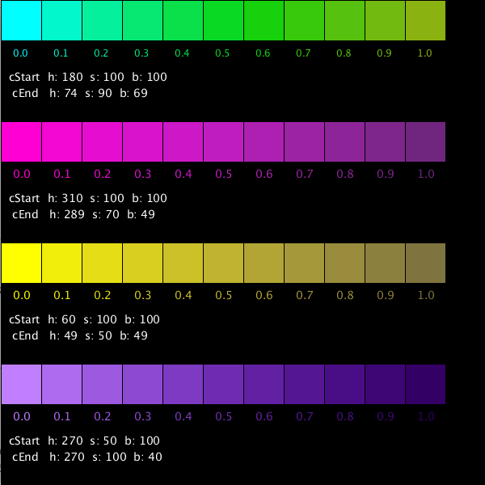

# Demo Lerp Colors



```java
void setup(){
  background(0);
  size( 600,600);
  colorMode(HSB, 360,100,100);
  int size=40;

  color c1Start = color(180, 100,100); //bright cyan
  color c1End = color(75, 90, 70); //pea green
  demoLerp( 0,0,50, c1Start, c1End);

  translate( 0, 150);
  color c2Start = color(310, 100,100); // magenta
  color c2End = color(290, 70, 50); // dark purple
  demoLerp( 0,0,50, c2Start, c2End);

  translate( 0, 150);
  color c3Start = color(60, 100,100); // yellow
  color c3End= color(50, 50, 50); // dark yellow
  demoLerp( 0,0,50, c3Start, c3End);

  translate( 0, 150);
  color c4Start = color(270, 50,100); // purple
  color c4End= color(270, 100, 40); // saturated dark purple
  demoLerp( 0,0,50, c4Start, c4End);

  resetMatrix();

}
void demoLerp( int x, int y, int size, color c1Start, color c1End){
  translate( x,y);

  for( int j=0; j< 11; j++){ //j is column index
      float amt = map( j, 0, 10, 0.0, 1.0);
      color c1Lerp = lerpColor( c1Start, c1End, amt);
      fill(c1Lerp);
      rect( j* size, 0, size, size);
      String s = nf(amt, 0,1);
      textAlign(LEFT);
      text( s, (j*size) +15 , 70);
  }
  fill(360);
  String colorLabel1 = "cStart " + " h: " +(int) hue(c1Start) + "  s: " + (int)saturation(c1Start) + "  b: " + (int)brightness( c1Start);
  String colorLabel2 = " cEnd  " + " h: " + (int)hue(c1End) + "  s: " + (int)saturation(c1End)+ "  b: " + (int)brightness( c1End);
  textSize( 14);
  text( colorLabel1,  10, 100);
  text( colorLabel2,  10, 120);
}
```

