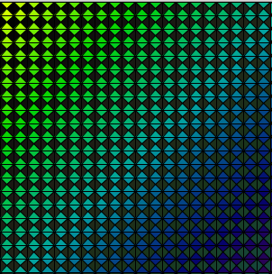
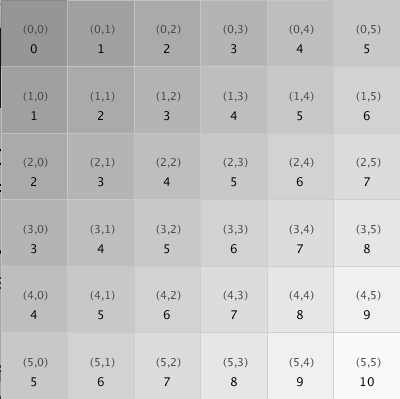
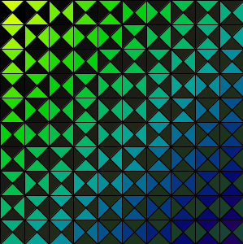
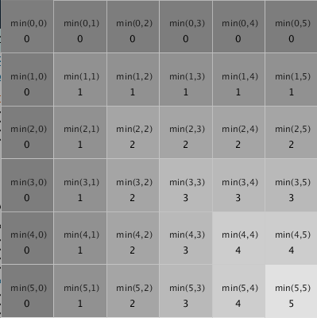
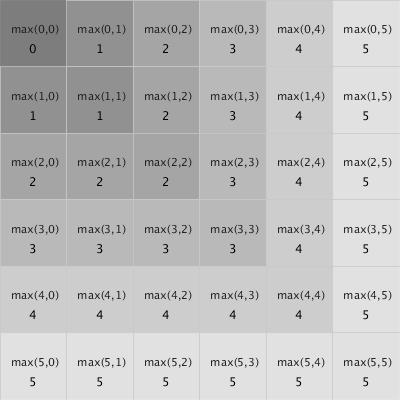
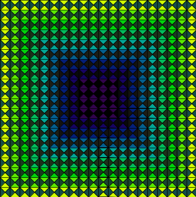
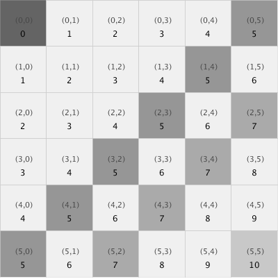
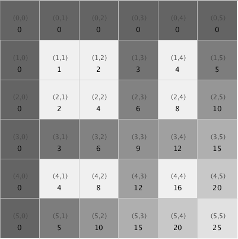

# Grid Patterns using 2D Array Indexes: i, j

## Diagonal Color Gradients



## Define variable k to determine color pattern.

In the image above, we see a diagonal color gradient in both the foreground and background colors. The logic associated with this can be seen in the image below. If we define a new variable: `int k = i + j;` , where k is the sum of the i, j index variables, we see that the value of k increases along the grid's diagonal direction. Then we can **use k as a factor to determine the fill color**.

## Color Gradient Logic:

Using the sum of grid indexes for color logic gives us a simple approach to create complex patterns. We can observe a pattern that forms when we consider i,j indexes of each cell: if we add i + j indexes for a cell, then neighboring cells along diagonal lines have equal values of i + j. We can use this relationship to determine fill values for cells, so we can create a gradient fill diagonally across a grid of cells.

```java
      int k= i + j; //i,j are for-loop indexes
      fill( 150 + (k * 10) );  //gradient logic
```



## Odd-Even Gradient Logic

We can also use this sum variable: `k` for determining odd-even logic. When we use the modulus operator `%`, we focus on the remainder component, so when `k%2` has no remainder `( k%2 == 0 )`, we have a way to implement odd-even logic in our patterns. In the image below, we've combined it with the gradient color fill logic. If we have an _odd_ item, then we use a light gray `fill(240)`, otherwise, we use our gradient logic to create our fill.

```java
int k= i + j; //i,j are for-loop indexes
if(k % 2 == 0){
    fill( 100 + k *10); //gradient logic
}
else{
    fill(240); //light gray
}
```


## Random Patterning Logic

In the images below, we can see that there are 2 different design units, shape1 has 2 colored vertically-stacked triangles on a dark background, shape 2 is a rotation - so the colored triangles have left/right orientation. By randomly selecting between these units, we have an additional design pattern.

 Shape1 ... Shape2



## Logic for Randomized 2-pattern arrangement:

We can use the Processing random\(min,max \) function to simulate random events. We define and initialize a random variable: `rand` that will be assigned a decimal value between 0.0 and 2.0. We determine that if `rand > 1`, then we `vertexPattern1( )`, like a coin flip, roughly half the time we'll have `rand < 1` and instead we'll `vertexPattern2( )`.

## Other Patterns based on i, j index



## min\( i, j\)

The logic for the image above uses the fact that along square shaped sections, like the outer top-row and the left-column both share the feature that the minimum value of the i,j index for each element is 0.

k = min\( i, j\);

## max\( i, j\);

The logic for the image above uses the fact that along square shaped sections, like the outer bottom-row and the right-column both share the feature that the max value of the i,j index for each element is 5.  The [lerpColor\( \) function](https://kdoore.gitbooks.io/cs1335/content/lerpcolor-and-map.html) can use a factor like k to determine color for each grid cell.



```java
//Code snippet for random logic to determine which shape is created.
float rand= random(0,2);
if(rand > 1){
    vertexPattern1(size, foreground, background);
}
else{
    vertexPattern2(size, foreground, background);
}
```

The image below uses logic: color factor k = min\( i, j\). In addition, there are color gradients on both the foreground and background colors. The primary block unit has been repeated 4 times across adjacent regions, where `scale( scaleX, scaleY)` has been used to create [mirror-images](https://kdoore.gitbooks.io/cs1335/content/transforms-for-position-rotation-scale-of-shapematrix-elements.html) of the basic unit



### Boolean Conditional Modulus Logic: Mod5 or Mod7



```java
//Mod 5 or Mod 7

      int k= i + j;
      if(k % 5 == 0 || k% 7 ==0){
        fill( 100 + k *10);
      }
      else{
        fill(240);
      }
   

```

### Multiplication with Modulus 3,5



```java
      int k= i * j;
      if(k % 3 == 0 || k% 5 ==0){
         fill( 100 + k * 5);
      }
      else{
         fill(240);
      }
```

