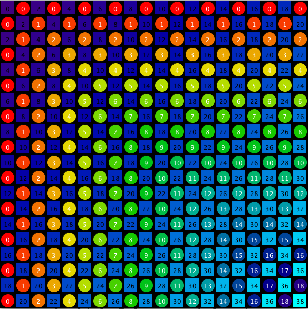
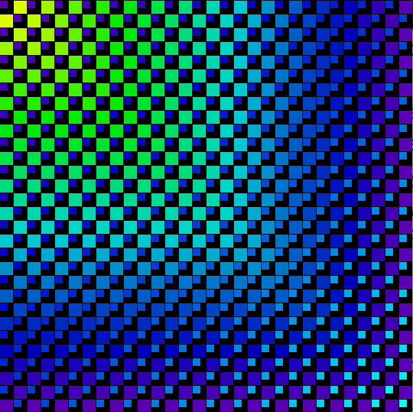
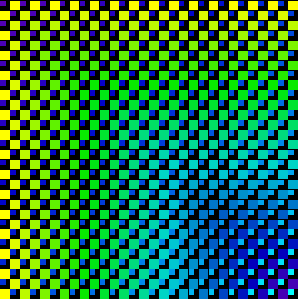
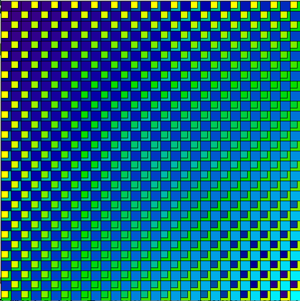

# Example Class Code



Notice that the circles are using fractionl logic for color: k= min\( i, j\) and this creates concentric color patterns. The Squares are using logic: k=i+j, which gives diagonal color gradient pattern.

```java
void setup(){
  size( 600, 600);
  colorMode(HSB, 360, 100, 100);
  background(0);
  color c1 = color( 270, 100, 50);//dark purple
  color c2 = color( 180, 100, 100); //cyan
  color c4 = color( 0,100,100  ); //red -some other color
  int rows = 20;
  int cols = 20;
  int size = width/cols;
  //data-type, variable name, initialize: objects: use 'new'
  int[][] intMatrix = new int[rows][cols];

  int xPos=0;  //for creating grid layout
  int yPos=0;  //for creating grid layout

  //nested for-loops -here we are populating and displaying at the same time
  for( int i=0; i< rows; i++){
    for( int j=0; j< cols; j++){
    int k = i + j;  ///play with this logic to determine k
    int l = min( i, j);
    float fractionk = map( k, 0,rows-1 + cols -1, 0.0, 1.0);  //want full range for lerpColor
    float fractionl = map( l, 0, rows-1, 0.0, 1.0); //want full range of colors
    color c3 = lerpColor( c1, c2, fractionk);
    color c5 = lerpColor( c4, c1, fractionl);

    int value = 0;
    if( k % 2 == 0){  //k is even number
     value = k;
          fill( c3); //color set by k logic
          rect( xPos,yPos,size * .9, size * .9);

        fill(0);//text color is set by fill
        textAlign( CENTER, CENTER); ///align horiz, vert to center
        text( k, xPos + (size/2), yPos +(size/2));
    } //end if
    else{
     value = l;
       fill( c5); //color set by l logic
       ellipse( xPos+(size/2),yPos+(size/2),size * .9, size * .9);
       fill(360);//text color is set by fill
        textAlign( CENTER, CENTER); ///align horiz, vert to center
        text( l, xPos + (size/2), yPos +(size/2));
    } //end else

    intMatrix[i][j] = value;


    xPos += size;
    } //end inner for-lop 
    xPos = 0; //reset at end of each row
    yPos += size; //reset for moving down to next row
  }//end outer for-loop


} //end setup
```

## Variations of Grid Color Patterns

 Using: int l = max\( i, j\)

 Using: int l = min\( i, j\)



