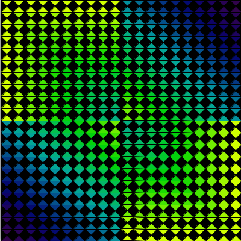

# Project 2 - Steps

## Project 2 - Steps

For Project 2, students will create a Processing program to create custom 2D-Grid Artwork using 2 different PShape vertex patterns. Project 2 builds on understanding learned in Project 1, creating PShape objects by specifying a set of vertex points.

### YouTube Video: Overview of Project 2 



## Inspiration:

#### 

Examine [inspiration artwork - Victor Vasarely](https://www.google.com/search?q=vasarely+art&sxsrf=ACYBGNR5aOjh-L3KJOhN3rHijlyrhLv15A:1571140401369&source=lnms&tbm=isch&sa=X&ved=0ahUKEwiDxY-Mmp7lAhURlKwKHeNaDGgQ_AUIEygC&biw=1740&bih=1064&dpr=0.75) to observe pattern design rules, then incorporate similar rules in your custom design. Design rules are implemented when populating the 2D array, using logic to create patterns, see [Grid Patterns](grid-patterns-using-2d-array-indexes-i-j/) for examples.

Create a 2D Array of PShape objects, create grid patterns using HSB colorMode and lerpColor to specify the color used. If using color-selector tool, specify `colorMode(HSB, 360,100,100); //specify max range values`

**Project Structure: Functions:**

### Step 1 - VertexShape Functions

* Create **2 functions** to create PShape vertex objects using float length, color foreground, and optional color: background as input parameters:

  PShape vertexShape1\( float len, color foreground\)

  PShape vertexShape2\( float len, color foreground\)

**PShape defined using len parameter** -

As with Project1, PShapes are defined using vertices and the input parameter len , or some multiplicative factor times len. Here, many vertices are defined using **len \* .5**. Since all vertices are defined in terms of the len input parameter, then we can vary the value of len when calling the function, and the displayed shape will be the same shape, but scaled at a different size depending on the value of len.

Note: to define our vertices, we are using `len * factor`, we are not using `len + factor`. By using a fractional value for `factor`, we're scaling the size of our pattern, since want to use len to control the size of our pattern. If we add a factor, `len + factor`, that would create a position offset or `x,y`positioning of our pattern at the time we draw the pattern using the PShape: shape\( s, x, y\) function.

```java
PShape vertexShape1( float len, color foreground) {
  PShape s = createShape( );
  s.beginShape();
  s.fill(foreground);
  s.vertex(len * .5, len * .5);
  s.vertex( 0, 0);
  s.vertex(len, 0);
  s.vertex( len * .5, len * .5);
  s.vertex( len, len);
  s.vertex(0, len);
  s.vertex( len * .5, len * .5);
  s.endShape(CLOSE);
  return s;
}  //end createOneShape
```

**Verify VertexShape renders correctly** After writing the vertexPattern functions, it's a good idea see what one of them looks like and to make sure they are displaying something, we can do this in setup

```java
void setup(){
size(600,600);
colorMode(HSB, 300,100,100);
color c1 = color(0, 255,255); //red
PShape testShape = vertexShape1( 100, c1); //hardcode value for len
shape( testShape, 300,300);//display at canvas center
}
```

### RecursivePattern Group-type PShape

**Group-Type PShape with stacked child PShapes**  In the first project, the rendering of the PShapes was part of the logic in the Recursive functions, but in this case, we need to **save / store** the 'stacked' Recursive PShapes in the 2D array so they can be rendered later in the displayShapeMatrix functions. We need the recursive function to create a single Group-type PShape that contains the stacked children PShapes. To accomplish this, we create the group-type PShape before calling the RecursivePattern function. The group-type PShape is passed into the RecursivePattern function as an input. After the RecursivePattern function execution is completed, the group-type PShape object contains all of the child PShapes.

```java
//example use of recursive function
//create the group PShape before calling the recursive function 
//pass the group PShape into the recursive function
//after the function has executed, the g PShape object will have all recursive stacked shapes
PShape g = createShape(GROUP); //this will hold stacked child PShapes
recursivePattern1( g, size,5, foreground ) ;//g is input
//after function execution, g contains stacked children
shapes[i][j] = g; //store in the array

//recursive function
void recursivePattern1(PShape g, float len, float level, color c1){
if( level<1){
return ;
}
color shapeColor = color( hue(c1), saturation(c1), brightness(c1)*.8, alpha(c1) );
PShape s= createShape1( len, shapeColor);
g.addChild( s); //add to group
//recursive call passes g to the next level recursion
recursivePattern1( g, len * .8, level-1, shapeColor);
}

//PShape motif with 2 shapes
void recursivePattern2(PShape g, float len, float level, color c1){
if( level<1){
return ;
}
color shapeColor = color( hue(c1), saturation(c1), brightness(c1)*.8, alpha(c1) );
PShape s= createShape1( len, shapeColor);
PShape s1= createShape1( len, shapeColor);
g.addChild( s);
s1.rotate( PI); //rotate 180 degrees
g.addChild( s1);
recursivePattern1( g, len * .8, level-1, shapeColor);
} //end function
```

### Step 2 - 2D Arrays of PShape Objects

* Functions to create 2-Dimensional Arrays of PShape objects: these functions have logic that determine color, shape, pattern logic. Use lerpColor and map functions with loop-index variables: i, j.  

```java
void populate2DArray1(PShape[][] shapes , int rows, int cols,float cellSize, color c1, color c2 ){
      for( int i=0; i<rows; i++){
        for( int j=0; j< cols; j++){
          int k = i + j;  //diagonal pattern
          float fractionK = map( k, 0, rows + cols-2, 0.0,1.0);
          color curColor = lerpColor( c1, c2, fractionK);
          shapesMatrix[i][j] = vertexShape1(cellSize,curColor); 
        }
     } //end for-loop i
}//end function
```

### Step 3 DisplayShapeMatrix Default Region

* Create functions to display each shapeMatrix.  These functions should take input parameters like:`PShape[][] shapes`,  `int rows`, `int cols`, `float cellSize`

The code below has simple logic to step through each shapes\[\]\[\] element and display it using the nested for loop to change the position of x and y across rows and columns.

```java
void displayShapeMatrix(PShape[][] shapes, int rows, int cols, float  cellSize){

   int xPos=0;
   int yPos=0;
      for( int i=0; i< rows; i++){
        for( int j=0; j< cols; j++){
          shape(shapes[i][j], xPos, yPos);
          xPos += size;
        }  
        xPos =0;
        yPos += size;
      }

}
```

### Step 4: Use Rotate, Translate, Scale to display in other Regions.

**Refactor your code, create functions** to transform, scale, rotate the shapeMatrix into regions 2,3,4.

Within these functions, the canvas is transformed prior to calling the displayShapeMatrix code above. An example of using Rotate is shown for creating a ShapeMatrix in Region2. Similar functions should be created for Region3 and Region4 - See [Transforms](transforms-for-position-rotation-scale-of-shapematrix-elements.md) for more examples.

```java
//display shapeMatrix in region2, use rotate( radians);
void displayRotateRegion2(PShape[][] shapesMatrix,int rows, int cols, float cellSize, int artWorkSize){
  pushMatrix();
  translate( artWorkSize, 0);
  rotate( PI/2);  //or rotate( radians(90));
  displayShapeMatrix(shapesMatrix, rows , cols ,cellSize);
  popMatrix();
}

//display shapeMatrix in region2, use rotate( radians);
void displayMirrorRegion2(PShape[][] shapesMatrix,int rows, int cols, float cellSize, int artWorkSize){
  pushMatrix();
  translate( artWorkSize, 0);
  scale( -1.0, 1.0 );  //or rotate( radians(90));
  displayShapeMatrix(shapesMatrix, rows , cols ,cellSize);
  popMatrix();
}
```



### Final Code: Setup:

The code below shows the setup function where we're defining our variables and calling our functions, since there's no animation or interactivity in this project, setup can be used for organizing and executing our project logic.

Now that we're creating smaller grid units and combining those to create a larger artwork, we need new variables to clarify these concepts. The larger composition will be called the **artWork**, it has **width = height = artWorkSize**. Each artwork is composed of 4 regions, where a 2D array of PShapes occupy one region of space. Each shapeMatrix has dimensions defined by regionWidth = artworkSize/2, rows = 20, cols = 20. cellSize is defined as regionWidth/cols.

```java
void setup(){
  size(400,400);
  background(0);
  colorMode(HSB, 360,100,100);
  //DEFINE COLORS: 
  color c1= color( 71, 100, 100); //yellow-green
  color c2 = color(278,95,30);// dark purple
  color c3 = color(0); //black
  color c4=  color(200); //gray (white is 360)

  //scale factors - allows custom-sizing 
 int artWorkSize=width;
 int regionWidth = artWorkSize/2;

  //dimensions for grid motif that occupies 1/4 size of the artWork 
  int rows = 20;
  int cols = rows;
  float cellSize = float(regionWidth/cols);

  //create smaller grid sections - 
  PShape[][] shapesMatrix1 = populate2DArray1(rows , cols ,cellSize, c1, c2  );
  PShape[][] shapesMatrix2 = populate2DArray2(rows , cols ,cellSize, c1, c2, c3, c4   );

  //add comments
  displayShapeMatrix(shapesMatrix1,  rows , cols ,cellSize);
  displayScaleRegion2(shapesMatrix2, rows , cols , cellSize, artWorkSize);
  displayScaleRegion3(shapesMatrix2, rows , cols , cellSize, artWorkSize);
  displayRotateRegion4(shapesMatrix1, rows , cols , cellSize, artWorkSize);
}
```

