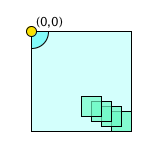
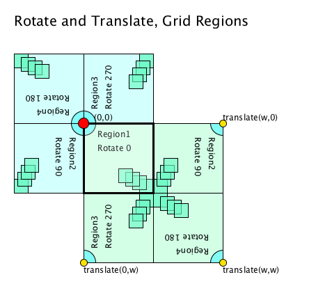
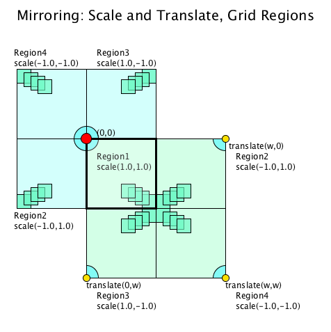
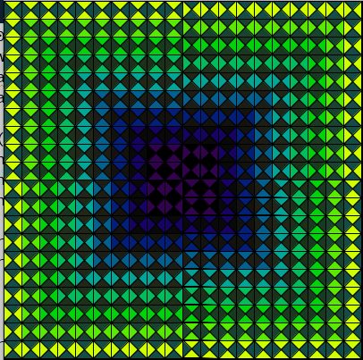
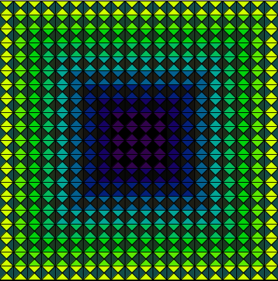
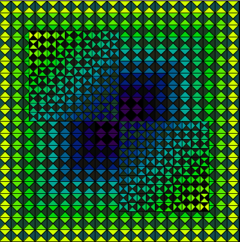
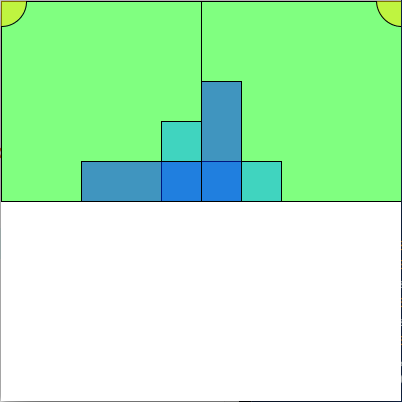

# Transforms for Position, Rotation, Scale of ShapeMatrix Elements

We can use the Processing transform functions to position our shapeMatrix elements when we are ready to create our design composition.

To create a complete artwork, we can take several simple 2D grids and position them adjacent to each other to form a larger artwork composition. There are several ways to reorient the blocks to create interesting design patterns.

Given a simple grid design element, shown positioned at the origin, repetition of this single motif, using Processing transform functions: `translate( x, y)`, `rotate( angle)`, `scale( scaleX, scaleY)`; can provide a simple way to create an interesting design composition.



### YouTube Video




## Rotation of Grid Units:

Given a single grid unit positioned at the canvas origin, let's look at the result of rotations of a single grid unit through 90, 180, and 270 degrees, where rotation always occurs around the canvas origin.



The image above shows that a combination of rotation and translation can be used to create design patterns from a single grid module. When writing these display functions. Region1 shows the position of the origin at the upper left corner. The larger, light-blue square located to the upper left of region 1 uses simple rotation to create a larger composition from a single unit.

The larger, light green square to the lower right of region 1 uses translation and rotation to form a larger composition using repetition of the basic square unit shown in region1. The yellow circles show where the origin has been translated. The red circle shows the canvas origin where the original Region1 square is positioned. The code below shows the transformations required for positioning the square at the Region2 location using rotation and translation. When using an asymmetric design, this method of repetition shows rotational asymmetry.

## Example code for Region2 Grid - Rotate 90 degrees

```java
void displayRotateRegion2(PShape[][] shapesMatrix,int rows, int cols, int cellSize, int artWorkSize){
 int w= artWorkSize;
  pushMatrix();
  translate( w, 0);
  rotate( PI/2);  // same as: rotate(radians( 90));
  displayShapeMatrix(shapesMatrix, 0 ,0, rows , cols ,cellSize);
  popMatrix();
}
```

## Mirroring - Using Processing scale\( x, y\)

In some situations, rotation of the grid doesn't provide the desired repetition configuration. If your design requires mirroring about an axis, then the Processing scale transformation functions can be useful. The image below uses `scale( scaleX, scaleY)` along with translate\( \) to achieve similar results as the with rotate, but results in mirroring the pattern.



## Example code for Region2 Grid  - Scale\( -1.0, 1.0\);

```java
void displayRotateRegion2(PShape[][] shapesMatrix,int rows, int cols, int cellSize, int artWorkSize){
  int w= artWorkSize;
  pushMatrix();
  translate( w, 0);
  scale(-1.0, 1.0);
  displayShapeMatrix(shapesMatrix, rows , cols ,cellSize);
  popMatrix();
}
```

## Rotation-Based Pattern



## Scale-For Mirroring Pattern



## Additional Patterns using Rotate and Scale



### Example Code - TODO: Create 4-Unit Composition

See YouTube video for details of the code below

```java
//Transforms to create 4-Grid Composition
//updated March 30, 2020

void setup(){
  size( 400, 400);
  colorMode(HSB, 360, 100,100,100);
  background(360);//white
  float artSize = width;
  float matrixSize = artSize/2;
  PShape s = asymSquare( matrixSize ); create 1 shape
  shape( s, 0,0); //render 1 shape
 
 //add code using transforms below to generate 4-unit composition
  rotateRegion2( s, artSize);
 // scaleRegion2( s, artSize);
}

//render 1 unit in Region2
void rotateRegion2( PShape s, float artSize){
   pushMatrix();
   translate( artSize, 0);
   //todo add rotate content
   rotate( radians( 90));
   shape(s, 0,0);
   popMatrix();
}

void scaleRegion2( PShape s, float artSize){
   pushMatrix();
   translate( artSize, 0);
   //todo add scale logic
   scale( -1.0, 1.0);
   shape(s, 0,0);
   popMatrix();
}

//Create 1 Asymmetric Square PShape using PShape groups
PShape asymSquare( float size){
   PShape g = createShape(GROUP);
   PShape s0 = createShape(RECT, 0,0,size, size);
   s0.setFill(color(120, 100, 100,50)); //green
   PShape s1 = createShape(RECT, size*.8, size*.6,size*.2, size*.4); 
   s1.setFill(color(200, 100, 100, 50)); //blue1
   PShape s2 = createShape(RECT, size*.4, size*.8,size*.6, size*.2); 
   s2.setFill(color(230, 100, 100, 50)); //blue2
   PShape s3 = createShape( ELLIPSE, 0,0,50,50);
   s3.setFill(color(55, 100,100,50)); //yellow
   g.addChild(s0);
   g.addChild(s1);
   g.addChild(s2);
   g.addChild(s3); //ellipse
   return g;
}


```



