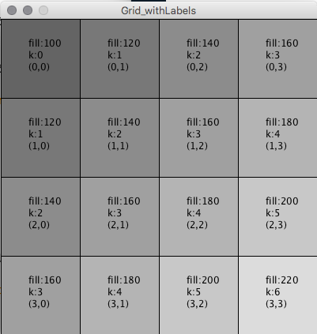
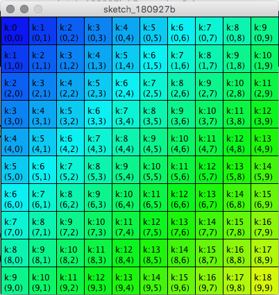

# 2D Array Grid with Labels

```java
 void setup(){
  size(400,400);
  int rows = 4;
  int cols = 4;
  int size=100;
  int[][] intMatrix ;  //declare 2D array of integers
  intMatrix = new int[rows][cols]; //initialize 
  int xPos = 0;
  int yPos = 0;
  //nested for loops to access each element
  for ( int i=0; i< rows; i++) {
    for ( int j=0; j<cols; j++) {
      int k =  i + j;  //create a variable to use for fill logic
      intMatrix[i][j] = k; //store this value for each cell
      int fillVal = k*20 + 100;
      fill(fillVal);  //set fill based on k value
      rect( xPos, yPos, size, size);
      fill(0); //text fill color
      text( "(" + i + "," + j + ")", xPos+ size/2-15, yPos + size/2+15);
      text( "k:" + k, xPos+ size/2-15, yPos + size/2);
      text( "fill:" + fillVal, xPos+ size/2-15, yPos + size/2 - 15);
      xPos += size;  //move xPos across to each new column
    }
    xPos = 0; //reset xPos to 0 for new row
    yPos += size; //move yPos down for the next row
  }
  }
```



## lerpColor Example Code

Below is the code that includes the changes we made to add background color using lerpColor\( \).



```java
void setup(){
  size(800,800);
  colorMode(HSB, 360, 100,100);
  int rows = 10;
  int cols = 10;
  int size=width/rows;
  int[][] intMatrix ;  //declare 2D array of integers - currently null
  intMatrix = new int[rows][cols]; //initialize 

  int xPos = 0;
  int yPos = 0;
  //nested for loops to access each element
  for ( int i=0; i< rows; i++) {
    for ( int j=0; j<cols; j++) {
      int k =  i + j;  //create a variable to use for fill logic
      intMatrix[i][j] = k; //store this value for each cell
      color c1 = color( 237, 95,95); //blue
      color c2 = color(69, 95, 97); //yellow
      float fraction = map(k, 0, rows+cols-2, 0.0, 1.0); //map to fractional range 0.0, 1.0 
      color c3 = lerpColor( c1, c2, fraction);
      fill(c3);  //set fill based on k value
      rect( xPos, yPos, size, size);
      fill(0); //text fill color
      //textSize(20);
      text( "(" + i + "," + j + ")", xPos+ size/2-15, yPos + size/2+15);
      text( "k:" + k, xPos+ size/2-15, yPos + size/2);
      //text( "fill:" + hueVal, xPos+ size/2-15, yPos + size/2 - 15);
      xPos += size;  //move xPos across to each new column
    }
    xPos = 0; //reset xPos to 0 for new row
    yPos += size; //move yPos down for the next row
  }
  }
```

