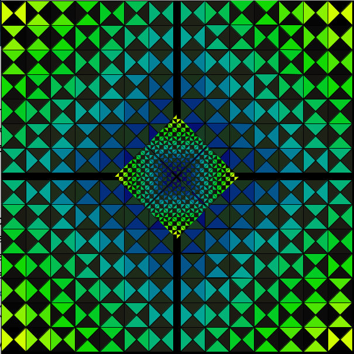
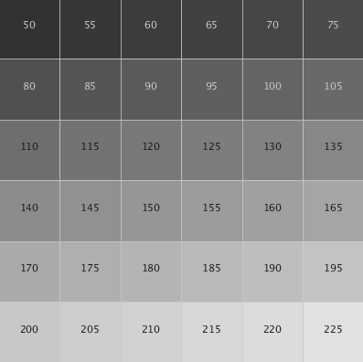
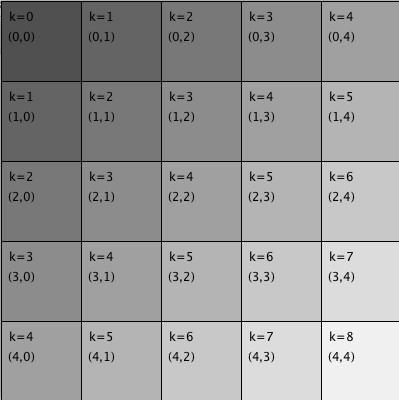
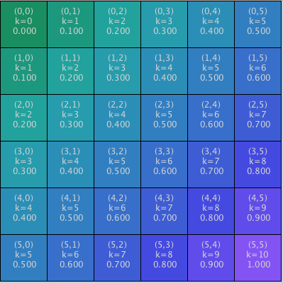

# Project 2 - 2D Arrays for Gradient Logic

After creating our mini-pattern preview, it might inspire us to rethink the complex logic that we've been using for creating regions in our designs. This will begin our transition into object oriented thinking.

## New Idea: Position ShapeGrids with Transform Functions

Instead of having complex logic within a single display-function's for-loop, let's create a set of simplified grid modules and position them using Processing's transform functions. This can lead us to simplified logic, which can allow for more complex patterns. In addition, we can implement logic for layering patterns on top of other patterns to achieve complex designs from simplified logic.

## Grid Sections - Translated, Rotated, Scaled

In the image below, a single grid pattern is used multiple times to create the entire design pattern. The basic grid section is displayed normally in region1. The same grid section is also used in region2, region3 and region4...where rotations, translations, and offsets change the orientation and position. Finally, 4 additional grid sections are used to create the inner design, this section is scaled to quarter size, it's rotated by 45 degrees, and it's translated to the center of the design.



## 1-Dimensional Arrays - Design Limitations

As seen in the image below, when we have a linear ordering for our colors \(1-Dimensional array\), then when we display those in a grid we see this linear ordering, which we perceive as rows of \(grayscale\) colors. This is a linearity is a limitation if we want more complex color relationships between neighboring cell items.



## 2-Dimensional Arrays for Storing our Shapes

Now is a good time to consider switching to 2-Dimensional arrays to store our modular design units. If we create our and store our shapes using a 2-Dimensional data-structure , then we can store higher-order relationships between our design units, such as 2-D color gradients.

Example: Declare and initialize a 2D array of 100 elements, to hold PShape objects.

`PShape[][] shapesMatrix = new PShape[10][10];`

When working with 2D arrays, we'll use 2-nested for-loops, where the outer for-loop: with index `i` corresponds to moving down the rows and the inner for-loop corresponds to index:`j` moving across each column.

## 2D Arrays and Nested for-loops.

The code below creates a 2D-array of ints: `intMatrix[][]` Then, nested for-loops are used to step through each element in the 2D array; where each array element: `intMatrix[i][j]` is accessed using the \[i\]\[j\] index values associated with the nested for-loops.

* outer for-loop, with index i, corresponds to the grid-rows
* inner for-loop, with index j, corresponds to the grid-cols
* int xPos corresponds to the x-position of a grid-cell, it gets incremented by the cellSize, each time the inner loop \(j\) is executed, it controls positioning of each column.  It is reset to 0 for each new row \(outer-loop logic\)
* int yPos corresponds to y-position of a grid cell, it gets incremented by cellSize each time the outer-loop \(i\) is executed, it controls positioning of each row 
* int k is a variable calculated based on the value of i, j for each grid cell, k can be used for color-pattern logic. Here, k = i + j, this creates a diagonal gradient, when used to set grayscale fill as seen in the image below.

```java
 void setup() {
  size(400, 400);
  colorMode(HSB, 360,100,100); //color selector tool settings
  int rows = 5;
  int cols = 5;
  int cellSize= width/cols; //determine cellSize

  int[][] intMatrix = new int[rows][cols]; //declare and initialize 2D integer array
  int xPos = 0;
  int yPos = 0;
  for ( int i=0; i < rows; i++ ) { //outer loop controls rows
    for ( int j=0; j <cols; j++ ) { //inner loop controls cols
      int k=  i + j;  //k determined from i,j values for each cell
      fill(80+(k*20)); //use k to calculate some grayscale fill
      intMatrix[i][j] = k;  //store k in each cell
      rect( xPos, yPos , cellSize, cellSize);//draw rect in each grid
      //code for display text removed
      xPos += cellSize; //move xPos to next column (each time j changes)
  } //end inner j loop
  xPos = 0; //reset xPos to first column
  yPos += cellSize; //move yPos down for next row
  } //end outer i loop
} //end setup
```

The image below is drawn using the code above. 

## Modifications to Code to use Map\( \) and LerpColor\( \)

For the code above, we simply calculated the value of k = i + j, then used it to calculate some grayscale fill. Without much additional effort, we can create color gradients by using map\( \) and lerpColor\( \) functions.

```text
void setup(){
  size( 400,400);
  colorMode(HSB, 360, 100,100); //corresponds to the color selector
  //DEFINE AND INITIALIZE VARIABLES
  int rows = 6;  int cols = 6;
  int cellSize = width/cols;
  int[][] intMatrix = new int[rows][cols];//2D array of ints
  int xPos = 0; //variables to control where rectangle is drawn
  int yPos = 0;
  color c1 = color(157, 83, 56); //pick end colors for gradient 
  color c2 = color(258, 66, 96); //bright purple

  //NESTED FOR-LOOPS FOR ROW, COLUMN GRID LOGIC
  for( int i=0; i< rows; i++){
    for( int j=0; j< cols; j++){
         int k = i + j;
         intMatrix[i][j]= k; //calculate k
         float kFraction = map( k, 0, (rows-1) + (cols-1),0.0, 1.0);  //use map to turn k into a value between 0.0, 1.)
         color c3 = lerpColor(c1, c2, kFraction);
         fill( c3 ); ///use our lerpColor
         rect(xPos, yPos, cellSize, cellSize);
         //code for text display removed
         xPos += cellSize; //increment for drawing the next column
    } //end of inner loop (cols)
    yPos +=cellSize; //move yPos for drawing next row
    xPos = 0;
  } //end of outer loop (rows) 
}
```



