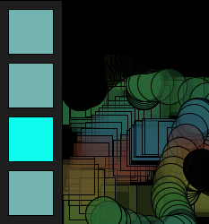

# Project 3 - Logic, Steps

For Project 3, you will create a simple drawing application where 4 buttons allow you to choose which pattern to draw. One additional button will clear the drawing canvas. 3 Sliders will be used to change the hue, saturation, brightness of the pattern that's drawn.

**The code on this page, and the image below shows a first iteration for this project**



## Overall Project Logic - Including Slider Logic

### Setup:  Initialize Global Variables

#### ButtonGroup, ClearButton, Sliders, Patterns, Background Color

* In Setup, create an **array** btnArray of 4 Buttons that function as a ButtonGroup to control which pattern is drawn.
* Initialize each Button: btnArray\[ i \] by calling the Button or PImageButton constructor.
* Pass the array of buttons into the ButtonGroup constructor.
* In draw:  add logic to displayButtons\( \) , each frame.
* Add logic in mouseClicked\( \) to have btnGroup.clicked\( mouseX, mouseY\) execucted
* Within mouseClicked, if the activeButton has changed, execute changePattern\( \), custom method. 
* In the main tab: you will define a function: ChangePattern\( \) that will connect the active button with a corresponding simple Pattern \(PShapes\) that can be drawn at the mouse position, the active pattern can be changed by selecting one of 4 pattern buttons.

#### Individual Button to Clear Canvas

* Create an additional 5th Button that will clear the canvas, but is not part of the ButtonGroup buttons.

#### Pattern Objects to draw patterns

* Create 2 Global Pattern Object variables, Initialize in Setup:  
  * Pattern eraserPattern; //initialize in setup with PShape eraser, fillColor is backgroundColor
  * Pattern currentPattern; // will point to current active pattern - set to eraserPattern to initialize in setup

### draw\( \):  Animation Logic 

Checks if Sliders have changed value, if using a scale slider, then the patterns must also be changed to reflect the new value of len.  
Checks if Mouse is pressed.  If so, then display current active pattern, also requires translation of origin to mouse position, patterns are drawn at origin.

### CheckSliders\( \) must occur before ChangePattern\( \)

* CheckSlider\( \) method, checks each slider to see if it's value has changed.  Also includes logic for color dependency between sliders:  
  * satSlider's hue is set by the hueSlider's sliderVal;
  * brightSlider's hue is set by the hueSlider's sliderVal;
  * brightSlider's sat is set by the satSlider's sliderVal;

### ChangePatternColor\( \)

#### Sliders modify Color for Patterns in ChangePatternColor\( \)

Before displaying the currentPattern, we'll use custom sliders to set the hue, saturation, brightness of the globalColor variable that's used when displaying patterns. This logic must be executed before displaying the currentPattern. See code details below below:

Simple method that changes the values for the global pattern color using the Slider's sliderVal.  

Defines hue, sat, bright values:   
Uses those values to set the global patternFillColor

* `float hue = hueSlider.sliderVal;`
* `float sat = 100;  //..initialize using satSlider`
* `float bright= 100; //..initialize using brightSlider`
* `patternFillColor = color( hue, sat, bright );//set from slider values`

### ChangePattern\( \) Switch-case Control Structure

Switch-case structure allows one pattern to be set as active by using the activeBtnIndex of the ButtonGroup, to set an active pattern to be drawn on the canvas. If using a  Length slider, then use a len variable that's modified by the lengthSlider, then used when creating each PShape.

### **DisplayPattern\( \)**

Sets the pattern color depending if it's the eraser or not, then calls curPattern.display\(\)

### ClearCanvas\( \)

A function to draw a rectangle of canvas-size, and backgroundColor, hides all previous patterns, called from mouseClicked when the clearButton is clicked.  After the clearButton is clicked, this method is executed, then the clearButton must be reset\( \).

## Main Tab Logic:

* Use Functions to organize main-tab Logic
* Use Classes to structure project logic.

### Detailed Project Logic:

#### Declare Global Variables in Main Tab

```java
//Global Variables

//Main Tab
//Make objects, objects call methods

//Global Variables
ButtonGroup btnGroup;  //will hold 4 pattern buttons
Button clearButton;//declare the variable as global - btn is null
color backgroundColor;
Pattern currentPattern; //pointer variable keeps track of active Pattern
Pattern eraserPattern;  //has a PShape circle and background fillColor

Slider hueSlider, satSlider, brightSlider;
```

## Logic In Main Tab:  

### Logic to Initialize Objects in setup\( \)

* Set Canvas Size: min: 800 x 600
* Set colorMode - HSB
* **Initialize objects by calling constructors:**
  * **declare an Array of Buttons**

    `Button[] btnArray;`

  * **initialize Array of Buttons**

    `btnArray = new Button[4];`

  * **initialize each Array element by calling Button , PImageButton Constructors** _You need to figure out Button constructor parameter values so that buttons are positioned in a vertical stack._

    ```java

    Button[] btnArray = new Button[4]; //declare and initialize button array
      btnArray[0] = new Button( 10, 10, 100, 100, "Eraser");
  
      PImage img1 = loadImage( "pattern1Btn.png"); //file name with extension
      btnArray[1] = new PImageButton( ... parameters ...);
  
      btnArray[2] = new PImageButton( ... parameters ...);
  
      btnArray[3] = new PImageButton( ... parameters ...);
  
      //Initialize ButtonGroup
      btnGroup = new ButtonGroup( btnArray );
 
    ```

  * **initialize btnGroup** by calling ButtonGroup Constructor and pass buttonArray as a parameter

    `btnGroup = new ButtonGroup( btnArray);`

  * **initialize clearButton** by calling Button Constructor - use either Button or PImageButton

    `clearButton = new Button( ...parameters... );`

  * **initialize eraserPattern, currentPattern Objects**
    * Create 1 PShape, pass one to Pattern Constructor 
      * Example initialization for 2 Patterns shown below
      * 2 pattern objects required
        * **`eraserPattern`** initialized with PShape
        * **`currentPattern`** initialized by pointing to eraserPattern's object data in heap:  sets to same memory address

```java
    PShape EraserPShape = createShape( ELLIPSE, 0,0,30,30);
    eraserPattern = new Pattern( EraserPShape);
    
    //keeps track of current pattern
    currentPattern = eraserPattern;
```

* **Initialize Sliders** Initialize Sliders by calling constructors with proper input parameters to determine position, size, min, max range

  ```java
  hueSlider = new HueSlider( 40, height-100, 200, 50, 0, 360 );
  satSlider = new SatSlider( parameters );
  brightSlider = new BrightSlider(  parameters );
  ```

### Logic In draw\( \):

* **if mousePressed**
  * checkSliders\( \);  //check before drawPattern, when mousePressed
  * changePattern\( \); //if using scale slider and checkSliders returns true
  * translate\(mouseX, mouseY\);
  * displayPattern\( \);
  * resetMatrix\(\);
* displayButtons\( \) //always draw menu of Buttons
* displaySliders\( \) //always draw menu of Sliders

```java
void draw(   ) {
  if( mousePressed){
    checkSliders( )
    translate( mouseX, mouseY );
    displayPattern( ); //draw currentPattern
    resetMatrix();
  }
  displayButtons(); //do after drawing patterns
  displaySliders();
} //end draw

```

### Logic in changePattern\( \):

* connects buttons to determine currentPattern
* sets **len** for currentPattern if  using a **length slider's sliderVal**
* **eraserPattern** color is not changed by sliders, should have fillColor, strokeColor set to global backgroundColor;
* use switch-case structure
* switch: check which buttonGroup button is active

  ```java
  void changePattern( ){

     Pattern currentPatttern = eraserPattern;
        float len = 100;
        //Add Logic to modify len if using a scale slider
        //len = lengthSlider.sliderVal;
     switch(buttonGroup.activeBtnIndex){
        case 0:
             currentPatttern = eraserPattern;
        break;

        case 1:
             PShape shape1 = createShape( RECT, 0,0,len, len);
             currentPatttern = new Pattern( shape1 );
        break;

        case 2:
             //call your custom vertex function - remove color parameter
              //PShape shape2 = createShape( RECT, 0,0,len*0.8, len* 1.2);
              PShape shape2 = vertexShape2( len );
              currentPatttern = new Pattern( shape2);
        break;

        case 3:
             //call your custom vertex function - remove color parameter
             //PShape shape3 = createShape( ELLIPSE, 0,0,len*0.6, len* 1.2);
              PShape shape3 = vertexShape3( len );
              currentPatttern = new Pattern( shape3);
        break;

        default:
              println("no match");
         }//end switch-case
   } // end checkPattern();
  ```

### Logic in displayPattern\( \) 

```java
void displayPattern(){
  if( currentPattern == eraserPattern){
    currentPattern.fillColor = eraserPattern.fillColor;
    currentPattern.strokeColor = backgroundColor;
  }
  currentPattern.fillColor = patternFillColor;  // in check sliders
  currentPattern.strokeColor = color(0);//reset to black
  currentPattern.display();  //sliders will set colors for other patterns
}
```

#### Logic in drawButtonMenu\( \):

Draw 5 buttons: 4 buttons in buttonGroup, 1 clearButton

* draw a menu-background \(rectangle\)
* buttonGroup.display\(\);
* clearButton.display\(\);
*   **Logic In MouseClicked\(  \):**

* btnGroup.clicked\( parameters \)
* if 
* clearButton.click\( parameters \)  
* if clearButton is selected

  * clearCanvas\( \) - draw rectangle over the canvas surface
  * reset the clearButton

  **Detailed Logic for Adding Sliders to Drawing Application**

```java
void mouseClicked(   ) {
//see if the activeButtonIndex has changed to indicate a new button is active
  boolean isChanged = btnGroup.clicked( mouseX, mouseY);
  if( isChanged){
    changePattern();
  }
  
  clearButton.clicked( mouseX, mouseY);
  if( clearButton.selected ){
    clearCanvas();  //call custom method to clear canvas
    clearButton.reset();  //turn clearButton off
  }
} //end mouseClicked
```

In this project, sliders will be used to control Hue, Saturation, Brightness of the patterns drawn.

The sliders must be checked each time the draw-loop executes if the mousePressed, to see if the sliderVal has changed.

Sliders must always be checked for changes in sliderVal before drawing any patterns.

`checkSliders( )` is a custom function in the main tab, that contains logic for checking each slider.

* Declare global variables:  

    `Slider hueSlider, satSlider, brightSlider;`

* Initialize 3 Sliders in setup\( \) by calling child class constructors: example

    `hueSlider = new HueSlider( 40, height-100, 200, 50, 0, 360 );`

* Incorporate Sliders into project using custom functions:
  * **void checkSliders\( \);**
  * **void setPatternColor\( \);**
  * **void drawSliders \( \);**
  * in displayPattern\( \) - set currentPattern fillColor using patternFillColor right before currentPattern is displayed: `currentPattern.display()`
    * see drawPattern above for integration of this example code:

```java
    
    if( currentPattern != eraserPattern){
    //set color using sliders sliderVal if not the eraserPattern

    //set 
    currentPattern.fillColor = patternFillColor;
    }
```

#### Logic in DisplaySliders\( \)

This code is similar to DrawButtons, we simply want to draw a rectangle behind the sliders, and then have each slider display itself by calling the over-ridden display\( \) method.

```java
void displaySliders( ){
  //draw background rectangle behind sliders
  //display hueSlider, example:
  hueSlider.display();
  //display other sliders

}
```

#### Logic in CheckSliders\( \)

In CheckSliders, we must check to see if each slider has been pressed. We need to set the hue value for the satSlider using the current sliderVal of the hueSlider since the display of satSlider should change when the hueSlider is changed. Similarly for the brightSlider, it must have it's hue and sat reset to reflect current hueSlider and satSlider values.

```java

boolean checkSliders(){
 boolean changed = false;
  if(hueSlider.checkPressed( mouseX, mouseY)){
    changed = true;
    satSlider.hue = hueSlider.sliderVal;
    //add logic for bright slider's hue
  }
  if(satSlider.checkPressed( mouseX, mouseY)){
    changed = true;
    //add logic for bright slider's hue
  }
  
  if(brightSlider.checkPressed( mouseX, mouseY)){
    changed=true;
  }
  if( changed == true){
    setPatternColor();
  }
  if( scaleSlider.checkPressed(mouseX, mouseY)){
    changed = true;
    
  }
 return changed;
}
```

### Additional Logic

### clearButton

The clearButton is a regular button that is used to clear the canvas. The clearButton must be declared as a global object-reference variable. The clearButton behaves like a door-bell, meaning it never displays that it is in the selected state. When the clearButton is clicked, it clears the canvas, then the reset\( \) method is called to turn the button off.

```text
//global variable
Button clearButton;
```

**Initialize in setup\(\)** The clearButton is not part of the buttonGroup buttons, but it's parameters should be defined so that the button is displayed below the other buttons that are part of the buttonGroup. \`

```text
//in setup()
clearButton = new Button(  parameters );
```

**Add code in displayButtons\( \), to display the clearButton**

```java
void displayButtons(){
//draw background rectangle
buttonGroup.display();
clearButton.display();
}
```

**Add code in mouseClicked\( \)** Add code to check if the clearButton has been clicked. Then, check to see if the clearButton is currently selected, if it is, then call custom function: clearCanvas\( \), then turn-off the clearButton by calling the reset\( \) method.

```java
void mouseClicked(){
  btnGroup.clicked( mouseX, mouseY);
  clearButton.clicked( mouseX, mouseY); //check to see if it's been clicked
  if( clearButton.selected){
    //do something
    clearCanvas();
    clearButton.reset(); //turn the button  off
  }
}
```

#### Logic in clearCanvas\( \):

called when clearButton has been clicked and has on==true

* set fill to global background color: backgroundColor
* draw a rectangle, the size of the entire canvas, to clear the canvas.  `rect( 0, 0, width, height)`

```java
void clearCanvas(){
   //TODO add code to draw a rectangle over the full canvas using background color
  fill( backgroundColor);
}//end clearCanvas
```

## Main Tab Final Structure

```java
//Main Tab
//Make objects, objects call methods

//Global Variables
ButtonGroup btnGroup;  //will hold 4 pattern buttons
Button clearButton;//declare the variable as global - btn is null
color backgroundColor;
color patternFillColor;  //global
color patternStrokeColor; //global

Pattern currentPattern; //pointer variable keeps track of active Pattern
Pattern eraserPattern;  //has a PShape circle and background fillColor

//SLIDERS
Slider lengthSlider, hueSlider;

void setup() {
  size( 800, 800);
  colorMode(HSB, 360, 100, 100, 100);
  backgroundColor = color( 300); //light gray
  background( backgroundColor);
 // Button( float x, float y, float w, float h, String label  )
  clearButton = new Button( 10, 450, 100, 100, "Clear");  //initialize - move to bottom
  Button[] btnArray = new Button[4]; //declare and initialize button array
  btnArray[0] = new Button( 10, 10, 100, 100, "Eraser");
  
  PImage img1 = loadImage( "pattern1Btn.png"); //file name with extension
  btnArray[1] = new PImageButton( 10, 120, 100, 100, img1);
  //initailize other buttons
  //btnArray[2]
 /// btnArray[3]
  
  btnGroup = new ButtonGroup( btnArray );
  
  //Logic for patterns
  PShape s0 = createShape( ELLIPSE, 0,0, 50, 50);
  eraserPattern = new Pattern( s0 ); 
  eraserPattern.fillColor = color(backgroundColor);//start with Purple
  eraserPattern.strokeColor = color(backgroundColor);
  currentPattern = eraserPattern;
  
  //Slider(float x, float y, float w, float h, float min, float max, String label ){
  lengthSlider = new Slider( 40,height - 40, 200, 30, 10, 200, "Length");
  hueSlider = new Slider( 280, height - 40, 200, 30, 0, 360, "Hue");
 //initialize other 
  //checkSliders at beginning to initialize sliders
  checkSliders();
  setPatternColor(); //initialize patternFillColor
} // end setup

void draw(   ) {
  if( mousePressed){
    checkSliders( )
    translate( mouseX, mouseY );
    displayPattern( ); //draw currentPattern
    resetMatrix();
  }
  displayButtons(); //do after drawing patterns
  displaySliders();
} //end draw

void mouseClicked(   ) {
  boolean isChanged = btnGroup.clicked( mouseX, mouseY);
  if( isChanged){
    changePattern();
  }
  clearButton.clicked( mouseX, mouseY);
  if( clearButton.selected ){
    clearCanvas();
    clearButton.reset();
  }
} //end mouseClicked

void displaySliders(){
  lengthSlider.display();
  hueSlider.display();
}//end displaySliders

boolean checkSliders(){
   boolean isChanged = false;
  if( hueSlider.checkPressed( mouseX, mouseY)){
   //add logic for dependencies between sliders
       //satSlider.hue = hueSlider.sliderVal
       //brightSlider.hue = hueSlider.sliderVal
        isChanged = true;
   }
   
   //if any hue, sat, bright slider has changed, then changePatternColor
   if( isChanged == true){
     setPatternColor( ); //always changePatternColor if a slider has changed
   }
    if(  lengthSlider.checkPressed( mouseX, mouseY)){
      changePattern( ) //length must be used to change Pattern
       isChanged = true;
   }
   return isChanged;
} //end checkSliders

void setPatternColor( ){
   float hue = hueSlider.sliderVal;
   float sat = 100;
   float bright = 100;
   patternFillColor = color(hue, sat, bright);
 }

void changePattern(){
   //TODO add logic to connect buttons to patterns
   //activeBtnIndex will let us determine which pattern should be the currentPattern
   //Switch Case Statement
   float len = 100;  //scale slider will set / modify this value
   len = lengthSlider.sliderVal;
   switch( btnGroup.activeBtnIndex){
      case 0:
          currentPattern = eraserPattern;
      break;
      
      case 1:
          PShape s1 = createShape( RECT, 0,0,len *.8 , len);
          currentPattern = new Pattern( s1);
      break;
      
      case 2:
          PShape s2 = createShape( RECT, 0,0,len , len);
          currentPattern = new Pattern( s2);
      break;
      
      case 3:
          PShape s3 = vertexShape1( len );
          currentPattern = new Pattern( s3 );
      break;
     
     default:
         println("No match on switch case");
     break;
   }  //end switch-case statement
} //end changePattern

void displayPattern(){
  if( currentPattern  != eraserPattern){
    //patternFillColor = color( 280, 100, 100, 50);
    //set in the Sliders
    patternStrokeColor = color( 0, 50);
    currentPattern.fillColor = patternFillColor;
    currentPattern.strokeColor = patternStrokeColor;
  }
  currentPattern.display();  //sliders will set colors for other patterns
} //end displayPattern

void clearCanvas(){
   //TODO add code to draw a rectangle over the full canvas using background color
  
}//end clearCanvas

void displayButtons(){
  fill(0); //black
  rect( 0,0, 120, height);//background of menu
  btnGroup.display();
  clearButton.display();
} //end displayButtons


```

