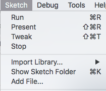
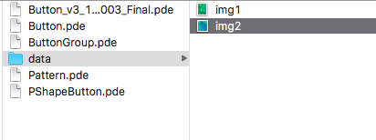
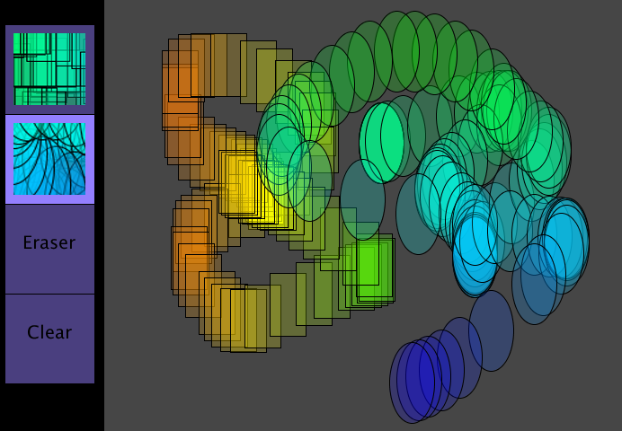

# PImageButton

## Class PImageButton

The PImageButton class is a child-class of the Button class. The extends keyword in the first line of code in the class definition below shows the syntax for defining this class as a child-class of the Button class. As a child class, PImageButton inherits all properties and methods of the Button class.

## PImage: Add an Image to Processing Folder:

To use the PImageButton class, you must first have an image in your project folder that you can use for displaying on the button.

Some newer versions of Processing don't require use of the data folder.

**Use Menu: Sketch -&gt; Add File..** The image below shows how to add an Image File to your Processing Project. When you select the Add File menu option, Processing will determine if the image needs to be in a separate data folder, or not. When using in your project, you will use code like the following:

`PImage img1 = loadImage( "eraser.png");` //Filename must be in quotes.



**Older Processing versions: Create data folder:**  For older versions of Processing, you must create a new folder inside your project folder with the name: data. See image below, which shows that 2 .png images have been added to the newly created data folder inside the project's sketch folder.



The images were created by taking screenshots of the canvas after the patterns had been drawn using the mouse.

```java
//main tab

  color color1 = color(250, 50, 100);//purple
  color color2 = color(250, 50, 50);//dark purple

  PImage img1 = loadImage( "eraser.png"); //must have image in data folder inside processing project

  //can use Button data-type for object reference variable 
  Button imgButton = new PImageButton( btnX, btnY,   buttonSize,buttonSize, color1 ,color2 ,  img1);


  //displays the button

  imgButton.display();  //overrides Button display() method

  //in mouseClicked function

  imgButton.clicked( mouseX, mouseY);  //uses Button clicked( ) method
```

## Class Definition Code

```java
//This tab will cause errors, it's missing code
class PImageButton extends Button{
  //Variables - Data
  PImage img;
 
  //CONSTRUCTORS
  //Button( float x, float y, float w, float h, String label  )
  PImageButton( float x, float y, float w, float h, PImage img ){
    super( x, y, w,h,"" );  //call to base class constructor
    this.img = img;
    } //end constructor
  
  //METHODS - Behaviours
  void display(  ){
    super.display(); //call the base class method
    image( img, x+10, y+10, w-20, h-20);
  }
  
} //end class
```

**PImageButtons shown on the Drawing Application** You can adjust the dimensions of the image in the display\( \) method in the PImageButton class, depending on the size of your buttons. The dimensions used in the code above work well for a button that is 100 px x 100 px.



