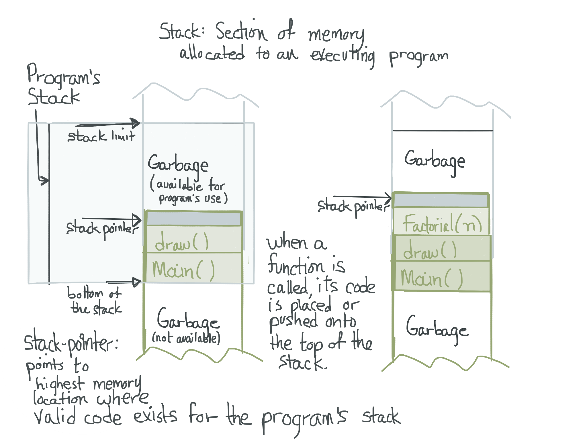
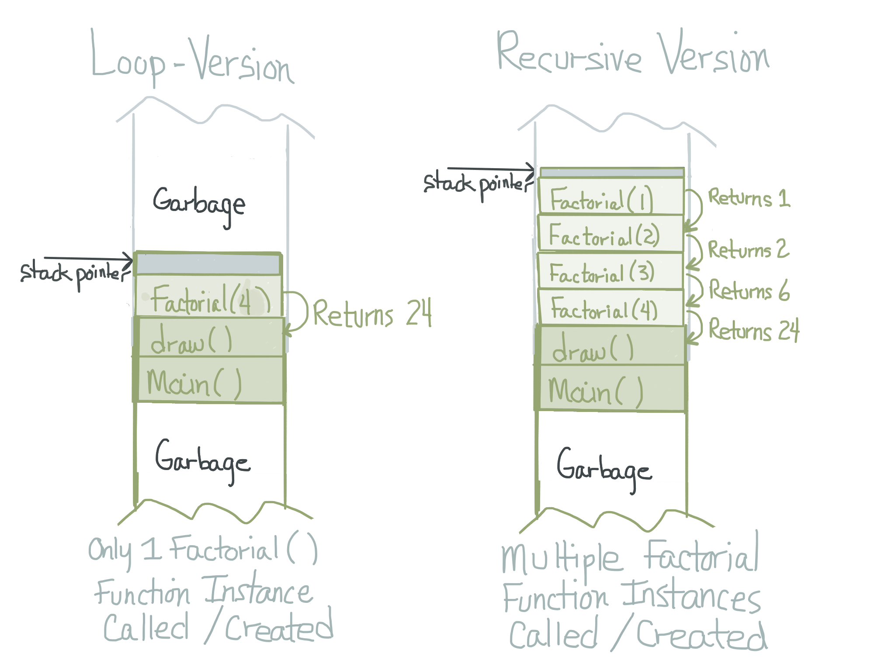
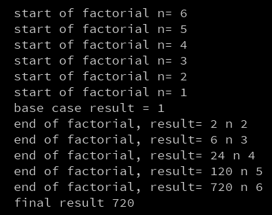

# Recursion

Recursion is a type of repetition. Recursion occurs when a thing is defined in terms of itself or of its type.    [Wikipedia](https://en.wikipedia.org/wiki/Recursion)


###Recursion in Programming
Recursive programs refer to programs that contain at least 1 recursive function.  **A recursive function is a function that has a function call to itself within the function definition. **


 
###Recursive Drawing
[Toby Schachman](http://tobyschachman.com/) created an interactive application that provides a visual interface for playing with recursion via 2D shape primitives. It's surprising how quickly the designs become disorienting, illustrating the power of recursion.   


###Recursive Patterns
When we look in nature, we see frequently see recursive patterning - we see a relationship between several objects - and we understand that these objects have a more complex relationship than simple repetition.  Often in recursive patterns, we can observe that some feature has been scaled larger or smaller, where a self-similarity forms patterns across a series of objects. Recursive patterns often include parent-child relationships between objects.


 

**Russian Nesting Dolls**
The classic Russian nesting dolls provides a nice example of a set of physical objects that have a recursive relationship.  Each doll is positioned within it's parent object, and it's been scaled down to fit snuggly within.  


###Factorial:  N!
Factorial is a mathematical formula that is used when determining probabilities. One example of the use of factorials can be observed when looking at a distinct set of `n` objects, the objects can be arranged in `n!` different configurations, so there are `n permutations` of arrangements for n distinct objects.    Factorials provide a nice example of a mathematical calculation that can be easily understood, and which can be written using a recursive function, factorial can also be calculated using standard for-loops.  In section 13.6 of Shiffman's book, he provides examples of both types of functions to calculate Factorial values, a recursive version of the factorial program code is included below.  

###Recursion Call-Stack
When our program is executing, a special section of the computer's memory-space is allocated just for our program called the program's `Call Stack`.  It is important to understand how a program's `Call-Stack` operates, in order to understand how recursive functions behave when they are executing.

###Simplified Call Stack



Each time a function is called, the code for the function, as well as space for function arguments and return values, is pushed onto the top of the call stack.  When the function finishes execution, then that code it is removed or popped-off of the top of the stack.  A stack only allows items to be added to the top-end, so it is called a Last-In-First-Out (LIFO) data structure.  In contrast, a queue is a First-In-First-Out data structure. In our programs, the draw() function is constantly being pushed onto the stack, then it is popped off the stack when it's completed executing the code. We can imagine other functions may be called by processing, after the draw function has completed executing, to do such tasks as to render our image to the screen.  Then the draw() function would be pushed back onto the stack when it was called to execute again.  We can imagine the draw() function is being called by processing within a while loop, that stops running when our program is stopped. 

###Simplified Stack: Loop vs. Recursive Factorial Function



Similarly, if we use a factorial function that doesn't use recursion, but uses a for-loop, then only 1 instance of the function is repeatedly pushed onto the stack, and it remains on the stack until it has completed executing, we can see this in the diagram above, where 1 instance of the Factorial(n) function is on the top of the call-stack.  However, when we execute a recursive function, then we have many distinct instances of our function's code pushed onto the stack, with the code on the top-most instance being executed until it completes.

###Order of Execution

Below is code for the Recursive version of Factorial Program, we have added several println statements so we can better understand how the code actually executes

```java
 
void setup(){
 int finalResult = factorial( 6 );
 println("final result " + finalResult);
}

int factorial( int n){
  println("start of factorial n= " + n);  //here is the recursive function call
  if( n == 1){  //base case 1! = 1  //return 1
    println( "base case result = 1");
    return 1;
  }
  int result = n * factorial(n - 1);
  println("end of factorial, result= " + result + " n " + n);
  return result;
}

```


From the above image we can see that the println statement within the factorial function that is located before the function calls itself gets printed in the order that the functions are called.  However, we can see that once we reach the base case, then the order changes.  As each function is completing it's calculation, it prints the end of factorial statement and then returns that value to the calling instance of the function.  So when we design recursive functions, the order of statements: before or after the recursive call has a large impact on the ordering of when the code is actually executed.

###Guidelines for Writing Recursive Functions
When writing recursive functions there are several factors to consider:
1. Identify the base-case or stopping condition
2. Insure that the variable that controls the stopping condition will be modified in the recursive function so that it will eventually reach the stopping condition.
3. Locate the conditional test for the stopping condition before the recursive call to prevent the recursive call from occuring when the stopping condition has been met.
4. Determine whether the function task should be performed before or after the recursive call. 
5. Insure that input parameters to the recursive function provide all information needed at each step, and be careful when modifying values passed as arguments. 
6. Be aware that each instance of a recursive function call causes a unique instance of the function's code to be placed on the `call-stack`, this can potentially cause stack-overflow errors if the program runs out of available program-execution memory space.


#Additional Examples of Recursion using Processing
For additional examples of patterns created using Recursive programs in Processing, see:  The Nature of Code, Daniel Shiffman.  Online eBook: [Chapter 8 , Section 2](http://natureofcode.com/book/chapter-8-fractals/)
