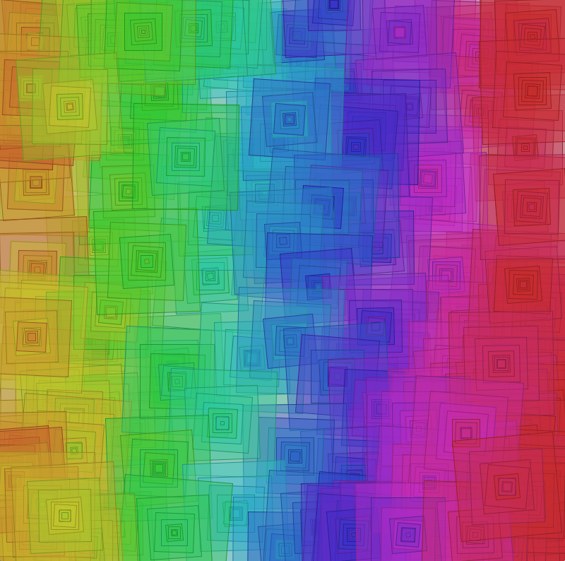

###Recursive Drawing - Patterns:
With Recursion, we can often think of a set of rules being executed for each function call. This can be used to create interesting patterns, because we can often decompose graphic patterns to be expressed as a set of rules.  In the artwork below, a simple pattern of concentric rectangles is created wherever the mouse is pressed. 



###Guidelines for Writing Recursive Functions
When writing recursive functions there are several factors to consider:

1. Identify the base-case or stopping condition
2. Insure that the variable that controls the stopping condition will be modified in the recursive function so that it will eventually reach the stopping condition.
3. Locate the conditional test for the stopping condition **before the recursive function call**, to prevent execution of the recursive call if the stopping condition has been met.
4. Determine whether the function task should be performed before or after the recursive call. 
5. Insure that input parameters to the recursive function provide all information needed at each step, and be careful when modifying values passed as arguments. 
6. Be aware that each instance of a recursive function call causes a unique instance of the function's code to be placed on the `call-stack`, this can potentially cause stack-overflow errors if the program runs out of available program-execution memory space.
    
    

###Recursive Pattern Drawing Application 

The recursive function: `recursivePattern(length, level)` takes 2 input parameters: `length` controls the size of the rectangle and `level`, which controls the number of concentric rectangles drawn.  By adding slight random variation in the rotation angle, rectangle size, and hueValue of the fill and stroke for each drawn rectangle, the user can create a unique artwork each time they run the program.  The hueValue can be mapped to the `x` position of the mouse.  Using the `Hue, Saturation, Brightness: colorMode(HSB)` allows for slight random variations of the hueValue to give slight variations in the hue of the drawn pattern.  

### Overview:  Main Program Structure

    - **If the user is pressing the mouse** 

```java
void Draw(){  //use processing Draw function
    if ( mousePressed){
    //Draw a Pattern at the Origin
        translate(mouseX, mouseY); //move origin to mouse position
        recursivePattern( 100, 5); //draw 5 nested patterns
        resetMatrix();  //move origin back to upper-left corner 
    }
}
```

    - **Draw a Pattern (drawn at origin):** move the canvas origin to the current mouse position. 
  
```java
    translate(mouseX, mouseY);
 ```

    - Draw some pattern based on ``length`` parameter, by **calling** the recursive function: recursivePattern( );
    
```java 
        
    recursivePattern( 100, 5); //Recursive Pattern Called 
```
       
    - Move Origin back to upper left corner

 ```java
    resetMatrix();
```

### Define Recursive Function
Here we **define** a recursive function: `recursivePattern` so that it calls itself for `level` number of times, with a `length` parameter that determines the pattern size:

```java
        
    void recursivePattern( float length, int level) {
    
```
        
1. We need to add a **test for the termination condition **as the first task in the function:     
        
    ```java
    if(level < 1) { 
        return; //stops recursion
    }
     ```
2.  We will **draw a shape at the origin using the ``length`` parameter**  
        
    ```java
    fill( 255, 255, 100);// set some fill color
    rect( 0, 0, length, length); //draw at origin, use length parameter
    ```
        
3. **Recursive function must call itself**, within the function , make sure to modify the function parameters:             

    -  change length:  length * 0.8  
    -  change level:  level - 1 
    
 

```java

   recursivePattern( length * 0.8, level - 1 );  
   }  //end of function
 

```


   
###Complete Recursive Function Definition
 

```java

void recursivePattern( float length, int level) {
    if(level < 1) {
    return; //stops recursion
    }
    fill( 255, 255, 100);// set some fill color
    rect( 0, 0, length, length); //draw at origin, use length parameter
    //recursive call
    recursivePattern( length * 0.8, level - 1 );  
}
```
###Example 2:  Recursive Function Variation
Below is a slight variation on the recursive function, here we're using a global variable: lenMin to determine when to terminate the recursion.  In addition, we're using global variables to determine the fill values for Hue and Brightness, where we'll set colorMode in the setup function:   colorMode(HSB, 360, 100, 100);


```java
//global Variables
float lenMin = 30;
float lenMax = 100;

 void recursivePattern( float length){
    if ( length < lenMin ){ //test for termination
        return; //termination condition is true
    }
    float hueVal = map( length, lenMin, lenMax, 130, 160);
    float brightVal = map( length, lenMin, lenMax, 0, 100);
    fill( hueVal, 100, brightVal, 100); //alpha is 100
    rect( 0, 0, length, length); //draw a pattern based on length parameter
    recursivePattern( length * 0.8 ); //call recursive function
}  
```

                            
                
### Complete Program
Here's a simple program that defines and uses a recursive function to create a pattern. In this case, we're just creating a rectangle as our recursive task. Notice that in this case we are using global variables: lenMin, lenMax as the range values for the Map( ) function which is determining the fill for the rectangle.  Also, lenMin is used as the termination test conditional expression.

```java
float lenMax  = 100.0;
float lenMin = 20;

void setup(){
  size( 600,600);
  colorMode(HSB, 360, 100, 100); 
  }
  
  void draw(){
    if(mousePressed){
      translate(mouseX, mouseY); 
          
          int numLevels = 5;
          recursivePattern( len, numLevels );   //call recursive function
      resetMatrix();
    }
  }
  
  //define recursive function
  void recursivePattern( float length, int level){
    if ( level < 1 ){  //test for termination
      return; //termination condition is true
    }
    float hueVal = map( length, lenMin, lenMax, 130, 160);
    float brightVal = map( length, lenMin, lenMax, 0, 100); 
    fill( hueVal, 100, brightVal, 100); //alpha is 100 
    rect( 0, 0, length, length);  //draw a pattern based on length parameter - Replace this with a call to your vertexPattern( length ) function
    recursivePattern( length * 0.8, level-1 ); //call recursive function
    }
    
    ```

###Recursive Pattern with VertexPattern
In the code below, we're calling our vertexPattern function inside the recursivePattern, so the color logic will need to be moved to inside our vertexPattern function.  Each time we call recursivePattern, we have reduced the size of the length parameter.

```java

//define recursive function
void recursivePattern( float length, int level){
    if ( length < lenMin ){ //test for termination
     return; //termination condition is true
    }
    vertexPattern( length ); //your custom vertexPattern
    recursivePattern( length - 20, level-1 ); //call recursive function
}
```

