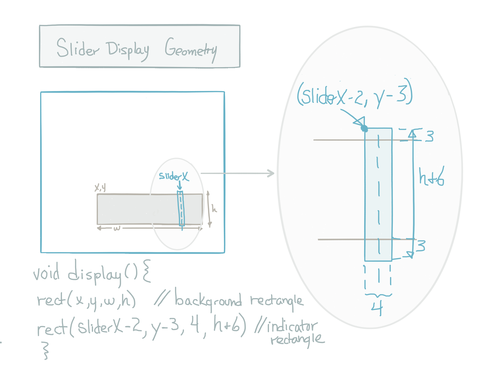

# Slider Controller

A slider controller is a user-interface element that we are probably all familiar with.  How can we create our own custom slider controller?  What is the structure, function, behavior of a slider control?

###Structure:
Typically we imagine some horizontal rectangle, with an interactive identifier that show the current position of the slider indicator.

###Function:  
A one dimensional slider is used to determine a value within a given range of values.

###Behavior:
When we press down on the slider, we expect the indicator to move to our mouse position if we are currently positioned over the bar. This is similar to button behavior, the button and slider only change values when they are directly under the mouse and there is some mouse movement. 

###Map: 
Our slider will use the processing map() function because it's core functionality is to provide users with the ability to select a value within a range.  The map function allows us to provide a visual range and an interactive indicator for the user to modify. In code, we create the mapping from the slider tool geometry: w, h, position, to determine the intended variation in the controlled value, such as hue or length. 



###Simple Linear Slider
The code below creates a slider that controls the length of a rectangle.  It uses the map function. When determining the slider rectangle's range of values, this is determined by the pixel width of the rectangle: w.  In order to determine the values we use to determine the slider's current position and current mapping output value, we need to also consider the x-offset of the slider.  In other words, if the slider's left-side is positioned along the left side of the canvas, then x offset is 0.  This would mean that if the indicator position: sliderX had a value of 20, and if the width of the slider was 40, we'd know that the slider indicator was at the middle of the range.   However, if sliderX had a value of 20, but the x coordinate of the slider rectangle was also 20, we'd know that the slider indicator would be at it's minimum value in the range. Since we want flexibility to position the slider anywhere on the canvas, we need to consider the x offset of the slider when determining the slider's value. So the possible values for the slider Indicator will fall in the range of: ( min: x, max: x+w ), and we'll use these ranges in the map function as the slider representation's min, max value.


###Slider, Base-Class
How can we define a Slider base class that allows us to create a slider of any size, at any position, that allows selection of values within any range?  The map( ) function will allow us to define a generalized Slider base class. 


```java
//Class slider 
//creates a horizontal slider
//uses map function to match displayed slider rectangle and 
//indicatror rectangles with the min, max values provided as input parameters
class Slider {
  float x, y;
  float w, h;
  float min, max;
  float sliderX;
  float sliderVal;
  String label;
 

  Slider( float x, float y, float w, float h, float min, float max, String label) {
    this.x = x;
    this.y = y;
    this.w = w;
    this.h = h;
    this.min = min;
    this.max = max;
    this.label = label; 
   
    sliderX = x + (w/2);
    sliderVal = map( sliderX, x, x+w, min, max);
    
  }

  //display split into 2 methods, the background layer displayes 
  void display() {
    backgroundLayer();

    fill(300);
    rect( x, y, w, h);   //slider rectangle  - this is changed in child classes 

    fill(360); //inidcator rectangle
    rect( sliderX-2, y-3, 4, h + 6);
    text( int(sliderVal), sliderX + 2, y-4);  //display the sliderValue
  }
  //display background rectangle that has text display 
  //for min, max, label
  void backgroundLayer() {
    pushStyle();
    fill( 100); 
    rect( x-10, y-20, w+20, h+40);  ////outer background rectangle
    fill( 360);  //fill for the text
    // Create text for min, max, label - displayed under slider rectangle
    textSize( 12);
    textAlign(LEFT);
    text( int(min), x, y+h+15);
    textAlign(RIGHT);
    text( int( max), x+w-10, y+h+15);
    textAlign(CENTER);
    textSize(14);
    text( label, x+(w/2), y+h +15);
    popStyle();
  }

  void setSliderVal( float sliderVal) {
    this.sliderVal = sliderVal;
    this.sliderX = map( sliderVal, min, max, x, x+w);
  }

  //test mouse coordinates to determine if within the slider rectangle
  //if not changed, return false
  //set sliderX to current mouseX position
  boolean checkPressed(int mx, int my) {
    boolean isChanged = false;
    if ( mx >= x && mx <= x+w && my> y && my< y +h) { //test for >= so endpoints are included
      isChanged = true;
      sliderX = mx;
      sliderVal = map( sliderX, x, x+w, min, max);
    }
    return isChanged;
  }
} // end class Slider
```


###Main Tab Code: 
In the code below, we use a slider instance to control the scale of an ellipse 

```java
Slider slider1;
float hue;   //modified by the slider

void setup(){
  size( 700, 700);
  colorMode( HSB, 360,100,100);
  slider1 = new Slider( 200,200, 200, 30, 0, 360, "Hue");
  hue = slider1.sliderVal;  //initialize hue using slider to set the initial value
}

void draw(){
  background( 0);
   if( mousePressed){
    boolean isChanged = slider1.checkPressed( mouseX, mouseY);
    if(isChanged){
        hue = slider1.sliderVal; //update hue using updated sliderVal
    }
  }
  slider1.display();
  fill( hue, 100, 100); //hue modified by slider1
  rect( 20,20, 50,50); //rectangle hue modified by slider1 
}

```
Can you make a slider to control Hue?  Can we use the Slider base class to create a HueSlider class, how do we create a ROYGBIV Gradient Rectangle?
Below is the HueSlider class.  How would we create a Saturation and Brightness slider? 

###HueSlider, Child-class
```java
class HueSlider extends Slider {
  HueSlider( int x, int y, int w, int h, float min, float max ) {
    super( x, y, w, h, min, max, "Hue" ); ////calling base class constructor
  }
  void display() {
    super.backgroundLayer();
    for (int i=0; i < w; i ++) { //what going on here?
      float hueVal = map( i, 0, w, min, max);
      stroke(hueVal, 100, 100);
      line(i+x, y, i + x, y + h);
    }
    fill(sliderVal, 100, 100);
    stroke(0);
    rect(sliderX, y-4, 5, h+8);
  } // end of display
} // end of class HueSlider

```

To create Saturation and Brightness sliders, we need to consider that their display may be dependent on the Hue slider.  So, in the main tab of our project, When we check the HueSlider, and before we display the Bright or Sat Sliders, we can use the value of the HueSlider to set their hue attribute.

//in main tab:

void CheckSliders(){
    

}

//SAT SLIDER

```java
class SatSlider extends Slider{
  
  SatSlider(int x, int y, int w, int h, float min, float max){
    super( x, y, w, h, min, max);
    }
  
  void display(){
    super.backgroundLayer();
    for( int i=0; i < w ; i++){
      float satVal = map( i, 0,w, min, max);  
      stroke( hue, satVal, 100); //calculate satVal for each line
      line( x+i, y, x+i, y+h); 
    }
    ///indicator rectangle
    stroke(0);  //reset stroke to default
    fill(hue , sliderVal, 100);   //use sliderVal to set the sat 
    strokeWeight(2);
    rect( sliderX-3, y-2, 6, h+4);
    strokeWeight(1);
  }
   
  
} // end of class
```

###Main Tab Code
Here's how we check the sliders and use the Hue Slider to set the hue value for the SatSlider before we display the SatSlider.  The sizeSlider is a base-class type slider.  Notice that the reference variable data type for all sliders is of the base-class type.

```java

Slider sizeSlider,hueSlider, satSlider;

void setup(){
  size( 600,600);
  colorMode(HSB, 360,100,100);
  
  // Slider( float x, float y, float w, float h, float min, float max, String label  ){
 sizeSlider = new Slider( 20, 40, 200, 30, 0, 200, "Size");
 hueSlider = new HueSlider( 20, 140, 200, 30, 0, 360);
 satSlider = new SatSlider( 20, 230, 200, 30, 0, 100);
}  //end of setup

void draw(){
   background(0);
   if(mousePressed){
     sizeSlider.checkPressed(mouseX,mouseY);
     hueSlider.checkPressed(mouseX,mouseY);
     satSlider.checkPressed(mouseX,mouseY);
  }
  
  sizeSlider.display();
  hueSlider.display();
  satSlider.hue = hueSlider.sliderVal;  //dependency between hue and sat slider
  satSlider.display();
  
  
  float hue = hueSlider.sliderVal;
  float size = sizeSlider.sliderVal;
  float sat = satSlider.sliderVal;
  fill( hue, sat,100); //use the sliderVal to change the hue of the ellipse
  ellipse( 400,400, size,size);
  
} //end of draw

```